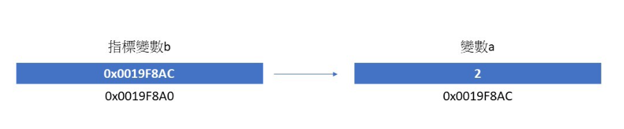
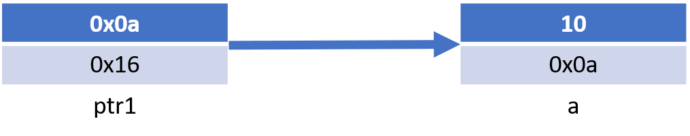
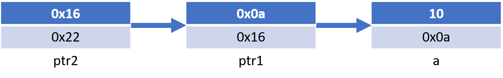
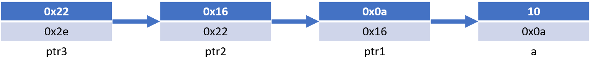
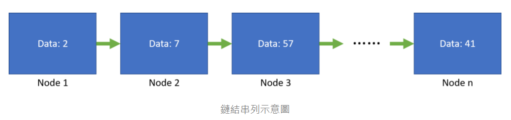
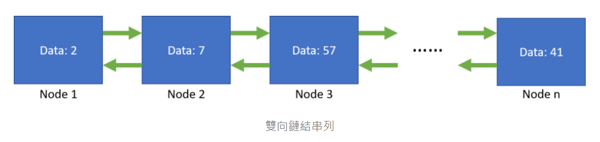
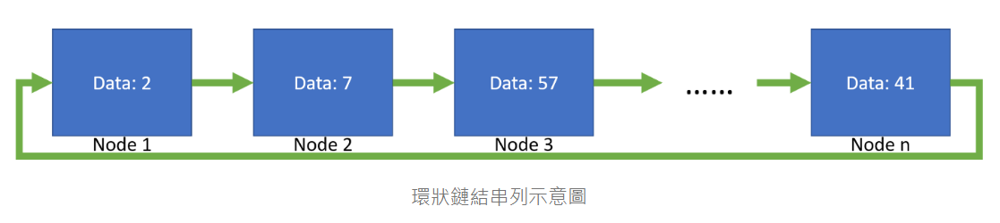

```
Author: Antony_Weng <Antony_Weng@chicony.com> | <weng851107@gmail.com>

This file is only used for the record of the learning process, only used by myself and the file has never been leaked out.
If there is related infringement or violation of related regulations, please contact me and the related files will be deleted immediately. Thank you!
```

# 目錄

- [自我練習](#0)
  - [單向鏈結串列](#0.1)
  - [雙向鏈結串列](#0.2)
  - [環狀鏈結串列](#0.3)
    - [如何檢測串鏈中是否存在環？如果存在，如何找到環的起點？](#0.3.1)
  - [堆疊](#0.4)
  - [佇列](#0.5)
  - [二元樹](#0.6)
  - [簡單的排列演算法](#0.7)
- [指標教學](#1)
  - [(1) 何謂指標](#1.1)
  - [(2) 宣告指標變數](#1.2)
  - [(3) 更改指標變數指向](#1.3)
  - [(4) Pass by value vs Pass by reference](#1.4)
  - [(5) 不同型態的指標變數以及容量大小](#1.5)
  - [(6) void pointer](#1.6)
  - [(7) 函數的參數形式為 void pointer](#1.7)
  - [(8) 函數回傳形式為 void pointer](#1.8)
  - [(9) 函數回傳形式與參數型態皆為 void pointer](#1.9)
  - [(10) 函數回傳形式與參數型態皆為 void pointer，以pthread為例](#1.10)
  - [(11) 多重指標](#1.11)
  - [(12) 使用指標來運算](#1.12)
  - [(13) 一維指標來訪問二維與三維陣列](#1.13)
- [鏈結串列](#2)
  - [(1) 單向鏈結串列](#2.1)
  - [(2) 雙向鏈結串列](#2.2)
  - [(3) 環狀鏈結串列](#2.3)
- [堆疊](#3)
  - [(1) 鏈結實作](#3.1)
- [佇列](#4)
  - [(1) 函數介紹](#4.1)
  - [(2) 型態宣告](#4.2)
  - [(3) 建構與解構函式](#4.3)
  - [(4) 佇列函式](#4.4)
- [二元搜尋樹](#5)
  - [(1) 函數介紹](#5.1)
  - [(2) 型態宣告](#5.2)
  - [(3) 建構與解構函式](#5.3)
  - [(4) 二元搜索樹操作函式](#5.4)
  - [(5) 二元搜索樹走訪函式](#5.5)
  - [(6) 引線二元樹(Thread Binary Tree)](#5.6)
- [排序](#6)
  - [氣泡排序法(Bubble sort)](#6.1)
  - [快速排序法(Quicksort)](#6.2)
  - [選擇排序法(Selection Sort)](#6.3)
  - [插入排序法（Insertion Sort）](#6.4)
  - [合併排序法（Merge Sort）](#6.5)
- [搜尋](#7)
  - [循序搜尋法（Sequential Search）](#7.1)
  - [二分搜尋法（Binary Search）](#7.2)
  - [哈希表（Hash Table）](#7.3)
- [簡單演算法](#8)
  - [最大公因數(GCD) 與 最小公倍數(LCM)](#8.1)
  - [Fibonacci 數列](#8.2)
  - [階乘(factorial)](#8.3)
- [位運算](#9)
  - [自己利用^運算計算出自己](#9.1)
  - [設置、清除或檢查特定的位](#9.2)
  - [位移運算來快速進行乘法和除法](#9.3)
  - [反轉一個整數的位數](#9.4)
  - [XOR 運算符交換兩個數值](#9.5)
  - [XOR 運算符將指定位取反](#9.6)
- [Other](#10)
  - [LRU Cache](#10.1)
  - [Brute-force、Greedy和Heuristic算法：介紹、比較及應用範例](#10.2)

<h1 id="0">自我練習</h1>

<h2 id="0.1">單向鏈結串列</h2>

[SingleListNode.c](./SingleListNode.c)

- [Polynomial.c](./Polynomial.c)

<h2 id="0.2">雙向鏈結串列</h2>

[DualListNode.c](./DualListNode.c)

<h2 id="0.3">環狀鏈結串列</h2>

[CircularListNode.c](./CircularListNode.c)

<h3 id="0.3.1">如何檢測串鏈中是否存在環？如果存在，如何找到環的起點？</h3>

快慢指針法（Floyd's algorithm），也稱為龜兔賽跑算法

- 使用兩個指針，一個快指針和一個慢指針，它們都指向串鏈的開頭
- 快指針每次向前移動兩步，而慢指針每次只向前移動一步。如果存在環，快指針最終會追上慢指針。當快指針追上慢指針時，我們可以確定存在環
- 為了找到起點，我們需要重新遍歷串鏈，但是這次我們將一個指針指向串鏈的開頭，另一個指針指向剛才相遇的點。接下來，我們讓這兩個指針同時向前移動，每次只移動一步，直到它們再次相遇。這次相遇的點就是環的起點。

    ```C
    #include <stdio.h>
    #include <stdlib.h>

    struct ListNode {
        int val;
        struct ListNode *next;
    };

    struct ListNode *detectCycle(struct ListNode *head) {
        struct ListNode *slow = head, *fast = head;
        while (fast && fast->next) {
            slow = slow->next;
            fast = fast->next->next;
            if (slow == fast) {
                break;
            }
        }
        
        if (!fast || !fast->next) {
            return NULL;
        }
        
        slow = head;
        while (slow != fast) {
            slow = slow->next;
            fast = fast->next;
        }
        
        return slow;
    }
    ```

<h2 id="0.4">堆疊</h2>

[void_stack.c](./void_stack.c)

- `push` 或 `pop` 一個Node，必須使用二維指標
  - 在您提供的這個堆疊的例子中，需要使用二維指標，因為您正在直接修改傳遞給 `push` 和 `pop` 函數的指針本身。
  - 在 `push` 函數中，您需要更新 `sTop` 以指向新插入的節點。要做到這一點，您需要使用一個指向指針的指針（二維指標），因為您想要修改傳遞給該函數的指針本身。在這種情況下，二維指標允許您直接更新 `sTop` 的值，而不僅僅是修改它所指向的內容。
  - 在 `pop` 函數中，同樣需要使用二維指標來修改傳遞給函數的指針本身。在移除堆疊頂部的節點時，您需要更新 `sTop` 以指向下一個節點。使用二維指標，您可以直接更改 `sTop` 的值。
  - 在這個堆疊的例子中，使用二維指標是必要的，因為您需要直接修改 `sTop` 指針本身，而不是它所指向的內容。這與先前的隊列例子不同，在那裡您只需修改 `Queue` 結構中的指針（`front` 和 `rear`），而不需要修改 `Queue` 結構的指針本身。

[Stack.c](./Stack.c)

<h2 id="0.5">佇列</h2>

[single_queue.c](./single_queue.c)

- 在 `enqueue` 或 `dequeue` 時，只要 `Queue *QList` 就可以實際新增Node，而不用使用二維指標
  - `Queue` 結構包含兩個指針：`front` 和 `rear`。當您在 `enqueue` 或 `dequeue` 函數中對 Queue 進行操作時，您是在修改這兩個指針的值。您不需要使用二維指標，因為您不是在修改 Queue 結構本身，而是在修改它所包含的指針。
  - 這裡不需要使用二維指標的原因是，您已經將 Queue 結構的地址傳遞給了相應的函數，這些函數可以直接訪問並修改這個結構的內容。二維指標在這種情況下沒有意義，因為它們通常用於表示二維數組，而在這裡，您只需要訪問和修改 Queue 結構的內容。

---

Design Circular Queue, 設計一個循環隊列

- `MyCircularQueue(k)`: 構造函數，設置隊列的大小為k。
- `enQueue(value)`: 將一個元素插入循環隊列。如果成功返回true，否則返回false。
- `deQueue()`: 從循環隊列中刪除一個元素。如果成功返回true，否則返回false。
- `Front()`: 從循環隊列中獲取前端元素。如果隊列為空，返回-1。
- `Rear()`: 從循環隊列中獲取尾端元素。如果隊列為空，返回-1。
- `isEmpty()`: 檢查循環隊列是否為空。
- `isFull()`: 檢查循環隊列是否已滿。

    ```C
    #include <stdbool.h>
    #include <stdlib.h>

    typedef struct mycircularqueue{
        int *queue;
        int head;
        int tail;
        int size;
        int capacity;
    } MyCircularQueue;

    MyCircularQueue* myCircularQueueCreate(int k) {
        MyCircularQueue* obj = (MyCircularQueue*) malloc(sizeof(MyCircularQueue));
        obj->queue = (int*) malloc(k * sizeof(int));
        obj->head = -1;
        obj->tail = -1;
        obj->size = 0;
        obj->capacity = k;
        return obj;
    }

    bool myCircularQueueEnQueue(MyCircularQueue* obj, int value) {
        if (obj->size == obj->capacity) return false;

        if (obj->tail == -1) {
            obj->head = 0;
            obj->tail = 0;
        } else {
            obj->tail = (obj->tail + 1) % obj->capacity;
        }
        obj->queue[obj->tail] = value;
        obj->size++;
        return true;
    }

    bool myCircularQueueDeQueue(MyCircularQueue* obj) {
        if (obj->size == 0) return false;

        if (obj->head == obj->tail) {
            obj->head = -1;
            obj->tail = -1;
        } else {
            obj->head = (obj->head + 1) % obj->capacity;
        }
        obj->size--;
        return true;
    }

    int myCircularQueueFront(MyCircularQueue* obj) {
        if (obj->size == 0) return -1;
        return obj->queue[obj->head];
    }

    int myCircularQueueRear(MyCircularQueue* obj) {
        if (obj->size == 0) return -1;
        return obj->queue[obj->tail];
    }

    bool myCircularQueueIsEmpty(MyCircularQueue* obj) {
        return obj->size == 0;
    }

    bool myCircularQueueIsFull(MyCircularQueue* obj) {
        return obj->size == obj->capacity;
    }

    void myCircularQueueFree(MyCircularQueue* obj) {
        free(obj->queue);
        free(obj);
    }

    /**
    * Your MyCircularQueue struct will be instantiated and called as such:
    * MyCircularQueue* obj = myCircularQueueCreate(k);
    * bool param_1 = myCircularQueueEnQueue(obj, value);
    * bool param_2 = myCircularQueueDeQueue(obj);
    * int param_3 = myCircularQueueFront(obj);
    * int param_4 = myCircularQueueRear(obj);
    * bool param_5 = myCircularQueueIsEmpty(obj);
    * bool param_6 = myCircularQueueIsFull(obj);
    * myCircularQueueFree(obj);
    */
    ```

---

Design Circular Deque, 設計一個雙端隊列（Deque）結構

- `MyCircularDeque(k)`: 構造函數，設置隊列的大小為k。
- `insertFront()`: 將一個元素添加到双端队列头部。 如果操作成功返回 true。
- `insertLast()`: 將一個元素添加到双端队列尾部。如果操作成功返回 true。
- `deleteFront()`: 從双端队列头部刪除一個元素。 如果操作成功返回 true。
- `deleteLast()`: 從双端队列尾部刪除一個元素。 如果操作成功返回 true。
- `getFront()`: 從双端队列中獲取前端元素。 如果双端队列为空，返回 -1。
- `getRear()`: 從双端队列中獲取尾端元素。 如果双端队列为空，返回 -1。
- `isEmpty()`: 檢查双端队列是否為空。
- `isFull()`: 檢查双端队列是否已滿。

    ```C
    #include <stdbool.h>
    #include <stdlib.h>

    typedef struct {
        int *deque;
        int head;
        int tail;
        int size;
        int capacity;
    } MyCircularDeque;

    MyCircularDeque* myCircularDequeCreate(int k) {
        MyCircularDeque* obj = (MyCircularDeque*) malloc(sizeof(MyCircularDeque));
        obj->deque = (int*) malloc(k * sizeof(int));
        obj->head = -1;
        obj->tail = -1;
        obj->size = 0;
        obj->capacity = k;
        return obj;
    }

    bool myCircularDequeInsertFront(MyCircularDeque* obj, int value) {
        if (obj->size == obj->capacity) return false;

        if (obj->head == -1) {
            obj->head = 0;
            obj->tail = 0;
        } else {
            obj->head = (obj->head - 1 + obj->capacity) % obj->capacity;
        }
        obj->deque[obj->head] = value;
        obj->size++;
        return true;
    }

    bool myCircularDequeInsertLast(MyCircularDeque* obj, int value) {
        if (obj->size == obj->capacity) return false;

        if (obj->tail == -1) {
            obj->head = 0;
            obj->tail = 0;
        } else {
            obj->tail = (obj->tail + 1) % obj->capacity;
        }
        obj->deque[obj->tail] = value;
        obj->size++;
        return true;
    }

    bool myCircularDequeDeleteFront(MyCircularDeque* obj) {
        if (obj->size == 0) return false;

        if (obj->head == obj->tail) {
            obj->head = -1;
            obj->tail = -1;
        } else {
            obj->head = (obj->head + 1) % obj->capacity;
        }
        obj->size--;
        return true;
    }

    bool myCircularDequeDeleteLast(MyCircularDeque* obj) {
        if (obj->size == 0) return false;

        if (obj->head == obj->tail) {
            obj->head = -1;
            obj->tail = -1;
        } else {
            obj->tail = (obj->tail - 1 + obj->capacity) % obj->capacity;
        }
        obj->size--;
        return true;
    }

    int myCircularDequeGetFront(MyCircularDeque* obj) {
        if (obj->size == 0) return -1;
        return obj->deque[obj->head];
    }

    int myCircularDequeGetRear(MyCircularDeque* obj) {
        if (obj->size == 0) return -1;
        return obj->deque[obj->tail];
    }

    bool myCircularDequeIsEmpty(MyCircularDeque* obj) {
        return obj->size == 0;
    }

    bool myCircularDequeIsFull(MyCircularDeque* obj) {
        return obj->size == obj->capacity;
    }

    void myCircularDequeFree(MyCircularDeque* obj) {
        free(obj->deque);
        free(obj);
    }

    /**
    * Your MyCircularDeque struct will be instantiated and called as such:
    * MyCircularDeque* obj = myCircularDequeCreate(k);
    * bool param_1 = myCircularDequeInsertFront(obj, value);
    * bool param_2 = myCircularDequeInsertLast(obj, value);
    * bool param_3 = myCircularDequeDeleteFront(obj);
    * bool param_4 = myCircularDequeDeleteLast(obj);
    * int param_5 = myCircularDequeGetFront(obj);
    * int param_6
    ```

---

[Queue.c](./Queue.c)

<h2 id="0.6">二元樹</h2>

[BinaryTree.c](./BinaryTree.c)

<h2 id="0.7">簡單的排列演算法</h2>

[Sort.c](./Sort.c)

<h1 id="1">指標教學</h1>

<h2 id="1.1">(1) 何謂指標</h2>

[Medium](https://medium.com/@racktar7743/c%E8%AA%9E%E8%A8%80-%E6%8C%87%E6%A8%99%E6%95%99%E5%AD%B8-%E4%B8%80-%E4%BD%95%E8%AC%82%E6%8C%87%E6%A8%99-bc9aca6efeb9)

### 定義

> 在電腦科學中，指標（英語：Pointer），是程式語言中的一類資料類型及其物件或變數，用來表示或儲存一個記憶體位址，這個位址的值直接指向（points to）存在該位址的物件的值。

- 程式的變數放置在記憶體當中

- 每個變數都有屬於自己的位址

    ```C
    int main()
    {
        int a;
        printf("%p\n", &a);
        
        return 0;
    }

    /***************************
    0076FC08
    ***************************/
    ```

### 指標

- 指標是一種資料型態，我們可以這種資料型態去指其他的變數。

    ```C
    int main()
    {
    int a=2;
    int *b;
    b = &a;
    printf("%p\n", &a);
    printf("%p\n", b);
    printf("%p\n", &b);
    return 0;
    }
    ```

    

<h2 id="1.2">(2) 宣告指標變數</h2>

[Medium](https://medium.com/@racktar7743/c%E8%AA%9E%E8%A8%80-%E6%8C%87%E6%A8%99%E6%95%99%E5%AD%B8-%E4%BA%8C-%E5%AE%A3%E5%91%8A%E6%8C%87%E6%A8%99%E8%AE%8A%E6%95%B8-%E4%B8%A6%E4%BD%BF%E7%94%A8%E6%AD%A4%E6%8C%87%E6%A8%99%E8%AE%8A%E6%95%B8%E6%8C%87%E5%90%91%E5%85%B6%E4%BB%96%E7%9A%84%E8%AE%8A%E6%95%B8-eb0d225952e1)

### 宣告

- 宣告一個指標變數，跟一般變數不一樣的地方在於，在變數的名子前方會有一個星號

    `int a;`

    `int *a;`

### 指向變數

```C
int b = 2;
int *a;
a = &b;

//------------------
int b = 2;
int *a = &b;
```

<h2 id="1.3">(3) 更改指標變數指向</h2>

- 由此我們可以知道 *a 與 b 是連動的，當我更改 b 的數值的時候，對指標 a 來講就是說，我們所指向的變數數值改變了，所以 *a 所呈現的數值也同樣是改變的。而當我們改變 *a 的數值的時候，就代表要改變 a 所指向變數的數值，所以 b 的數值被改變，而 *a 所呈現的數值當然就不一樣。

    ```C
    #include <stdio.h>
    int main(int argc, char* argv[])
    {
        int *a; // declare pointer variable a
        int b = 2; // declare variable b
        a = &b;
        printf("*a is %d\n", *a);
        printf("b is %d\n", b);
        
        *a = 5;
        printf("After setting *a = 5\n");
        printf("*a is %d\n", *a);
        printf("b is %d\n", b);
        
        b = 8;
        printf("After setting b = 8\n");
        printf("*a is %d\n", *a);
        printf("b is %d\n", b);

        return 0;
    }

    /**********************************************
    *a is 2
    b is 2
    After setting *a = 5
    *a is 5
    b is 5
    After setting b = 8
    *a is 8
    b is 8
    **********************************************/
    ```

<h2 id="1.4">(4) Pass by value vs Pass by reference</h2>

- 遇到函數的參數傳遞，常常使用到 Pass by value (或叫 Call by value) 或者是 Pass by reference (或叫 Call by reference)

    [What’s the difference between passing by reference vs. passing by value?](https://stackoverflow.com/questions/373419/whats-the-difference-between-passing-by-reference-vs-passing-by-value)

  - 當一個參數是 pass by reference，對於參數而言，呼叫與被呼叫者，都使用相同的變數。如果被呼叫者改變了參數的數值，同樣的影響會影響到呼叫者的變數。

  - 當一個參數是 pass by value，呼叫者與被呼叫者是兩個獨立的變數但使用相同的數值。如果被呼叫者更改了參數的數值，並不會影響到呼叫者本身。


### Pass by value

- 我們可以看到參數傳進去函數後，也無法更改 num1 的數值。

- 用圖片解釋的話我們可以假設 num1的位址為0x000000aa，而數值是 2 ，num2的位址是0x000000ba，數值被更改為 5，但不會對 num1 造成影響。

    

    ```C
    #include <stdio.h>

    void setNum(int num2);

    int main(int argc, char* argv[])
    {
        int num1 = 2;
        printf("before setNum(), num1: %d\n", num1);

        setNum(num1);
        printf("after setNum(), num1: %d\n", num1);
    }
    void setNum(int num2)
    {
        printf("before setting, num2: %d\n", num2);
        num2 = 5;
        printf("after sett ing, num2: %d\n", num2);
    }

    /*************************************************
    before setNum(), num1: 2
    before setting, num2: 2
    after setting, num2: 5
    after setNum(), num1: 2
    *************************************************/
    ```

- 那我們可以使用 pass by value 的方式，使 num1與 num2 連動，答案是可以的，只是以下的方式常常被誤解為 pass by reference。

### Pointer方式的pass by value

- 使傳遞參數與接收參數之間彼此連動

- 事實上，我們使用 C 語言的時候，也沒有辦法使用 reference，所以也只有使用這個方法來同時改變傳進來參數的數值。

    [ c語言有沒有call by reference(or call by address) ?](http://eportfolio.lib.ksu.edu.tw/~T093000170/blog?node=000000119)

  - 原始的C語言發明人K&R 在其原著 “The C programming language” 中即已說明, C語言只有call by value
    > C does not directly support pass by reference because it always uses pass by value, but a programmer can implement pass by reference by passing a pointer to the variable that the programmer wants passed by reference.
    > C 不直接支持 pass by reference 因為它總使用 pass by value，但是一個程式設計師可以實作 pass by reference 藉由傳遞指標到程式設計師希望 pass by reference 的變數。

- 使用 pointer 的方法，來達成 pass by reference 的效果

    ```C
    #include <stdio.h>

    void setNum(int *num2);

    int main(int argc, char* argv[])
    {
        int num1 = 2;
        printf("before setNum(), num1: %d\n", num1);

        setNum(&num1);
        printf("after setNum(), num1: %d\n", num1);
    }
    void setNum(int *num2)
    {
        printf("before setting, num2: %d\n", *num2);
        *num2 = 5;
        printf("after setting, num2: %d\n", *num2);
    }

    /**********************************************
    before setNum(), num1: 2
    before setting, num2: 2
    after setting, num2: 5
    after setNum(), num1: 5
    **********************************************/
    ```

  - 用圖片解釋的話，可以看成說 num2 是個指標變數，它的位址是0x000000ba，它指向了 num1，所以我們更改了*num2 的數值，num1理所當然地也會跟著改變。

    

<h2 id="1.5">(5) 不同型態的指標變數以及容量大小</h2>

- 指標是要儲存著所指變數的位址，所以說指標的大小就是位址的大小，在我們一般所通用的 64 位元作業系統中，指標的大小就是 8 bytes。

    ```C
    #include <stdio.h>

    int main(int argc, char* argv[])
    {
        char *a; 
        short *b; 
        int *c; 
        long int *d; 
        float *e; 
        double *f;

        printf("sizeof char*: %lu\n", sizeof(a));
        printf("sizeof short*: %lu\n", sizeof(b));
        printf("sizeof int*: %lu\n", sizeof(c));
        printf("sizeof long int*: %lu\n", sizeof(d));
        printf("sizeof float*: %lu\n", sizeof(e));
        printf("sizeof double*: %lu\n", sizeof(f));
        
        return 0;
    }

    /************************************************
    sizeof char*: 8
    sizeof short*: 8
    sizeof int*: 8
    sizeof long int*: 8
    sizeof float*: 8
    sizeof double*: 8
    ************************************************/
    ```

- 如果我們去印出指標所指的變數大小呢？ ---> 原本型態的大小

    ```C
    #include <stdio.h>

    int main(int argc, char* argv[])
    {
        char *a; 
        short *b; 
        int *c; 
        long int *d; 
        float *e; 
        double *f;

        printf("sizeof char: %lu\n", sizeof(*a));
        printf("sizeof short: %lu\n", sizeof(*b));
        printf("sizeof int: %lu\n", sizeof(*c));
        printf("sizeof long int: %lu\n", sizeof(*d));
        printf("sizeof float: %lu\n", sizeof(*e));
        printf("sizeof double: %lu\n", sizeof(*f));

        return 0;
    }

    /************************************************
    sizeof char: 1
    sizeof short: 2
    sizeof int: 4
    sizeof long int: 8
    sizeof float: 4
    sizeof double: 8
    ************************************************/
    ```

<h2 id="1.6">(6) void pointer</h2>

[Medium](https://medium.com/@racktar7743/c%E8%AA%9E%E8%A8%80-%E6%8C%87%E6%A8%99%E6%95%99%E5%AD%B8-%E4%BA%94-1-void-pointer-c1cb976712a3)

### 指標的形式

- 當我們認為這個變數可以是其他型態的時候，我們可以先將這個變數設定為 void pointer 的型態，然後這個型態可以是 int 或者 char 

- 假設我們有一個程式，這個程式宣告了一個整數變數 a ，我們想要用一個指標變數來指這個變數 a。可以創立一個 void pointer, *void_ptr 來指向這個變數 a，如果我們要指標的數值，記得還要再加上一個星號 * ，也就是 `*(int *)void_ptr` ，這樣才能將指標的數值抽取出來

    ```C
    #include <stdio.h>

    int main(int argc, char* argv[])
    {
        int a = 10;
        void *void_ptr = &a;

        printf("%d\n", *(int *)void_ptr);

        return 0;
    }

    /******************************************
    10
    ******************************************/
    ```

- 如果我們想讓這個 void pointer 去指其他的變數，那當然也是可以

    ```C
    #include <stdio.h>

    int main(int argc, char* argv[])
    {
        int a = 10;
        void *void_ptr = &a;

        printf("%d\n", *(int *)void_ptr);

        char b = 20;
        void_ptr = &b;

        printf("%d\n", *(char *)void_ptr);

        return 0;
    }

    /****************************************
    10
    20
    ****************************************/
    ```

<h2 id="1.7">(7) 函數的參數形式為 void pointer</h2>

[Medium](https://medium.com/@racktar7743/c%E8%AA%9E%E8%A8%80-%E6%8C%87%E6%A8%99%E6%95%99%E5%AD%B8-%E4%BA%94-2-%E5%87%BD%E6%95%B8%E7%9A%84%E5%8F%83%E6%95%B8%E5%BD%A2%E5%BC%8F%E7%82%BA-void-pointer-2c956913f7f5)

- 假設我們現在有的函數 func，接收參數的形式是 void *void_ptr，那麼我們可以傳入 int, char array 甚至是結構變數

- 想傳進一個整數並將它印出來，程式可以寫成如下，將 a 傳進去函數之後，使用 *((int *)void_ptr) 轉成整數的形式印出來

    ```C
    #include <stdio.h>

    void func(void *void_ptr)
    {
        int a = *((int *)void_ptr);
        printf("%d\n", a);
    }

    int main(int argc, char* argvp[])
    {
        int a = 10;

        func(&a);

        return 0;
    }
    ```

- 想傳進個字元陣列的話，可以改寫成如下，將傳進的陣列改寫成 (char *) 的型態並印出

    ```C
    #include <stdio.h>

    void func(void *void_ptr)
    {
        char *a = (char *)void_ptr;
        printf("%s\n", a);
    }

    int main(int argc, char* argvp[])
    {
        char a[] = "void pointer test";

        func(a);

        return 0;
    }
    ```

- 結構變數也是變數的一種

    ```C
    #include <stdio.h>
    #include <string.h>

    typedef struct data {
        int value;
        char a[20];
    } data_t;

    void func(void *void_ptr)
    {
        data_t *data1 = (data_t *)void_ptr;

        printf("%d\n", data1->value);
        printf("%s\n", data1->a);
    }

    int main(int argc, char* argvp[])
    {
        data_t data1;
        data1.value = 10;
        strcpy(data1.a, "void pointer test");

        func(&data1);

        return 0;
    }
    
    /****************************************
    10
    void pointer test
    ****************************************/
    ```

<h2 id="1.8">(8) 函數回傳形式為 void pointer</h2>

[Medium](https://medium.com/@racktar7743/c%E8%AA%9E%E8%A8%80-%E6%8C%87%E6%A8%99%E6%95%99%E5%AD%B8-%E4%BA%94-3-%E5%87%BD%E6%95%B8%E5%9B%9E%E5%82%B3%E5%BD%A2%E5%BC%8F%E7%82%BA-void-pointer-88c5e74662fb)

- 現在我們想要傳入一個整數，然後以 void pointer 的型態回傳，最後再把這個整數印出來，則程式碼我們可以寫成如下

    ```C
    #include <stdio.h>

    void *func(int a)
    {
        void *b = &a;
        return b;
    }

    int main(int argc, char* argvp[])
    {
        void *c = func(9);

        printf("%d\n", *((int* )c));

        return 0;
    }

    /************************************
    9
    ************************************/
    ```

- 回傳字元陣列的 void pointer

    ```C
    #include <stdio.h>

    void *func(char *s)
    {
        void *b = s;
        return b;
    }

    int main(int argc, char* argvp[])
    {
        void *c = func("test");

        printf("%s\n", (char*) c);

        return 0;
    }

    /**************************************
    test
    **************************************/
    ```

- 回傳結構型態的 void pointer

    ```C
    #include <stdio.h>
    #include <string.h>

    typedef struct {
        int c;
    }data_t;

    void *func(int a)
    {
        data_t data1;
        data1.c = a;

        void *e = &data1;
        return e;
    }

    int main(int argc, char* argv[])
    {
        void *e = func(10);

        printf("%d\n", ((data_t*)e)->c);

        return 0;
    }

    /************************************
    10
    ************************************/
    ```

<h2 id="1.9">(9) 函數回傳形式與參數型態皆為 void pointer</h2>

[Medium](https://medium.com/@racktar7743/c%E8%AA%9E%E8%A8%80-%E6%8C%87%E6%A8%99%E6%95%99%E5%AD%B8-%E4%BA%94-4-%E5%87%BD%E6%95%B8%E5%9B%9E%E5%82%B3%E5%BD%A2%E5%BC%8F%E8%88%87%E5%8F%83%E6%95%B8%E5%9E%8B%E6%85%8B%E7%9A%86%E7%82%BA-void-pointer-4f7bcd45bec)

- 傳入的型態為整數指標

    ```C
    #include <stdio.h>

    void *func(void *void_ptr)
    {
        return void_ptr; 
    }

    int main(int argc, char* argv[])
    {
        int a = 10;
        int *b;

        b = ((int *)func(&a));

        printf("value: %d\n", *b);

        return 0;
    }

    /***********************************
    value: 10
    ***********************************/
    ```

- 傳入的型態為字元陣列

    ```C
    #include <stdio.h>

    void *func(void *void_ptr)
    {
        return void_ptr; 
    }

    int main(int argc, char* argv[])
    {
        char a[30] = "test";
        char *b;

        b = ((char *)func(a));

        printf("string: %s\n", b);

        return 0;
    }

    /***********************************
    string: test
    ***********************************/
    ```

- 傳入的型態為結構指標

    ```C
    #include <stdio.h>

    typedef struct {
        int a;
    }data_t;

    void *func(void *void_ptr)
    {
        ((data_t *)void_ptr)->a = 10;
        return void_ptr; 
    }

    int main(int argc, char* argv[])
    {
        data_t data1;
        data_t *data_ptr;

        data_ptr = ((data_t *)func(&data1));

        printf("value: %d\n", data_ptr->a);

        return 0;
    }

    /********************************************
    value: 10
    ********************************************/
    ```

<h2 id="1.10">(10) 函數回傳形式與參數型態皆為 void pointer，以pthread為例</h2>

[Medium](https://medium.com/@racktar7743/c%E8%AA%9E%E8%A8%80-%E6%8C%87%E6%A8%99%E6%95%99%E5%AD%B8-%E4%BA%94-5-%E5%87%BD%E6%95%B8%E5%9B%9E%E5%82%B3%E5%BD%A2%E5%BC%8F%E8%88%87%E5%8F%83%E6%95%B8%E5%9E%8B%E6%85%8B%E7%9A%86%E7%82%BA-void-pointer-%E4%BB%A5pthread%E7%82%BA%E4%BE%8B-%E6%8C%87%E6%A8%99%E6%95%99%E5%AD%B8-%E4%BA%94-%E5%AE%8C-7d93c352910)

```C
#include <stdio.h>
#include <string.h>
#include <pthread.h>

void *
threadFunc(void *arg)
{
    char *s = (char *) arg;

    printf("%s", s);

    return (void *) strlen(s);
}

int
main(int argc, char *argv[])
{
    pthread_t t1;
    void *res;

    pthread_create(&t1, NULL, threadFunc, "Hello world\n");

    printf("Message from main()\n");

    pthread_join(t1, &res);

    printf("Thread returned %ld\n", (long) res);

    return 0;
}

/***********************************************
Message from main()
Hello world
Thread returned 12
***********************************************/
```

### pthread_create

```C
int pthread_create(pthread_t *thread, const pthread_attr_t *attr,
                   void *(*start_routine) (void *), void *arg)
```

- `void *(*start_routine) (void *)` 這個就是一個 function pointer

- 函數的形式將是接收 `(void *)` 這樣的 void pointer 參數

- void * 則代表說回傳的是 void pointer，而這是一個 function pointer

- 第四個參數 “Hello world\n” 接收的形式也是一個 void pointer 的形式 `void *arg`，這一個參數欄位在這裡的函數設計會把它傳給 threadFunc 用

### threadFunc

- 把 arg 轉成 char pointer 的形式，然後用 printf 印出來，最後在回傳的時候，我們用 strlen 函數取出這個字串的長度，轉成 void pointer 回傳

### 主函數

- 我們把這個 thread 回收之後，最後把 res 印出來，會發現數值就是 12

<h2 id="1.11">(11) 多重指標</h2>

[Medium](https://medium.com/@racktar7743/c%E8%AA%9E%E8%A8%80-%E6%8C%87%E6%A8%99%E6%95%99%E5%AD%B8-%E4%B8%83-%E5%A4%9A%E9%87%8D%E6%8C%87%E6%A8%99-89854e6eae0b)

### 一般指標

- 這裡我們先宣告一個指標 *ptr1來只到變數a，這邊我們假設變數 a 的位址為0x0a，而 ptr1 的位址是 0x16，變數 a 的數值設為 10，則情況會如下圖所示

    

    ```C
    #include <stdio.h>

    int main(int argc, char* argv)
    {
        int a = 10;
        int *ptr1 = &a;

        printf("The address of a is %p\n", &a);
        printf("The address of ptr1 is %p\n", &ptr1);

        printf("The value of ptr1 is %p\n", ptr1);

        printf("value of a: %d\n", a);
        printf("value of *ptr1(point to variable a): %d\n", *ptr1);

        return 0;
    }

    /********************************************
    The address of a is 0x7ffe91f80e3c
    The address of ptr1 is 0x7ffe91f80e40
    The value of ptr1 is 0x7ffe91f80e3c
    value of a: 10
    value of *ptr1(point to variable a): 10
    ********************************************/
    ```

### 雙重指標

- 宣告一個指標變數，去指這個指標，而原本的指標因為指向了一個變數，所以這個指標變數最終也會指向變數。

- 有一個指標變數 ptr1 指向變數 a，而我們今天再宣告一個指標變數 **ptr2，用它來指向 ptr1，我們最終就可以用這個變數指向 a。

    

    ```C
    #include <stdio.h>

    int main(int argc, char* argv)
    {
        int a = 10;
        int *ptr1 = &a;
        int **ptr2 = &ptr1;

        printf("The address of a is %p\n", &a);
        printf("The address of ptr1 is %p\n", &ptr1);
        printf("The address of ptr2 is %p\n", &ptr2);

        printf("The value of ptr1 is %p\n", ptr1);
        printf("The value of ptr2 is %p\n", ptr2);
        printf("The value of *ptr2 is %p\n", *ptr2);

        printf("value of a: %d\n", a);
        printf("value of *ptr1(point to variable a): %d\n", *ptr1);
        printf("value of **ptr2(point to variable a): %d\n", **ptr2);

        return 0;
    }

    /***************************************************
    The address of a is 0x7fffcbe41e34
    The address of ptr1 is 0x7fffcbe41e38
    The address of ptr2 is 0x7fffcbe41e40
    The value of ptr1 is 0x7fffcbe41e34
    The value of ptr2 is 0x7fffcbe41e38
    The value of *ptr2 is 0x7fffcbe41e34
    value of a: 10
    value of *ptr1(point to variable a): 10
    value of **ptr2(point to variable a): 10
    ***************************************************/
    ```

### 三重指標

- 宣告一個三重指標 ***ptr3 ，假設它的位址是 0x2e，它指向了ptr2，ptr2 再指向了 ptr1，ptr1 最終指向了變數 a

    

    ```C
    #include <stdio.h>

    int main(int argc, char* argv)
    {
        int a = 10;
        int *ptr1 = &a;
        int **ptr2 = &ptr1;
        int ***ptr3 = &ptr2;

        printf("The address of a is %p\n", &a);
        printf("The address of ptr1 is %p\n", &ptr1);
        printf("The address of ptr2 is %p\n", &ptr2);
        printf("The address of ptr3 is %p\n", &ptr3);

        printf("The value of ptr1 is %p\n", ptr1);
        printf("The value of ptr2 is %p\n", ptr2);
        printf("The value of ptr3 is %p\n", ptr3);
        printf("The value of *ptr2 is %p\n", *ptr2);
        printf("The value of *ptr3 is %p\n", *ptr3);
        printf("The value of **ptr3 is %p\n", **ptr3);

        printf("value of a: %d\n", a);
        printf("value of *ptr1(point to variable a): %d\n", *ptr1);
        printf("value of **ptr2(point to variable a): %d\n", **ptr2);
        printf("value of ***ptr3(point to variable a): %d\n", ***ptr3);

        return 0;
    }

    /***********************************************
    The address of a is 0x7ffc07469ebc
    The address of ptr1 is 0x7ffc07469ec0
    The address of ptr2 is 0x7ffc07469ec8
    The address of ptr3 is 0x7ffc07469ed0
    The value of ptr1 is 0x7ffc07469ebc
    The value of ptr2 is 0x7ffc07469ec0
    The value of ptr3 is 0x7ffc07469ec8
    The value of *ptr2 is 0x7ffc07469ebc
    The value of *ptr3 is 0x7ffc07469ec0
    The value of **ptr3 is 0x7ffc07469ebc
    value of a: 10
    value of *ptr1(point to variable a): 10
    value of **ptr2(point to variable a): 10
    value of ***ptr3(point to variable a): 10
    ***********************************************/
    ```

<h2 id="1.12">(12) 使用指標來運算</h2>

[Medium](https://medium.com/@racktar7743/c%E8%AA%9E%E8%A8%80-%E6%8C%87%E6%A8%99%E6%95%99%E5%AD%B8-%E5%85%AB-%E4%BD%BF%E7%94%A8%E6%8C%87%E6%A8%99%E4%BE%86%E9%81%8B%E7%AE%97-c87c7516e380)

```C
#include <stdio.h>

int main(int argc, char* argv)
{
	int a = 10;
	int b = 20;

	int *ptr1 = &a;
	int *ptr2 = &b;

	printf("a * b = %d\n", *ptr1 * *ptr2);

	return 0;
}

/*********************************************
a * b = 200
*********************************************/
```

<h2 id="1.13">(13) 一維指標來訪問二維與三維陣列</h2>

使用一維指標訪問二維陣列元素的例子：

```C
#include <stdio.h>

int main() {
    int rows = 3;
    int columns = 4;

    int array[][4] = {
        {1, 2, 3, 4},
        {5, 6, 7, 8},
        {9, 10, 11, 12}
    };

    int *ptr = (int *)array; // 將二維陣列的基地址賦給一維指標

    // 使用一維指標訪問二維陣列的每個元素
    for (int i = 0; i < rows; i++) {
        for (int j = 0; j < columns; j++) {
            int value = *(ptr + i * columns + j);
            printf("array[%d][%d] = %d\n", i, j, value);
        }
    }

    return 0;
}
```

使用一維指標訪問三維陣列的元素的例子如下：

```C
#include <stdio.h>

int main() {
    int x = 2;
    int y = 3;
    int z = 4;

    int array[][3][4] = {
        {
            {1, 2, 3, 4},
            {5, 6, 7, 8},
            {9, 10, 11, 12}
        },
        {
            {13, 14, 15, 16},
            {17, 18, 19, 20},
            {21, 22, 23, 24}
        }
    };

    int *ptr = (int *)array; // 將三維陣列的基地址賦給一維指標

    // 使用一維指標訪問三維陣列的每個元素
    for (int i = 0; i < x; i++) {
        for (int j = 0; j < y; j++) {
            for (int k = 0; k < z; k++) {
                int value = *(ptr + i * y * z + j
                * z + k);
                printf("array[%d][%d][%d] = %d\n", i, j, k, value);
            }
        }
    }

    return 0;
}
```

<h1 id="2">鏈結串列</h1>

<h2 id="2.1">(1) 單向鏈結串列</h2>

[Medium](https://medium.com/@racktar7743/%E8%B3%87%E6%96%99%E7%B5%90%E6%A7%8B-%E9%8F%88%E7%B5%90%E4%B8%B2%E5%88%97%E6%95%99%E5%AD%B8-4-%E5%AE%8C%E6%95%B4%E7%A8%8B%E5%BC%8F%E7%A2%BC-23f4f857f2cb)



### 新增、印出、插入與刪除

```C
#include <stdio.h>
#include <stdlib.h>

typedef struct node
{
	int data;
	struct node *next;
}Node;

void add_node(Node **start, int value);
void insert_node(Node **start, int insert_after_value, int value);
void delete_node(Node **start, int value);
void print_list(Node *node);
void free_list(Node *node);

int main(int argc, char* argv[])
{
    // create first node "head"
    Node *head = NULL;
    add_node(&head, 5);
    add_node(&head, 128);
    add_node(&head, 41);

    // insert non-exist node, linked list would not have changed
    insert_node(&head, 77, 92);
    // insert after node of data 128
    insert_node(&head, 128, 84); 
    // insert after the last node
    insert_node(&head, 41, 97);

    // delete the first node
    delete_node(&head, 5);
    // delete the node of data 41
    delete_node(&head, 41);
    // delete the last node
    delete_node(&head, 97);

    print_list(head);
    free_list(head);

    return 0;
}

void add_node(Node **start, int value)
{
    Node *new_node = (Node*)malloc(sizeof(Node));
    new_node->data = value;
    new_node->next = NULL;

    if(*start == NULL) {
        *start = new_node;
        return;
    }
    else {
        Node *current;
        current = *start;
        while(current->next != NULL) {
            current = current->next;
        }
        current->next = new_node;
        return;
    }
}

void insert_node(Node **start, int insert_after_value, int value)
{
    Node *current = *start; 

    while(current != NULL) {
        if(insert_after_value == current->data) {
            Node *new_node = (Node*)malloc(sizeof(Node));	
            new_node->data = value;
            new_node->next = NULL;
            if(current->next == NULL) {
                current->next = new_node;
                break;
            }
            else {
                new_node->next = current->next;
                current->next = new_node;
                break;
            }
        }
        current = current->next;
    }
}

void delete_node(Node **start, int value)
{
    Node *current = *start;
    Node *temp;

    if(value == current->data) {
        *start = current->next;
        free(current);
        return;
    }

    while(current != NULL) {
        if(current->next->data == value) {
            temp = current->next;
            current->next = current->next->next;	
            free(temp);
            return;
        }
        current = current->next;
    }
}

void print_list(Node *node)
{
    while(node != NULL) {
        printf("%d ", node->data); 
        node = node->next;
    }
    printf("\n");
}

void free_list(Node *node)
{
    Node *current, *temp;
    current = node;
    while(current != NULL) {
        temp = current;
        current = current->next;
        free(temp);
    }
}
```

<h2 id="2.2">(2) 雙向鏈結串列</h2>

[Medium](https://medium.com/@racktar7743/%E8%B3%87%E6%96%99%E7%B5%90%E6%A7%8B-%E9%9B%99%E5%90%91%E9%8F%88%E7%B5%90%E4%B8%B2%E5%88%97%E6%95%99%E5%AD%B8-4-%E5%AE%8C%E6%95%B4%E7%A8%8B%E5%BC%8F%E7%A2%BC-2cff2cc7f896)



### 新增、印出、插入與刪除

```C
#include <stdio.h>
#include <stdlib.h>

typedef struct node
{
    int data;
    struct node *next;
    struct node *prev;
}Node;

void add_node(Node **start, int value);
void print_list(Node *node);
void insert_node(Node **start, int insert_after_value, int value);
void delete_node(Node **start, int value);
void inverse_print_list(Node *node);
void free_list(Node *node);

int main(int argc, char* argv[])
{
    // create first node "head"
    Node *head = NULL;
    add_node(&head, 5);
    add_node(&head, 128);
    add_node(&head, 41);

    // insert non-exist node, linked list would not have changed
    insert_node(&head, 77, 92);
    // insert after node of data 128
    insert_node(&head, 128, 84); 
    // insert after the last node
    insert_node(&head, 41, 97);

    // delete the first node
    delete_node(&head, 5);
    // delete the node of data 41
    delete_node(&head, 41);
    // delete the last node
    delete_node(&head, 97);

    print_list(head);

    Node *last = head;
    while(last->next != NULL) {
        last = last->next;
    }
    inverse_print_list(last);

    free_list(head);

    return 0;
}

void add_node(Node **start, int value)
{
    Node *new_node = (Node*)malloc(sizeof(Node));
    new_node->data = value;
    new_node->next = NULL;
    new_node->prev = NULL;

    if(*start == NULL) {
        *start = new_node;
        return;
    }
    else {
        Node *current;	
        current = *start;
        while(current->next != NULL) {
            current = current->next;
        }
        current->next = new_node;
        new_node->prev = current;
        return;
    }
}

void insert_node(Node **start, int insert_after_value, int value)
{
    Node *current = *start; 

    while(current != NULL) {
        if(insert_after_value == current->data) {
            Node *new_node = (Node*)malloc(sizeof(Node));
            new_node->data = value;
            new_node->next = NULL;
            new_node->prev = NULL;
            if(current->next == NULL) {
                current->next = new_node;
                new_node->prev = current;
                break;
            }
            else {
                new_node->next = current->next;
                current->next->prev = new_node;
                current->next = new_node;
                new_node->prev = current;
                break;
            }
        }
        current = current->next;
    }
}

void delete_node(Node **start, int value)
{
    Node *current = *start;
    Node *temp;

    if(value == current->data) {
        *start = current->next;
        (*start)->prev = NULL;
        free(current);
        return;
    }

    while(current != NULL) {
        if(current->next->data == value) {
            temp = current->next;
            current->next = current->next->next;	
            if(current->next != NULL)
                current->next->prev = current;
            free(temp);
            return;
        }
        current = current->next;
    }
}

void print_list(Node *node)
{
    printf("List:\n");
    while(node != NULL) {
        printf("%d ", node->data); 
        node = node->next;
    }
    printf("\n");
}

void inverse_print_list(Node *node)
{
    printf("Inverse List:\n");
    while(node != NULL) {
        printf("%d ", node->data); 
        node = node->prev;
    }
    printf("\n");
}

void free_list(Node *node)
{
    Node *current, *temp;
    current = node;
    while(current != NULL) {
        temp = current;
        current = current->next;
        free(temp);
    }
}
```


<h2 id="2.3">(3) 環狀鏈結串列</h2>

[Medium](https://medium.com/@racktar7743/%E8%B3%87%E6%96%99%E7%B5%90%E6%A7%8B-%E7%92%B0%E7%8B%80%E9%8F%88%E7%B5%90%E4%B8%B2%E5%88%97%E6%95%99%E5%AD%B8-4-%E5%AE%8C%E6%95%B4%E7%A8%8B%E5%BC%8F%E7%A2%BC-7be4f782daae)



### 新增、印出、插入與刪除

```C
#include <stdio.h>
#include <stdlib.h>

typedef struct node
{
    int data;
    struct node *next;
}Node;

void add_node(Node **start, int value);
void insert_node(Node **start, int insert_after_value, int value);
void delete_node(Node **start, int value);
void print_list(Node *node);
void free_list(Node *node);

int main(int argc, char* argv[])
{
    // create first node "head"
    Node *head = NULL;
    add_node(&head, 5);
    add_node(&head, 128);
    add_node(&head, 41);

    // insert non-exist node, linked list would not have changed
    insert_node(&head, 77, 92);
    // insert after node of data 128
    insert_node(&head, 128, 84); 
    // insert after the last node
    insert_node(&head, 41, 97);

    // delete the first node
    delete_node(&head, 5);
    // delete the node of data 41
    delete_node(&head, 41);
    // delete the last node
    delete_node(&head, 97);

    print_list(head);
    free_list(head);

    return 0;
}

void add_node(Node **start, int value)
{
    Node *new_node = (Node*)malloc(sizeof(Node));
    new_node->data = value;
    new_node->next = NULL;

    if(*start == NULL) {
        *start = new_node;
        (*start)->next = *start;
        return;
    }
    else {
        Node *current;	
        current = *start;
        while(current->next != *start) {
            current = current->next;
        }
        current->next = new_node;
        new_node->next = *start;
        return;
    }
}

void insert_node(Node **start, int insert_after_value, int value)
{
    Node *current = *start; 

    do {
        if(insert_after_value == current->data) {
            Node *new_node = (Node*)malloc(sizeof(Node));	
            new_node->data = value;
            new_node->next = NULL;
            if(current->next == *start) {
                current->next = new_node;
                new_node->next = *start;
                break;
            }
            else {
                new_node->next = current->next;
                current->next = new_node;
                break;
            }
        }
        current = current->next;
    }while(current != *start);
}

void delete_node(Node **start, int value)
{
    Node *current = *start;
    Node *temp;
    Node *ori_start = *start;

    if(value == current->data) {
        *start = current->next;
        free(current);
        do {
            current = current->next;
        } while(current->next != ori_start);
        current->next = *start;
        return;
    }

    do {
        if(current->next->data == value) {
            temp = current->next;
            current->next = current->next->next;	
            free(temp);
            return;
        }
        current = current->next;
    }while(current != *start);
}

void print_list(Node *node)
{
    Node *first_node = node;
    printf("%d ", node->data);
    node = node->next; 

    while(node != NULL) {
        if(node == first_node) break;
        printf("%d ", node->data); 
        node = node->next;
    }
    printf("%d\n", node->data);
}

void free_list(Node *node)
{
    int total_node = 1;
    Node *first = node;
    node = node->next;
    while(node != first) {
        node = node->next;
        total_node++;
    }

    Node *current = first;
    Node *temp;
    int i;
    for(i = 0; i < total_node; i++) {
        temp = current;
        current = current->next;
        free(temp);
    }
}
```

<h1 id="3">堆疊</h1>

<h2 id="3.1">(1) 鏈結實作</h2>

- https://openhome.cc/Gossip/AlgorithmGossip/StackByLink.htm

- 使用陣列實作堆疊，會受到陣列大小必須事先宣告好的限制，我們可以使用鏈結（link）的方式來實作堆疊，以動態記憶體宣告的方式來新增每一個元素。

    ```C
    #include <stdio.h> 
    #include <stdlib.h> 

    struct node { 
        int data; 
        struct node *next; 
    }; 

    typedef struct node Node; 

    Node* creates(void);         // 建立堆疊 
    int isEmpty(Node*);           // 堆疊已空 
    int stacktop(Node*);   // 傳回頂端元素 
    Node* add(Node*, int);   // 新增元素 
    Node* delete(Node*);     // 刪除元素 
    void list(Node*);      // 顯示所有內容 

    int main(void) { 
        Node* sTop; 
        int input, select; 

        sTop = creates(); 

        while(1) { 
            printf("\n\n請輸入選項(-1結束)："); 
            printf("\n(1)插入值至堆疊"); 
            printf("\n(2)顯示堆疊頂端"); 
            printf("\n(3)刪除頂端值"); 
            printf("\n(4)顯示所有內容"); 
            printf("\n\$c>"); 
            scanf("%d", &select); 
            
            if(select == -1) 
                break; 

            switch(select) { 
                case 1: 
                    printf("\n輸入值："); 
                    scanf("%d", &input); 
                    sTop = add(sTop, input); 
                    break; 
                case 2: 
                    printf("\n頂端值：%d", stacktop(sTop)); 
                    break; 
                case 3: 
                    sTop = delete(sTop); 
                    break; 
                case 4: 
                    list(sTop); 
                    break; 
                default: 
                    printf("\n選項錯誤！"); 
            } 
        } 

        printf("\n"); 

        return 0; 
    } 

    Node* creates() { 
        return NULL; 
    } 

    int isEmpty(Node* top) { 
        return (top == NULL); 
    } 

    int stacktop(Node* top) { 
        return top->data; 
    } 

    Node* add(Node* top, int item) { 
        Node* newnode; 

        newnode = (Node*) malloc(sizeof(Node)); 

        if(newnode == NULL) { 
            printf("\n記憶體配置失敗！"); 
            exit(1); 
        } 

        newnode->data = item; 
        newnode->next = top; 
        top = newnode; 

        return top; 
    } 

    Node* delete(Node* top) { 
        Node* tmpnode; 

        tmpnode = top; 
        if(tmpnode == NULL) { 
            printf("\n堆疊已空！"); 
            return NULL; 
        } 

        top = top->next; 
        free(tmpnode); 

        return top; 
    } 

    void list(Node* top) { 
        Node* tmpnode; 
        tmpnode = top; 

        printf("\n堆疊內容："); 
        while(tmpnode != NULL) { 
            printf("%d ", tmpnode->data); 
            tmpnode = tmpnode->next; 
        } 
    }
    ```

<h1 id="4">佇列</h1>

https://opensourcedoc.com/data-structures-in-c/queue-in-list/

<h2 id="4.1">(1) 函數介紹</h2>

**佇列至少有以下公開行為：**

- IsEmpty(Q)：確認佇列是否為空
- Peek(Q)：檢視佇列頭端的資料，不改變佇列大小
- Enqueue(Q, data)：從佇列尾端推入資料，佇列長度加 1
- Dequeue(Q)：從佇列頭端推出資料，佇列長度減 1

**以下方法是選擇性的：**

- IsFull(Q)：檢查佇列是否已滿
- Size(Q)：回傳佇列的大小
- PeekRear(Q)：存取佇列尾端的資料，不改變佇列大小

<h2 id="4.2">(2) 型態宣告</h2>

```C
#ifndef QUEUE_H
#define QUEUE_H

#ifndef __cplusplus
    #include <stdbool.h>
#endif

typedef struct node_t node_t;

struct node_t {
    int data;
    node_t *prev;
    node_t *next;
};

typedef struct queue_t queue_t;

struct queue_t {
    node_t *head;
    node_t *tail;
};

#ifdef __cplusplus
extern "C" {
#endif

queue_t * queue_new(void);
void queue_delete(void *self);
bool queue_is_empty(const queue_t *self);
int queue_peek(const queue_t *self);
bool queue_enqueue(queue_t *self, int data);
int queue_dequeue(queue_t *self);

#ifdef __cplusplus
}
#endif

#endif  /* QUEUE_H */
```

<h2 id="4.3">(3) 建構與解構函式</h2>

**建構**

```C
queue_t * queue_new(void)
{
    queue_t *q = malloc(sizeof(queue_t));
    if (!q) {
        return q;
    }
    
    q->head = NULL;
    q->tail = NULL;
    
    return q;
}
```

**解構**

```C
void queue_delete(void *self)
{
    if (!self)
        return;
    
    node_t *curr = ((queue_t *) self)->head;
    while (curr) {
        node_t *temp = curr;
        curr = curr->next;
        free(temp);
    }
    
    free(self);
}
```

<h2 id="4.4">(4) 佇列函式</h2>

**確認佇列是否為空：`IsEmpty()`**

- 檢查頭端的指標是否為空

    ```C
    bool queue_is_empty(const queue_t *self)
    {
        assert(self);
        
        return !(self->head) ? true : false;
    }
    ```

**檢視佇列頭端的資料：`Peek()`**

- 確認佇列不為空，之後直接存取頭端節點的資料

    ```C
    int queue_peek(const queue_t *self)
    {
        assert(!queue_is_empty(self));
        
        return self->head->data;
    }
    ```

**將資料放入佇列：`Enqueue()`**

- 要將資料放入節點時，先建立新的資料節點 `node`，將 `tail` 節點和其相接

    ```C
    static node_t * node_new(int data)
    {
        node_t *node = malloc(sizeof(node_t));
        if (!node)
            return node;
        
        node->data = data;
        node->prev = NULL;
        node->next = NULL;
        
        return node;
    }

    bool queue_enqueue(queue_t *self, int data)
    {
        assert(self);

        node_t *node = node_new(data);
        if (!node) {
            return false;
        }
        
        if (!(self->head)) {
            self->head = node;
            self->tail = node;
            return true;
        }
        
        self->tail->next = node;
        node->prev = self->tail;
        self->tail = node;
        
        return true;
    }
    ```

**將資料移出佇列：`Dequeue()`**

- 要將資料節點移出佇列時，需要使用額外的指標 curr，該指標指向 head 所在的節點

    ```C
    int queue_dequeue(queue_t *self)
    {
        assert(!queue_is_empty(self));

        int popped = self->head->data;
        
        if (self->head == self->tail) {
            free(self->head);
            self->head = NULL;
            self->tail = NULL;
        }
        else {
            node_t *curr = self->head;
            self->head = curr->next;
            free(curr);
        }
        
        return popped;
    }
    ```

<h1 id="5">二元搜尋樹</h1>

https://opensourcedoc.com/data-structures-in-c/binary-search-tree/

<h2 id="5.1">(1) 函數介紹</h2>

- IsEmpty(T)：檢查樹是否為空
- Height(T)：取得樹的高度
- Contains(T, value)：檢查特定值是否存在於樹中
- Max(T)：取得樹的最大值
- Min(T)：取得樹的最小值
- Add(T, value)：將單一值加入樹
- Remove(T, value)：將單一值移出樹

- 

<h2 id="5.2">(2) 型態宣告</h2>

```C
typedef struct node_t node_t;

struct node_t {
    int data;
    node_t *left;
    node_t *right;
};

typedef struct tree_t tree_t;

struct tree_t {
    node_t *root;
    cmpFn cmp;
};
```

<h2 id="5.3">(3) 建構與解構函式</h2>

**建構**

```C
typedef short (*cmp_fn)(int a, int b);

tree_t * tree_new(cmp_fn cmp)
{
    tree_t *self = (tree_t *) malloc(sizeof(tree_t));
    if (!self)
        return self;

    self->root = NULL;
    self->cmp = cmp;

    return self;
}
```

**解構**

- 以遞迴逐一走訪並釋放內部節點後再釋放二元樹物件本身；走訪的方式是採後序走訪 (postorder traversal)

    ```C
    static void _tree_delete(node_t *node);

    static void _tree_delete(node_t *node)
    {
        if (!node) {
            return;
        }

        _tree_delete(node->left);
        _tree_delete(node->right);
        free(node);
    }

    void tree_delete(void *self)
    {
        if (!self)
            return;

        node_t *root = ((tree_t *) self)->root;
        _tree_delete(root);

        free(self);
    }
    ```

<h2 id="5.4">(4) 二元搜索樹操作函式</h2>

**檢查二元搜尋樹是否為空：`IsEmpty(T)`**

- 藉由檢查根節點是否為空 `null` 即可知樹是否為空

    ```C
    bool tree_is_empty(const tree_t *self)
    {
        assert(self);

        return !(self->root) ? true : false;
    }
    ```

**檢查二元搜尋樹的高度：`Height(T)`**

- 當節點為空時，高度是 `0`

- 反之，分別檢查左子樹和右子樹的高度後，取較大值，再加 1 (本身高度)，最後回傳答案。

- 從根節點開始遞迴走訪即可知道整顆樹的高度。

    ```C
    static size_t _tree_height(const node_t *node);

    size_t tree_height(const tree_t *self)
    {
        assert(self);

        return _tree_height(self->root);
    }

    static size_t _tree_height(const node_t *node)
    {
        if (!node)
            return 0;

        size_t l = (!(node->left)) ? 0 : _tree_height(node->left);
        size_t r = (!(node->right)) ? 0 : _tree_height(node->right);

        size_t h = l > r ? l : r;

        return h + 1; 
    }
    ```

**檢查特定值是否存在於二元搜尋樹中：`Contains(T, value)`**

- 若節點為空，表示沒有符合 value 的值，故回傳 false。

- 若節點不為空，則以 cmp 比較兩者間的關係。若兩數相符，則回傳 true；若節點值大於 value，則繼續搜尋左子樹以找出是否有符合 value 的值；若節點小於 value，則繼續搜尋右子樹以找出是否有符合 value 的值。

    ```C
    static bool _tree_contains(node_t *node, int value, cmp_fn cmp);

    bool tree_contains(const tree_t *self, int value)
    {
        assert(self);

        return _tree_contains(self->root, value, self->cmp);
    }

    static bool _tree_contains(node_t *node, int value, cmp_fn cmp) {
        if (!node)
            return false;
        
        if (cmp(value, node->data) == 0) {
            return true;
        }
        else if (cmp(value, node->data) < 0) {
            return _tree_contains(node->left, value, cmp);
        }
        else if (cmp(value, node->data) > 0) {
            return _tree_contains(node->right, value, cmp);
        }

        return false;
    }
    ```

**取得二元搜尋樹的最小 (極左) 值：`Min(T)`**

- 最小 (極左) 值一定是在整顆樹最左側的節點，故只要從根節點逐一向左走訪至盡頭即可

    ```C
    int tree_min(const tree_t *self)
    {
        assert(!tree_is_empty(self));

        node_t *p = self->root;
        while (p->left) {
            p = p->left;
        }

        return p->data;
    }
    ```

**取得二元搜尋樹的最大 (極右) 值：`Max(T)`**

- 最大 (極右) 值一定是在整顆樹最右側的節點，故只要從根節點逐一向右走訪至盡頭即可

    ```C
    int tree_max(const tree_t *self)
    {
        assert(!tree_is_empty(self));

        node_t *p = self->root;
        while (p->right) {
            p = p->right;
        }

        return p->data;
    }
    ```

**將值加入二元搜尋樹中：`Add(T, value)`**

- 當節點本身為空 null 時，直接在節點處新增子樹 tree 即可

- 當節點不為空時，會根據 value 和節點值的關係來決定下一個步驟。當節點值大於 value 時，繼續搜尋左子樹，找出適合加入節點的位置；當節點值小於 value 時，繼續搜尋右子樹，找出適合加入節點的位置。

- 當節點值等於 value 時，有兩種處理方式，一種是拋棄該值，一種是將該值指定至左右子樹之一；指定子樹時，需固定方向

    ```C
    static node_t * node_new(int value)
    {
        node_t *node = (node_t *) malloc(sizeof(node_t));
        if (!node)
            return node;

        node->data = value;
        node->left = NULL;
        node->right = NULL;

        return node;
    }

    static bool _tree_insert(node_t **node, int value, cmp_fn cmp);

    static bool _tree_insert(node_t **node, int value, cmp_fn cmp)
    {
        if (!(*node)) {
            *node = node_new(value);
            if (!(*node)) {
                return false;
            }

            return true;
        }

        if (cmp(value, (*node)->data) < 0) {
            return _tree_insert(&((*node)->left), value, cmp);
        }
        else if (cmp(value, (*node)->data) >= 0) {
            return _tree_insert(&((*node)->right), value, cmp);
        }

        return false;
    }

    bool tree_insert(tree_t *self, int value)
    {
        assert(self);

        return _tree_insert(&(self->root), value, self->cmp);
    }
    ```

**將值移出二元搜尋樹：`Remove(T, value)`**

- 若節點為空，不需執行移出值的動作，直接跳出函式即可

- 若節點不為空，則需依照節點值和 value 間的關係來決定下步。當節點值大於 value 時，繼續搜尋左子樹，以找出符合條件的可刪除值；反之，當節點值小於 value 時，繼續搜尋右子樹，以找出符合條件的可刪除值。

- 當節點值符合 value 時，會依照該節點和子樹間的關係決定下一步。
  - 當左子樹為空時，直接以右子樹取代節點所在的位置
  - 當右子樹為空時，直接以左子樹取代節點所在的位置
  - 當左右子樹皆不為空時，找出右子樹的最小值，取代原節點的值；之後要繼續搜尋右子樹，刪除該最小值。也可以用左子樹的最大值來補值

    ```C
    static int _tree_min(const node_t *node)
    {
        assert(node);

        if (node->left)
            return _tree_min(node->left);

        return node->data;
    }

    static bool _tree_remove(node_t **node, int value, cmp_fn cmp);

    static bool _tree_remove(node_t **node, int value, cmp_fn cmp)
    {
        if (!(*node)) {
            return false;
        }

        if (cmp(value, (*node)->data) < 0) {
            return _tree_remove(&((*node)->left), value, cmp);
        }
        else if (cmp(value, (*node)->data) > 0) {
            return _tree_remove(&((*node)->right), value, cmp);
        }

        if (!((*node)->left)) {
            node_t *temp = (*node)->right;
            free(*node);
            *node = temp;
        }
        else if (!((*node)->right)) {
            node_t *temp = (*node)->left;
            free(*node);
            *node = temp;
        }
        else {
            int min = _tree_min((*node)->right);
            (*node)->data = min;
            if (!_tree_remove(&((*node)->right), min, cmp)) {
                return false;
            }
        }

        return true;
    }

    bool tree_remove(tree_t *self, int value)
    {
        if (tree_is_empty(self)) {
            return false;
        }

        return _tree_remove(&(self->root), value, self->cmp);
    }
    ```

<h2 id="5.5">(5) 二元搜索樹走訪函式</h2>

- **前序走訪函數：`preorder(node_t *p)`**

    ```C
    void preorder(node_t *p)
    {
        if (p!=NULL) {
            printf("%c", p->data);
            preorder(p->left);
            preorder(p->right);
        }
    }
    ```

- **中序走訪函數：`inorder(node_t *p)`**

    ```C
    void inorder(node_t *p)
    {
        if (p!=NULL) {
            inorder(p->left);
            printf("%c", p->data);
            inorder(p->right);
        }
    }
    ```

- **後序走訪函數：`postorder(node_t *p)`**

    ```C
    void postorder(node_t *p)
    {
        if (p!=NULL) {
            postorder(p->left);
            postorder(p->right);
            printf("%c", p->data);
        }
    }
    ```

<h2 id="5.6">(6) 引線二元樹(Thread Binary Tree)</h2>

[Reference](https://garychang.gitbook.io/data-structure/lecture2-tree-and-binary-tree/lecture2.6-thread-binary-tree)

- n個節點的二元樹若以Link List表示則會有n+1個指標指向NULL，為了充分利用這些指標，將他們改指向其他節點，則稱為**引線二元樹**。其中這些指標稱為**Thread Pointers**。

    `左引線:若 x->lchild = NULL則改指向中序排序中的前一個節點。`
    `右引線:若 x->rchild = NULL則改指向中序排序中的後一個節點。`

- 節點儲存結構: `[Left Thread] [Lchild] [Data] [Rchild] [Right Thread]`

    `Left Thread: True表示Lchild是左引線；False表示Lchild指向左子點`
    `Right Thread: True表示Rchild是右引線；False表示Rchild指向左子點`

<h1 id="6">排序</h1>

<h2 id="6.1">氣泡排序法(Bubble sort)</h2>

氣泡排序法（Bubble Sort）是一種簡單的排序算法，它重複地遍歷待排序的列表，比較每對相鄰的元素，如果它們的順序錯誤，就交換它們的位置。這個過程會重複直到沒有元素需要交換，也就是說列表已經排序完成。

```C
#include <stdio.h>

void swap(int *a, int *b) {
    int temp = *a;
    *a = *b;
    *b = temp;
}

void bubble_sort(int *arr, int n) {
    for (int i = 0; i < n - 1; i++) {
        for (int j = 0; j < n - i - 1; j++) {
            if (arr[j] > arr[j + 1]) {
                swap(&arr[j], &arr[j + 1]);
            }
        }
    }
}

void print_array(int *arr, int size) {
    for (int i = 0; i < size; i++) {
        printf("%d ", arr[i]);
    }
    printf("\n");
}

int main() {
    int arr[] = {64, 34, 25, 12, 22, 11, 90};
    int n = sizeof(arr) / sizeof(arr[0]);

    printf("Unsorted array: \n");
    print_array(arr, n);

    bubble_sort(arr, n);

    printf("Sorted array: \n");
    print_array(arr, n);
    return 0;
}
```

<h2 id="6.2">快速排序法(Quicksort)</h2>

一種基於 "分治法" 的排序算法。它的基本思想是選擇一個基準數（pivot），通過一趟排序將待排序的數據分割成獨立的兩部分，其中一部分的所有數據都比基準數小，另一部分的所有數據都比基準數大，然後再分別對這兩部分數據進行排序，以達到整個序列有序的目的。

```C
#include <stdio.h>

void swap(int* a, int* b) {
    int tmp = *a;
    *a = *b;
    *b = tmp;
}

void quicksort(int arr[], int left, int right) {
    if (left < right) {
        int pivot = arr[(left + right) / 2]; // 选择中间数作为基准数
        int i = left - 1;
        int j = right + 1;
        while (1) {
            while (arr[++i] < pivot);
            while (arr[--j] > pivot);
            if (i >= j)
                break;
            swap(&arr[i], &arr[j]);
        }
        quicksort(arr, left, j);
        quicksort(arr, j + 1, right);
    }
}

int main() {
    int arr[] = { 5, 4, 3, 2, 1 };
    int n = sizeof(arr) / sizeof(arr[0]);

    quicksort(arr, 0, n - 1);

    printf("Sorted array: ");
    for (int i = 0; i < n; i++) {
        printf("%d ", arr[i]);
    }
    printf("\n");
    return 0;
}
```

<h2 id="6.3">選擇排序法(Selection Sort)</h2>

選擇排序（Selection Sort）是一種簡單的比較排序算法。它的工作原理是在每次循環中選擇數組中最小（或最大）的元素，並將其與當前循環的第一個元素交換。然後，算法繼續對剩餘的數組重複此過程，直到整個數組排序完成。

```C
#include <stdio.h>

void selectionSort(int *arr, int n) {
    for (int i = 0; i < n - 1; i++) {
        int min_idx = i;

        for (int j = i + 1; j < n; j++) {
            if (arr[j] < arr[min_idx]) {
                min_idx = j;
            }
        }

        if (min_idx != i) {
            int temp = arr[min_idx];
            arr[min_idx] = arr[i];
            arr[i] = temp;
        }
    }
}

int main() {
    int arr[] = {64, 34, 25, 12, 22, 11, 90};
    int n = sizeof(arr) / sizeof(arr[0]);

    selectionSort(arr, n);

    printf("Sorted array: \n");
    for (int i = 0; i < n; i++) {
        printf("%d ", arr[i]);
    }
    printf("\n");
    return 0;
}
```

<h2 id="6.4">插入排序法（Insertion Sort）</h2>

```C
#include <stdio.h>

void insertionSort(int arr[], int n) {
    // 從第二個元素（索引 1）開始遍歷數組
    for (int i = 1; i < n; i++) {
        int key = arr[i]; // 當前要插入的元素
        int j = i - 1; // 用於遍歷已排序部分的變量

        // 將當前元素（key）與已排序部分的元素進行比較，如果已排序部分的元素比 key 大，則將它們向右移動
        while (j >= 0 && arr[j] > key) {
            arr[j + 1] = arr[j];
            j = j - 1;
        }
        // 將 key 插入到適當的位置
        arr[j + 1] = key;
    }
}

int main() {
    int arr[] = {12, 11, 13, 5, 6};
    int n = sizeof(arr) / sizeof(arr[0]);

    // 對數組進行插入排序
    insertionSort(arr, n);

    printf("Sorted array: \n");
    // 打印排序後的數組
    for (int i = 0; i < n; i++) {
        printf("%d ", arr[i]);
    }
    printf("\n");
    return 0;
}
```

用linklist來實現：

- 比較當前節點和已排序部分的最後一個節點。如果當前節點的值大於等於已排序部分的最後一個節點的值，則無需進行插入操作，直接將指針向前移動。
- 否則，我們需要在已排序部分找到合適的插入位置，將當前節點插入並更新鏈表結構。

    ```C
    /**
    * Definition for singly-linked list.
    * struct ListNode {
    *     int val;
    *     struct ListNode *next;
    * };
    */
    struct ListNode* insertionSortList(struct ListNode* head){
        // 如果鏈表為空或只有一個節點，則直接返回頭節點
        if (!head || !head->next) {
            return head;
        }
        
        // 初始化虛擬頭節點
        struct ListNode dummyhead;
        dummyhead.next = head;
        
        // 初始化lastnode為已排序部分的最後一個節點，current為待排序部分的第一個節點
        struct ListNode* lastnode = head;
        struct ListNode* current = head->next;
        
        // 遍歷待排序部分的節點
        while (current) {
            // 如果當前節點的值大於等於已排序部分的最後一個節點的值
            // 這意味著當前節點已經在正確的位置，無需插入操作
            if (lastnode->val <= current->val) {
                lastnode = current;
                current = current->next;
            } else {
                // 初始化prev_ptr為虛擬頭節點，用於遍歷已排序部分，尋找插入位置
                struct ListNode* prev_ptr = &dummyhead;
                
                // 在已排序部分中找到插入位置
                while ((prev_ptr->next) && (prev_ptr->next->val < current->val)) {
                    prev_ptr = prev_ptr->next;
                }
                
                // 將當前節點從待排序部分中移除
                lastnode->next = current->next;
                
                // 將當前節點插入到已排序部分的正確位置
                current->next = prev_ptr->next;
                prev_ptr->next = current;
                
                // 更新current指針，指向待排序部分的下一個節點
                current = lastnode->next;
            }
        }
        
        // 返回已排序鏈表的頭節點
        return dummyhead.next;
    }
    ```

<h2 id="6.5">合併排序法（Merge Sort）</h2>

合併排序（Merge Sort）是一種分治算法，它將數組分成兩半，對每一半進行排序，然後將排序後的兩半合併。合併排序是一種穩定的排序算法，具有 O(n log n) 的時間複雜度。

在這個示例中，我們定義了兩個函數：merge 和 mergeSort。

- merge 函數將兩個已排序的子數組（left 和 right）合併成一個排序後的數組（arr）。
- mergeSort 函數進行實際的排序。首先，它將數組分成兩半，然後對每一半進行遞歸排序。
- 最後，它調用 merge 函數將排序後的兩半合併。

```C
#include <stdio.h>

void merge(int *arr, int *left, int left_size, int *right, int right_size) {
    int i = 0, j = 0, k = 0;

    while (i < left_size && j < right_size) {
        if (left[i] < right[j]) {
            arr[k++] = left[i++];
        } else {
            arr[k++] = right[j++];
        }
    }

    while (i < left_size) {
        arr[k++] = left[i++];
    }

    while (j < right_size) {
        arr[k++] = right[j++];
    }
}

void mergeSort(int *arr, int n) {
    if (n < 2) {
        return;
    }

    int mid = n / 2;
    int left[mid];
    int right[n - mid];

    for (int i = 0; i < mid; i++) {
        left[i] = arr[i];
    }

    for (int i = mid; i < n; i++) {
        right[i - mid] = arr[i];
    }

    mergeSort(left, mid);
    mergeSort(right, n - mid);
    merge(arr, left, mid, right, n - mid);
}

int main() {
    int arr[] = {12, 11, 13, 5, 6, 7};
    int n = sizeof(arr) / sizeof(arr[0]);

    mergeSort(arr, n);

    printf("Sorted array: \n");
    for (int i = 0; i < n; i++) {
        printf("%d ", arr[i]);
    }
    printf("\n");
    return 0;
}
```

用linklist來實現

- `struct ListNode* splitlist(struct ListNode* head)` 將一個串鏈從中間分成兩個，並回傳中間的節點
- `struct ListNode* mergesort(struct ListNode* head)` 把一個原始串鏈不斷一分為二，並呼叫 `struct ListNode* mergelist(struct ListNode* L, struct ListNode* R)`，透過遞迴會從最小的各別為一個node的開始排列

    ```C
    /**
    * Definition for singly-linked list.
    * struct ListNode {
    *     int val;
    *     struct ListNode *next;
    * };
    */

    // 此函數用於將鏈表分成兩部分，並返回中間節點
    struct ListNode* splitlist(struct ListNode* head)
    {
        if (!head) {
            return NULL;
        }
        struct ListNode* prev = NULL;
        struct ListNode* slow = head;
        struct ListNode* fast = head;
        while (fast && fast->next) {
            prev = slow;
            slow = slow->next;
            fast = fast->next->next;
        }

        if (prev) {
            prev->next = NULL;
        }

        return slow;
    }

    // 此函數將兩個已排序的鏈表 L 和 R 進行合併
    struct ListNode* mergelist(struct ListNode* L, struct ListNode* R)
    {
        if (!L && !R) {
            return NULL;
        }
        else if (!L) {
            return R;
        }
        else if (!R) {
            return L;
        }

        struct ListNode T;
        struct ListNode *ptr = &T;
        // 遍歷 L 和 R，按照節點的值將它們合併到新的鏈表中
        while (L && R) {
            if (L->val <= R->val) {
                ptr->next = L;
                L = L->next;
            }
            else {
                ptr->next = R;
                R = R->next;
            }
            ptr = ptr->next;
        }

        // 將 L 和 R 中剩餘的節點添加到新鏈表的末尾
        while (L) {
            ptr->next = L;
            L = L->next;
            ptr = ptr->next;
        }

        while (R) {
            ptr->next = R;
            R = R->next;
            ptr = ptr->next;
        }
        return T.next;
    }

    // 使用合併排序對鏈表進行排序
    struct ListNode* mergesort(struct ListNode* head)
    {
        if (!head || !head->next) {
            return head;
        }

        // 將鏈表分為兩部分
        struct ListNode* mid = splitlist(head);
        struct ListNode* left = mergesort(head);
        struct ListNode* right = mergesort(mid);

        // 合併兩個已排序的鏈表
        return mergelist(left, right);
    }

    // 主函數
    struct ListNode* sortList(struct ListNode* head){
        return mergesort(head);
    }
    ```


<h1 id="7">搜尋</h1>

<h2 id="7.1">循序搜尋法（Sequential Search）</h2>

循序搜尋法（Sequential Search）是一種在資料結構中查找特定元素的簡單算法。它依次檢查數組中的每個元素，直到找到所需元素或遍歷完數組。

```C
#include <stdio.h>

int sequential_search(int *arr, int n, int target) {
    for (int i = 0; i < n; i++) {
        if (arr[i] == target) {
            return i; // 找到目標，返回其索引
        }
    }
    return -1; // 未找到目標，返回-1
}

int main() {
    int arr[] = {34, 56, 78, 22, 89, 7, 45};
    int n = sizeof(arr) / sizeof(arr[0]);
    int target = 22;

    int result = sequential_search(arr, n, target);

    if (result != -1) {
        printf("元素 %d 在數組中的索引是 %d\n", target, result);
    } else {
        printf("元素 %d 不在數組中\n", target);
    }

    return 0;
}
```

<h2 id="7.2">二分搜尋法（Binary Search）</h2>

二分搜尋法（Binary Search）是一種在已排序數組中查找特定元素的高效算法。該算法的工作原理是不斷將數組範圍分成兩半，然後根據目標元素與當前範圍中間元素的大小關係確定目標元素所在的半邊。

```C
#include <stdio.h>

int binary_search(int *arr, int left, int right, int target) {
    while (left <= right) {
        int mid = left + (right - left) / 2;

        if (arr[mid] == target) {
            return mid; // 找到目標，返回其索引
        }

        if (arr[mid] < target) {
            left = mid + 1; // 目標在右半部分
        } else {
            right = mid - 1; // 目標在左半部分
        }
    }

    return -1; // 未找到目標，返回-1
}

int main() {
    int arr[] = {7, 22, 34, 45, 56, 78, 89};
    int n = sizeof(arr) / sizeof(arr[0]);
    int target = 22;

    int result = binary_search(arr, 0, n - 1, target);

    if (result != -1) {
        printf("元素 %d 在數組中的索引是 %d\n", target, result);
    } else {
        printf("元素 %d 不在數組中\n", target);
    }

    return 0;
}
```

<h2 id="7.3">哈希表（Hash Table）</h2>

HashTable（哈希表），又稱散列表，是一種基於關鍵字（Key）查找和存儲值（Value）的數據結構。它通過使用哈希函數將關鍵字映射到數組的某個位置，從而實現快速查找、插入和刪除操作。在理想情況下，哈希表的時間複雜度為O(1)，即常數時間。

哈希表的基本原理是：

1. 創建一個固定大小的數組（稱為“buckets”或“slots”）。
2. 使用哈希函數將關鍵字映射到數組的索引。哈希函數應具有良好的均勻分布特性，這意味著不同的關鍵字應盡可能地映射到不同的索引。
3. 在數組中存儲值，索引由哈希函數計算得出。

然而，有時哈希函數可能會將多個不同的關鍵字映射到相同的索引，這稱為"哈希碰撞"。為了解決這個問題，可以使用以下兩種常見的碰撞解決策略：

1. 鏈接法（Chaining）：在每個數組索引處存儲一個鏈表，當哈希碰撞發生時，將具有相同索引的條目添加到對應的鏈表中。
2. 開放定址法（Open Addressing）：當發生哈希碰撞時，按照某種順序在數組中尋找下一個可用的空位。常用的開放定址策略包括線性探測（Linear Probing）、二次探測（Quadratic Probing）和雙重哈希（Double Hashing）。

哈希表的性能取決於多個因素，如哈希函數的質量、負載因子（即表中已使用的位置與總位置數的比例）和碰撞解決策略。在實際應用中，哈希表被廣泛用於實現字典、集合、緩存等數據結構。

- 一個使用整數作為鍵的哈希表範例，包含插入、查找和刪除操作，並在發生哈希碰撞時使用鏈接法：

  - 使用簡單的模數哈希函數將整數鍵映射到哈希表的索引。當然，實際應用中可能需要選擇更好的哈希函數來確保鍵在哈希表中均勻分布。
  - 查找鍵值對，我們首先計算鍵的哈希值，然後檢查具有相應索引的鏈表節點。如果找到具有相同鍵的節點，則返回其值。
  - 刪除操作中，我們同樣遍歷具有相同索引的鏈表節點，找到要刪除的節點後，調整鏈表結構以跳過該節點，並釋放相應的內存。

    ```C
    #include <stdio.h>
    #include <stdlib.h>

    // 創建鏈表節點結構體
    typedef struct Node {
        int key;
        int value;
        struct Node *next;
    } Node;

    // 創建哈希表結構體
    typedef struct HashTable {
        int size;
        Node **table;
    } HashTable;

    // 簡單的哈希函數
    unsigned int hash(int key, int table_size) {
        return key % table_size;
    }

    // 創建一個新的哈希表
    HashTable *create_hash_table(int size) {
        HashTable *hash_table = (HashTable *)malloc(sizeof(HashTable));
        hash_table->size = size;
        hash_table->table = (Node **)calloc(size, sizeof(Node *));
        return hash_table;
    }

    // 插入鍵值對到哈希表
    void insert(HashTable *hash_table, int key, int value) {
        unsigned int index = hash(key, hash_table->size);
        Node *new_node = (Node *)malloc(sizeof(Node));
        new_node->key = key;
        new_node->value = value;
        new_node->next = hash_table->table[index];
        hash_table->table[index] = new_node;
    }

    // 查找鍵值對
    int find(HashTable *hash_table, int key) {
        unsigned int index = hash(key, hash_table->size);
        Node *node = hash_table->table[index];
        while (node) {
            if (node->key == key) {
                return node->value;
            }
            node = node->next;
        }
        return -1; // 未找到
    }

    // 刪除鍵值對
    void delete(HashTable *hash_table, int key) {
        unsigned int index = hash(key, hash_table->size);
        Node *node = hash_table->table[index];
        Node *prev = NULL;

        while (node) {
            if (node->key == key) {
                if (prev) {
                    prev->next = node->next;
                } else {
                    hash_table->table[index] = node->next;
                }
                free(node);
                return;
            }
            prev = node;
            node = node->next;
        }
    }

    int main() {
        HashTable *hash_table = create_hash_table(100);
        insert(hash_table, 1, 100);
        insert(hash_table, 2, 200);
        insert(hash_table, 3, 300);

        printf("1: %d\n", find(hash_table, 1));
        printf("2: %d\n", find(hash_table, 2));
        printf("3: %d\n", find(hash_table, 3));

        delete(hash_table, 2);
        printf("2 (deleted): %d\n", find(hash_table, 2));

        return 0;
    }
    ```

- 一個使用字串鍵的哈希表範例，包含插入、查找和刪除操作，並在發生哈希碰撞時使用鏈接法：

    ```C
    #include <stdio.h>
    #include <stdlib.h>
    #include <string.h>

    // 創建鏈表節點結構體
    typedef struct Node {
        char *key;
        int value;
        struct Node *next;
    } Node;

    // 創建哈希表結構體
    typedef struct HashTable {
        int size;
        Node **table;
    } HashTable;

    // 簡單的哈希函數
    unsigned int hash(const char *key, int table_size) {
        unsigned int hash_value = 0;
        for (; *key != '\0'; key++) {
            hash_value = *key + (hash_value << 5) - hash_value;
        }
        return hash_value % table_size;
    }

    // 創建一個新的哈希表
    HashTable *create_hash_table(int size) {
        HashTable *hash_table = (HashTable *)malloc(sizeof(HashTable));
        hash_table->size = size;
        hash_table->table = (Node **)calloc(size, sizeof(Node *));
        return hash_table;
    }

    // 插入鍵值對到哈希表
    void insert(HashTable *hash_table, const char *key, int value) {
        unsigned int index = hash(key, hash_table->size);
        Node *new_node = (Node *)malloc(sizeof(Node));
        strcpy(new_node->key, key);
        new_node->value = value;
        new_node->next = hash_table->table[index];
        hash_table->table[index] = new_node;
    }

    // 查找鍵值對
    int find(HashTable *hash_table, const char *key) {
        unsigned int index = hash(key, hash_table->size);
        Node *node = hash_table->table[index];
        while (node) {
            if (strcmp(node->key, key) == 0) {
                return node->value;
            }
            node = node->next;
        }
        return -1; // 未找到
    }

    // 刪除鍵值對
    void delete(HashTable *hash_table, const char *key) {
        unsigned int index = hash(key, hash_table->size);
        Node *node = hash_table->table[index];
        Node *prev = NULL;

        while (node) {
            if (strcmp(node->key, key) == 0) {
                if (prev) {
                    prev->next = node->next;
                } else {
                    hash_table->table[index] = node->next;
                }
                free(node->key);
                free(node);
                return;
            }
            prev = node;
            node = node->next;
        }
    }

    int main() {
        HashTable *hash_table = create_hash_table(100);
        insert(hash_table, "apple", 1);
        insert(hash_table, "banana", 2);
        insert(hash_table, "orange", 3);

        printf("apple: %d\n", find(hash_table, "apple"));
        printf("banana: %d\n", find(hash_table, "banana"));
        delete(hash_table, "orange");
        printf("orange (after delete): %d\n", find(hash_table, "orange"));

        return 0;
    }
    ```

<h1 id="8">簡單演算法</h1>

<h2 id="8.1">最大公因數(GCD) 與 最小公倍數(LCM)</h2>

輾轉相除法（又稱歐幾里得算法）：

- 輾轉相除法的基本思想是利用整數的性質，不斷地將大數除以小數，直到除數為零，此時被除數即為最大公因數
- 輾轉相除法的原理基於以下定理：
  - 對於任意兩個非零整數 a 和 b，它們的最大公因數（GCD）等於 a 除以 b 的餘數（r）和 b 的最大公因數。換句話說，$gcd(a, b) = gcd(b, r)，其中 r = a % b$。

1. 給定兩個非零整數 a 和 b，其中 a >= b。
2. 將 a 除以 b，計算餘數 r（即 a % b）。
3. 如果餘數 r 等於零，則 b 是 a 和 b 的最大公因數。
4. 如果餘數 r 不等於零，則將 b 賦值給 a，將 r 賦值給 b，然後回到步驟2。

- 可以用於計算最小公倍數（LCM），因為 $LCM(a, b) = (a * b) / GCD(a, b)$，我們可以通過輾轉相除法先求得最大公因數（GCD），然後再計算兩數的最小公倍數（LCM）

在C語言中，我們可以使用輾轉相除法（又稱輾轉相除法或歐幾里得算法）來計算兩個數的最大公因數（GCD）。同時，我們可以使用最大公因數來求兩個數的最小公倍數（LCM）。以下是使用遞迴算法來求最大公因數和最小公倍數的程式碼：

```C
#include <stdio.h>

// 使用遞迴計算最大公因數(GCD)
int gcd(int a, int b) {
    if (b == 0) {
        return a;
    } else {
        return gcd(b, a % b);
    }
}

// 使用GCD計算最小公倍數(LCM)
int lcm(int a, int b) {
    return (a * b) / gcd(a, b);
}

int main() {
    int num1, num2, gcd_result, lcm_result;

    printf("請輸入兩個整數：");
    scanf("%d %d", &num1, &num2);

    gcd_result = gcd(num1, num2);
    lcm_result = lcm(num1, num2);

    printf("兩數的最大公因數是：%d\n", gcd_result);
    printf("兩數的最小公倍數是：%d\n", lcm_result);

    return 0;
}
```

<h2 id="8.2">Fibonacci 數列</h2>

定義了一個名為 fibonacci 的函數，它接受一個整數 n 作為參數。如果 n 為 0，函數返回 0；如果 n 為 1，則返回 1。對於 n 大於 1 的情況，函數遞迴地調用自身，計算 fibonacci(n - 1) 和 fibonacci(n - 2) 的和，然後返回這個結果。

```C
#include <stdio.h>

int fibonacci(int n) {
    if (n == 0) {
        return 0;
    } else if (n == 1) {
        return 1;
    } else {
        return fibonacci(n - 1) + fibonacci(n - 2);
    }
}

int main() {
    int n = 10;

    printf("Fibonacci(%d) = %d\n", n, fibonacci(n));

    return 0;
}
```

<h2 id="8.3">階乘(factorial)</h2>

```C
#include <stdio.h>

unsigned long long factorial(unsigned int n) {
    if (n == 0) {
        return 1;
    } else {
        return n * factorial(n - 1);
    }
}

int main() {
    unsigned int n = 10;

    printf("%u! = %llu\n", n, factorial(n));

    return 0;
}
```


<h1 id="9">位運算</h1>

<h2 id="9.1">自己利用^運算計算出自己</h2>

根據按位異或（`XOR`）運算的性質，我們可以推導出以下結果：

`(A ^ B) ^ B = A`

- 如果 `A` 和 `B` 的某一位都是0，那麼 `(A ^ B)` 的這一位也是0，而 `(A ^ B) ^ B` 的這一位則等於 `B` 的這一位，即0。
- 如果 `A` 和 `B` 的某一位都是1，那麼 `(A ^ B)` 的這一位是0，而 `(A ^ B) ^ B` 的這一位則等於 `B` 的這一位，即1。
- 如果 `A` 的某一位是0，`B` 的某一位是1，那麼 `(A ^ B)` 的這一位是1，而 `(A ^ B) ^ B` 的這一位則等於1 ^ 1 = 0，即 `A` 的這一位。
- 如果 `A` 的某一位是1，`B` 的某一位是0，那麼 `(A ^ B)` 的這一位是1，而 `(A ^ B) ^ B` 的這一位則等於1 ^ 0 = 1，即 `A` 的這一位。

`(A ^ B) ^ A = B`

- 如果 `A` 和 `B` 的某一位都是0，那麼 `(A ^ B)` 的這一位也是0，而 `(A ^ B) ^ A` 的這一位則等於 `A` 的這一位，即0。
- 如果 `A` 和 `B` 的某一位都是1，那麼 `(A ^ B)` 的這一位是0，而 `(A ^ B) ^ A` 的這一位則等於 `A` 的這一位，即1。
- 如果 `A` 的某一位是0，`B` 的某一位是1，那麼 `(A ^ B)` 的這一位是1，而 `(A ^ B) ^ A` 的這一位則等於1 ^ 0 = 1，即 `B` 的這一位。
- 如果 `A` 的某一位是1，`B` 的某一位是0，那麼 `(A ^ B)` 的這一位是1，而 `(A ^ B) ^ A` 的這一位則等於1 ^ 1 = 0，即 `B` 的這一位。

<h2 id="9.2">設置、清除或檢查特定的位</h2>

```C
#include <stdio.h>

int main() {
    unsigned int flags = 0;

    // 設置第3位
    flags |= (1 << 2);

    // 檢查第3位是否設置
    if (flags & (1 << 2)) {
        printf("第3位已設置\n");
    }

    // 清除第3位
    flags &= ~(1 << 2);

    // 檢查第3位是否設置
    if (!(flags & (1 << 2))) {
        printf("第3位已清除\n");
    }

    return 0;
}
```

<h2 id="9.3">位移運算來快速進行乘法和除法</h2>

```C
#include <stdio.h>

int main() {
    int num = 8;

    // 乘以 2 (左移一位)
    int multiply_by_2 = num << 1;
    printf("%d * 2 = %d\n", num, multiply_by_2);

    // 除以 2 (右移一位)
    int divide_by_2 = num >> 1;
    printf("%d / 2 = %d\n", num, divide_by_2);

    return 0;
}
```

<h2 id="9.4">反轉一個整數的位數</h2>

```C
#include <stdio.h>
#include <stdint.h>

uint32_t reverse_bits(uint32_t num) {
    uint32_t result = 0;
    int bits = sizeof(num) * 8;

    for (int i = 0; i < bits; i++) {
        result <<= 1;
        result |= (num & 1);
        num >>= 1;
    }

    return result;
}

int main() {
    uint32_t num = 0b10010101;
    uint32_t reversed = reverse_bits(num);

    printf("原始數字: %u\n", num);
    printf("反轉後的數字: %u\n", reversed);

    return 0;
}
```

<h2 id="9.5">XOR 運算符交換兩個數值</h2>

這種方法只適用於整數類型，並且在某些情況下可能不是最佳選擇，因為它可能會引入未定義行為（例如，當 `a` 和 `b` 指向同一個內存位置時）。另外，對於現代編譯器，這種方法的性能優勢相對有限，因為編譯器通常能自動優化變量交換。

```C
#include <stdio.h>

int main() {
    int a = 5;
    int b = 10;

    printf("交換前: a = %d, b = %d\n", a, b);

    // 使用 XOR 運算符交換兩個數值，不需要額外的臨時變量
    a = a ^ b;
    b = a ^ b;
    a = a ^ b;

    printf("交換後: a = %d, b = %d\n", a, b);

    return 0;
}
```

<h2 id="9.6">XOR 運算符將指定位取反</h2>

```C
#include <stdio.h>

int main() {
    int num = 13;      // 二進制表示：1101
    int bit_position = 1; // 要取反的位（從0開始）

    printf("原始數字: %d\n", num);

    // 使用 XOR 運算符將指定位取反
    num ^= (1 << bit_position);

    printf("取反後的數字: %d\n", num); // 二進制表示：1111

    return 0;
}
```

<h1 id="10">Others</h1>

<h2 id="10.1">LRU Cache</h2>

一個基於雙向鏈表和哈希表的實現。這個實現有幾個主要部分：

1. Node 結構：用於表示鏈表中的節點，它包含key、value、prev指針（指向前一個節點）和next指針（指向下一個節點）。
2. LRUCache 結構：它包含LRU Cache的容量（capacity）、當前大小（size）、頭指針（head）、尾指針（tail）和一個哈希表（hash_table），該哈希表用於存儲每個節點的指針。
3. create_node 函數：用於創建一個新的節點。
4. lRUCacheCreate 函數：用於創建並初始化一個新的LRU Cache。
5. move_to_front 函數：將節點移動到鏈表的前面。這是LRU Cache算法的核心部分，每次訪問時，都會將節點移動到鏈表的前面。
6. lRUCacheGet 函數：根據key獲取節點的值，如果節點存在，則將其移動到鏈表的前面。
7. lRUCachePut 函數：向Cache中添加或更新節點。如果節點已存在，則更新值並將節點移動到鏈表的前面；如果節點不存在，則創建一個新節點並將其添加到鏈表的前面。如果Cache已滿，則首先刪除最近最少使用的節點（即鏈表的尾節點）。
8. lRUCacheFree 函數：釋放LRU Cache占用的內存。

```C
#include <stdlib.h>

typedef struct Node {
    int key;
    int value;
    struct Node* prev;
    struct Node* next;
} Node;

typedef struct LRUCache {
    int capacity;
    int size;
    Node* head;
    Node* tail;
    Node** hash_table;
} LRUCache;

Node* create_node(int key, int value) {
    Node* node = (Node*)malloc(sizeof(Node));
    node->key = key;
    node->value = value;
    node->prev = NULL;
    node->next = NULL;
    return node;
}

LRUCache* lRUCacheCreate(int capacity) {
    LRUCache* cache = (LRUCache*)malloc(sizeof(LRUCache));
    cache->capacity = capacity;
    cache->size = 0;
    cache->head = NULL;
    cache->tail = NULL;
    cache->hash_table = (Node**)calloc(capacity, sizeof(Node*));
    return cache;
}

void move_to_front(LRUCache* obj, Node* node) {
    if (obj->head == node) return;

    if (node == obj->tail) {
        obj->tail = node->prev;
    } else {
        node->next->prev = node->prev;
    }

    node->prev->next = node->next;
    node->next = obj->head;
    node->prev = NULL;
    obj->head->prev = node;
    obj->head = node;
}

int lRUCacheGet(LRUCache* obj, int key) {
    Node* node = obj->hash_table[key];
    if (!node) return -1;
    move_to_front(obj, node);
    return node->value;
}

void lRUCachePut(LRUCache* obj, int key, int value) {
    Node* node = obj->hash_table[key];

    if (node) {
        node->value = value;
        move_to_front(obj, node);
        return;
    }

    if (obj->size == obj->capacity) {
        Node* last_node = obj->tail;
        obj->hash_table[last_node->key] = NULL;

        if (obj->size == 1) {
            obj->head = obj->tail = NULL;
        } else {
            obj->tail = obj->tail->prev;
            obj->tail->next = NULL;
        }

        obj->size--;
        free(last_node);
    }

    node = create_node(key, value);
    obj->hash_table[key] = node;

    if (!obj->head) {
        obj->head = obj->tail = node;
    } else {
        node->next = obj->head;
        obj->head->prev = node;
        obj->head = node;
    }

    obj->size++;
}

void lRUCacheFree(LRUCache* obj) {
    Node* current = obj->head;
    while (current) {
        Node* temp = current->next;
        free(current);
        current = temp;
    }
    free(obj->hash_table);
    free(obj);
}

/**
 * Your LRUCache struct will be instantiated and called as such:
 * LRUCache* obj = lRUCacheCreate(capacity);
 * int param_1 = lRUCacheGet(obj, key);
 * lRUCachePut(obj, key, value);
 * lRUCacheFree(obj);
*/
```

<h2 id="10.2">Brute-force、Greedy和Heuristic算法：介紹、比較及應用範例</h2>

1. Brute-force算法：

    Brute-force算法是一種通過穷举搜索所有可能解的方法來找到最佳解的策略。該算法在解決問題時會盡可能地探索所有潛在解，最後選擇最優解。Brute-force算法在簡單問題上效果良好，但對於規模較大的問題，計算量會很大，效率較低。

2. Greedy算法：

    Greedy算法是一種在每個步驟中選擇當前局部最佳解的優化算法。這種方法在許多問題中可以快速地找到一個近似最優解，但並不保證找到全局最優解。Greedy算法的主要優點是其簡單性和計算效率。

3. Heuristic算法：

    Heuristic算法是一種基於經驗規則或者啟發式方法尋找近似最優解的方法。這種算法通常在解空間非常大且無法通過優化算法直接找到全局最優解的情況下使用。啟發式算法的優點是可以在有限時間內找到一個合理的近似解，但是不能保證找到最優解。

比較：

- Brute-force算法可以找到全局最優解，但計算量大，效率低。
- Greedy算法計算效率高，但可能無法找到全局最優解。
- Heuristic算法在大規模問題中找到合理近似解的能力較強，但不能保證最優解。

範例：旅行推銷員問題（TSP）

給定一系列城市和城市之間的距離，旅行推銷員需遍歷所有城市並返回原點，使得總距離最小。

- Brute-force：穷举所有可能的路線組合，選擇總距離最短的路線。計算量隨著城市數量的增加呈指數上升，效率低。
- Greedy：在每個步驟中選擇距當前城市最近的下一個城市作為下一個目的地。這個方法不能保證找到全局最優解，但計算效率較高。
- Heuristic：Heuristic：使用一些啟發式方法（如最近鄰居法、最小生成樹法等）來構建近似最優解。這些方法可能無法找到全局最優解，但在有限時間內可以找到一個合理的近似解。
  - 以最近鄰居法為例：
    - 選擇一個起始城市。
    - 找到距離當前城市最近的未訪問過的城市。
    - 將當前城市設為剛剛找到的最近城市，將其標記為已訪問。
    - 重複步驟2-3，直到所有城市都被訪問過。
    - 最後返回起始城市，完成旅程。

總結：Brute-force、Greedy和Heuristic算法各有優缺點。在選擇適當的算法時，應該根據問題的規模、對解的精度要求以及可用計算資源等因素進行綜合考慮。

---

實際 C語言 範例

**[Brute-force 算法]**：

<u>旅行銷售員問題（Traveling Salesman Problem，簡稱TSP）</u>是一個經典的組合最優化問題。在這個問題中，有一個銷售員需要訪問多個城市，每個城市只能訪問一次，最後返回出發城市。每對城市之間的距離已知。目標是找到一條最短的路線，使得銷售員訪問所有城市並返回出發點的總距離最短。

Brute-force算法是一種暴力求解方法，用於求解TSP問題的一種簡單方法。該算法會嘗試所有可能的路線組合，然後從中選擇最短的路線。以下是使用Brute-force算法求解TSP問題的步驟：

1. 計算所有可能的路線組合。對於n個城市，總共有(n-1)!種可能的路線。
2. 對於每條路線，計算總距離。
3. 從所有路線中選擇總距離最短的路線。

儘管Brute-force算法在理論上可以找到TSP問題的最優解，但由於其計算複雜度為O(n!)，在實際應用中，當城市數量增加時，所需的計算時間會急劇增加。因此，Brute-force算法僅適用於較小規模的TSP問題。

```C
#include <stdio.h>
#include <stdbool.h>
#include <limits.h>

// 計算當前選擇的路線的總距離
int tsp_brute_force_recursive(int n, int dist[][n], int start, int current, int visited[], int count) {
    // 當所有城市都被訪問過，返回當前城市到出發點的距離
    if (count == n) {
        return dist[current][start];
    }

    int min_dist = INT_MAX;
    // 遍歷所有城市
    for (int i = 0; i < n; i++) {
        // 如果城市尚未訪問
        if (!visited[i]) {
            // 標記城市為已訪問
            visited[i] = true;
            // 計算包含當前選擇的城市在內的路線的總距離
            int dist_taken = dist[current][i] + tsp_brute_force_recursive(n, dist, start, i, visited, count + 1);
            // 更新最短距離
            min_dist = dist_taken < min_dist ? dist_taken : min_dist;
            // 撤銷對城市的訪問標記，以便下次遍歷
            visited[i] = false;
        }
    }

    return min_dist;
}

// TSP問題的Brute-force解法
int tsp_brute_force(int n, int dist[][n], int start) {
    int visited[n];
    for (int i = 0; i < n; i++) {
        visited[i] = false;
    }
    // 標記起始城市為已訪問
    visited[start] = true;
    return tsp_brute_force_recursive(n, dist, start, start, visited, 1);
}

int main() {
    // 初始化距離矩陣
    int dist[][4] = {
        {0, 10, 15, 20},
        {10, 0, 35, 25},
        {15, 35, 0, 30},
        {20, 25, 30, 0},
    };

    // 調用Brute-force解法，獲得最短距離
    int min_dist = tsp_brute_force(4, dist, 0);
    printf("Minimum distance: %d\n", min_dist);

    return 0;
}
```

- `tsp_brute_force_recursive` 函數遞歸地計算當前選擇路線的總距離，傳入參數包括城市數量 n，距離矩陣 dist，出發城市 start，當前城市 current，訪問狀態數組 visited 和已訪問城市計數器 count。
- 如果已訪問所有城市，則返回當前城市到出發點的距離。
- 遍歷所有城市，檢查每個城市的訪問狀態。如果未訪問，則標記該城市並計算包含當前選擇城市的路線的總距離。更新最短距離並撤銷對城市的訪問標記以進行下次遍歷。
- 在 `tsp_brute_force` 函數中，初始化訪問狀態數組，標記起始城市為已訪問，然後調用遞歸函數以計算最短距離。
- 在 `main` 函數中，初始化距離矩陣，調用 Brute-force 解法並獲得最短距離，然後輸出最短距離。

**[Greedy 算法]**：

<u>分數背包問題（Fractional Knapsack Problem）</u>是一個經典的組合最優化問題。在這個問題中，有一個背包，其容量有限，並且有一系列物品。每個物品都有一定的價值和重量。目標是將物品放入背包，使得背包中物品的總價值最大，同時不超過背包的容量限制。

與0-1背包問題（0-1 Knapsack Problem）不同，分數背包問題允許物品以任意比例分割。也就是說，可以將物品的一部分放入背包，而不是完整的物品。

1. 計算每個物品的價值與重量的比率（價值/重量）。
2. 按價值與重量的比率對物品進行降序排序。
3. 依次選擇比率最高的物品，直到背包容量達到限制。

每次選擇都是在當前情況下最優的選擇，貪心算法可以找到分數背包問題的最優解。

```C
#include <stdio.h>
#include <stdlib.h>

// 定義物品結構體，包含價值和重量
typedef struct {
    int value;
    int weight;
} Item;

// 比較函數，用於對物品按價值與重量的比率進行排序
int cmp(const void *a, const void *b) {
    double ratio1 = (*(Item *)a).value / (double)(*(Item *)a).weight;
    double ratio2 = (*(Item *)b).value / (double)(*(Item *)b).weight;
    return (ratio1 < ratio2) - (ratio1 > ratio2);
}

// 分數背包問題的貪心解法
double fractional_knapsack(int capacity, Item items[], int n) {
    // 對物品按價值與重量的比率進行降序排序
    qsort(items, n, sizeof(Item), cmp);

    double max_value = 0;
    // 遍歷物品，按價值與重量比率從高到低選擇物品
    for (int i = n - 1; i >= 0 && capacity > 0; i--) {
        // 計算選擇的物品重量
        int weight_taken = capacity < items[i].weight ? capacity : items[i].weight;
        // 更新總價值
        max_value += weight_taken * (items[i].value / (double)items[i].weight);
        // 更新剩餘背包容量
        capacity -= weight_taken;
    }

    return max_value;
}

int main() {
    // 初始化物品陣列
    Item items[] = {{60, 10}, {100, 20}, {120, 30}};
    // 計算物品數量
    int n = sizeof(items) / sizeof(items[0]);
    // 背包容量
    int capacity = 50;

    // 調用分數背包問題的貪心解法
    double max_value = fractional_knapsack(capacity, items, n);
    // 輸出最大價值
    printf("Maximum value: %.2f\n", max_value);

    return 0;
}
```

- 定義物品結構體，包含價值和重量。
- 實現比較函數，用於對物品按價值與重量的比率進行排序。
- 實現分數背包問題的貪心解法函數。
- 在主函數中，初始化物品陣列、計算物品數量和背包容量。
- 調用分數背包問題的貪心解法函數，獲得最大價值。
- 輸出最大價值。

**[Heuristic 啟發式算法]**

最近鄰近似法（Nearest Neighbor Heuristic）解決旅行銷售員問題（TSP）

```C
#include <stdio.h>
#include <stdbool.h>
#include <limits.h>

// 尋找距離最近的未訪問城市
int nearest_neighbor(int n, int dist[][n], int current, bool visited[]) {
    int min_dist = INT_MAX;
    int nearest = -1;

    for (int i = 0; i < n; i++) {
        if (!visited[i] && dist[current][i] < min_dist) {
            min_dist = dist[current][i];
            nearest = i;
        }
    }

    return nearest;
}

// 最近鄰近似法解決TSP問題
int tsp_nearest_neighbor(int n, int dist[][n], int start) {
    bool visited[n];
    for (int i = 0; i < n; i++) {
        visited[i] = false;
    }
    visited[start] = true;

    int current = start;
    int total_dist = 0;

    for (int count = 1; count < n; count++) {
        int nearest = nearest_neighbor(n, dist, current, visited);
        total_dist += dist[current][nearest];
        visited[nearest] = true;
        current = nearest;
    }

    total_dist += dist[current][start];
    return total_dist;
}

int main() {
    // 初始化距離矩陣
    int dist[][4] = {
        {0, 10, 15, 20},
        {10, 0, 35, 25},
        {15, 35, 0, 30},
        {20, 25, 30, 0},
    };

    // 調用最近鄰近似法解決TSP問題
    int total_dist = tsp_nearest_neighbor(4, dist, 0);
    printf("Total distance: %d\n", total_dist);

    return 0;
}
```

- `nearest_neighbor` 函數用於尋找距離當前城市最近的未訪問城市。傳入參數包括城市數量 n，距離矩陣 dist，當前城市 current，和訪問狀態數組 visited。
- 在 `tsp_nearest_neighbor` 函數中，初始化訪問狀態數組，標記起始城市為已訪問，初始化當前城市與總距離。
- 循環遍歷未訪問城市，每次選擇距離最近的未訪問城市，更新總距離與當前城市。
- 當所有城市都被訪問後，將總距離加上返回出發點的距離，得到最後的總距離，然後返回此距離作為最近鄰近似法的結果。
- 在 `main` 函數中，初始化距離矩陣，調用最近鄰近似法解決TSP問題，獲得總距離並輸出。

---

啟發式（Heuristic）和貪婪（Greedy）算法都是解決優化問題的方法，尤其是在問題規模較大時。它們之間的主要差異在於求解策略和局部決策的方式：

1. 啟發式（Heuristic）算法：

    啟發式算法是基於問題特性和經驗法則設計的一類近似解決方案。它們通常無法保證找到最優解，但可以在相對短的時間內找到一個可接受的近似解。啟發式算法的主要目的是降低計算複雜度，從而在有限時間內得到合理的結果。啟發式算法依賴於問題特性，通常需要針對特定問題進行設計。

2. 貪婪（Greedy）算法：

    貪婪算法是一種特殊類型的啟發式算法，它通過在每個決策階段選擇當前最佳選擇來求解問題。貪婪算法的核心思想是局部最優選擇能導致全局最優解。然而，這並不總是成立，因此貪婪算法也可能無法找到最優解。儘管如此，在某些情況下，貪婪算法可以找到最優解，例如在最小生成樹問題中的 Kruskal 算法和 Prim 算法。

總結一下，啟發式算法是一個更廣泛的概念，包含了很多針對不同問題的解決策略。而貪婪算法是啟發式算法的一個子集，它遵循一個特定的策略，即在每一步選擇當前看起來最好的選擇。在某些問題中，貪婪算法可能會得到最優解，但在其他問題中，它可能只能得到一個近似解。


