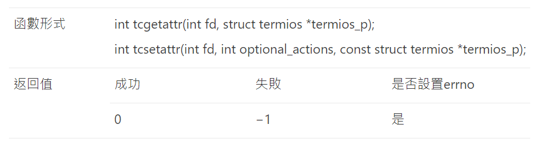
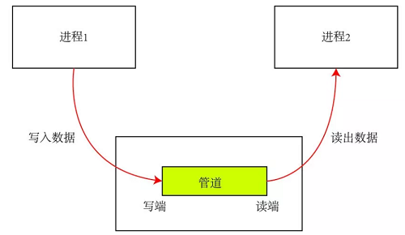
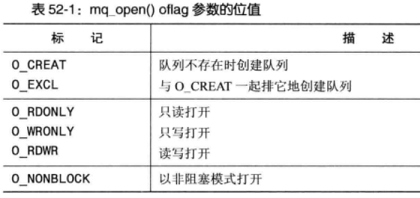
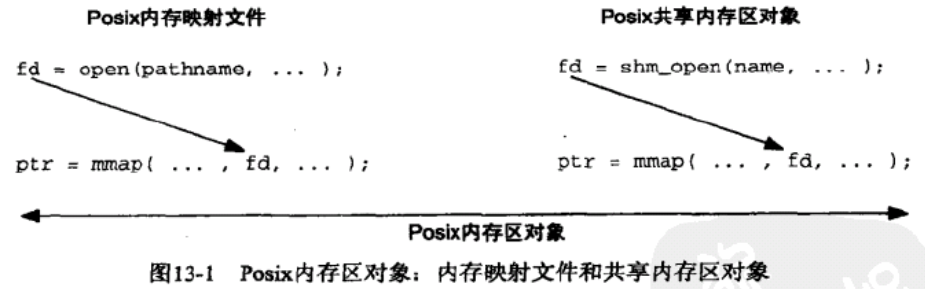
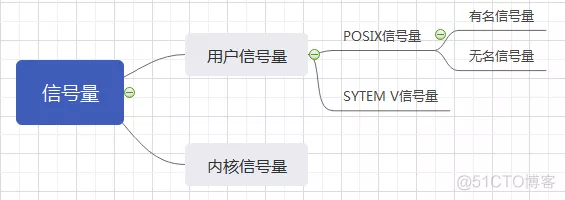

```Text
Author: Antony_Weng <weng851107@gmail.com>

This file is only used for the record of the learning process, only used by myself and the file has never been leaked out.
If there is related infringement or violation of related regulations, please contact me and the related files will be deleted immediately. Thank you!
```

# 目錄

- [Note](#0)
  - [學習教程](#0.1)
  - [C標準庫](#0.2)
  - [[直播公開課]韋東山老師嵌入式C語言加強](#0.3)
  - [2~32進位線上轉換器(含浮點數)](#0.4)
  - [網頁資訊](#0.5)
- [A ‘C’ Test: The 0x10 Best Questions for Would-be Embedded Programmers](#1)
- [Data Structure](#2)
- [VT100](#3)
  - [VT100字元型控制碼](#3.1)
  - [VT100數字型控制碼](#3.2)
  - [C語言 宏定義 輸出不同顏色字串](#3.3)
- [相關概念](#4)
  - [void與void*的用法](#4.1)
  - [getchar應用](#4.2)
  - [exit() & return](#4.3)
  - [sizeof() & strlen()](#4.4)
  - [實現不同log等級設置](#4.5)
- [Linux C](#5)
  - [命令行選項解析函數 getopt() & getopt_long()](#5.1)
  - [計算時間差 gettimeofday()](#5.2)
  - [FileOperation](#5.3)
  - [C 執行shell command並得到回傳字串](#5.4)
  - [linux c 底層系統調用函數open()](#5.5)
  - [Uart Tx & Rx 範例](#5.6)
    - [(linux c) struct termios](#5.6.1)
    - [tcflush()](#5.6.2)
    - [tcgetattr() & tcsetattr()](#5.6.3)
    - [cfsetispeed() & cfsetospeed()](#5.6.4)
  - [IPC (Interprocess Communication)](#5.7)
    - [管道](#5.7.1)
    - [消息隊列](#5.7.2)
    - [共享內存](#5.7.3)
    - [信號](#5.7.4)
    - [信號量](#5.7.5)
    - [基於socket的進程間通信](#5.7.6)
  - [Linux下的定時器：alarm()與setitimer()](#5.8)
  - [fork & vfork()](#5.9)
  - [exec函數族](#5.10)
  - [alias + weak](#5.11)
  - [內聯函數(inline)](#5.12)
  - [內建函數](#5.13)
  - [Linux內核使用的 likely 與 unlikely](#5.14)
- [C Standard Library](#6)
  - [time.h](#6.1)
    - [Conversion for time](#6.1.1)
  - [stdlib.h](#6.2)
    - [Dynamic memory management](#6.2.1)
    - [String conversion](#6.2.2)
    - [Environment](#6.2.3)
  - [stdio.h](#6.3)
    - [Macros & Type](#6.3.0)
    - [Formatted input/output](#6.3.1)
      - [printf(), fprintf(), sprintf(), snprintf() 相關用法](#6.3.1.1)
      - [scanf(), sscanf(), fscanf() 相關用法](#6.3.1.2)
      - [vprintf(), vfprintf() 相關用法](#6.3.1.3)
    - [Character input/output](#6.3.2)
      - [getc(), fgetc(), getchar(), gets(), fgets() 相關用法](#6.3.2.1)
      - [putc(), fputc(), putchar(), puts(), fputs() 相關用法](#6.3.2.2)
    - [File access](#6.3.3)
  - [string.h](#6.4)
    - [Copying](#6.4.1)
    - [Concatenation](#6.4.2)
    - [Comparison](#6.4.3)
    - [Searching](#6.4.4)
    - [memset() - Fill block of memory](#6.4.5)
    - [strlen() - Get string length](#6.4.6)
  - [assert.h - assert()](#6.5)
  - [stdarg.h - va_list](#6.6)
- [Json](#7)
  - [安裝 json-c library](#7.1)
  - [Function](#7.2)
  - [write_to_json_file](#7.3)
  - [read_from_json_file](#7.4)
  - [Example](#7.5)


<h1 id="0">Note</h1>

<h2 id="0.1">學習教程</h2>

### w3schools

https://www.w3schools.com/c/index.php

### GeeksforGeeks

https://www.geeksforgeeks.org/c-programming-language/?ref=ghm

### 菜鳥教程

https://www.runoob.com/cprogramming/c-tutorial.html

### 億聚網

https://www.1ju.org/cprogramming/index

<h2 id="0.2">C標準庫</h2>

### cplusplus for C standard library

https://cplusplus.com/reference/clibrary/

### GitBOOK for C standard library

http://tw.gitbook.net/c_standard_library/20130920395.html

### 菜鳥教程 for C standard library

https://www.runoob.com/cprogramming/c-standard-library.html

<h2 id="0.3">[直播公開課]韋東山老師嵌入式C語言加強</h2>

[[直播公開課]韋東山老師嵌入式C語言加強.md](./[直播公開課]韋東山老師嵌入式C語言加強/[直播公開課]韋東山老師嵌入式C語言加強.md)

<h2 id="0.4">2~32進位線上轉換器(含浮點數)</h2>

http://www.speedfly.cn/tools/hexconvert/

<h2 id="0.5">網頁資訊</h2>

[Windows, 用 VSCode 寫 C/C++ 教學](https://hackmd.io/@liaojason2/vscodecppwindows)

<h1 id="1">A ‘C’ Test: The 0x10 Best Questions for Would-be Embedded Programmers</h1>

- [0x10.md](./0x10.md)

- 英文原文網址 [A ‘C’ Test: The 0x10 Best Questions for Would-be Embedded Programmers](https://rmbconsulting.us/publications/a-c-test-the-0x10-best-questions-for-would-be-embedded-programmers/)

- 中文參考網址 [C語言測試 應知道的0x10個基本問題](https://creteken.pixnet.net/blog/post/24524138)

<h1 id="2">Data Structure</h1>

[DataStructure.md](./DataStructure/DataStructure.md)

<h1 id="3">VT100</h1>

- VT100是一個古老的終端定義,後面出現的終端幾乎都相容這種終端，有時又稱為ANSI Escape Sequence.

- VT100控制碼是用來在終端擴充套件顯示的程式碼

- 所有的VT100控制符是 \033打頭(即ESC的ASCII碼)用輸出字元語句來輸出。
  - 在命令列用`echo -e`命令
  - 在C程式中用`printf`來輸出VT100的控制字元

- 具體格式有兩種：
  - 一種數字形式, \033[<數字>m：
  - 一種是控制字元形式, 即最後一個字元不是m, 而是控制字元：

<h2 id="3.1">VT100字元型控制碼</h2>

   


<h2 id="3.2">VT100數字型控制碼</h2>


- `\033[30m – \033[37m` 為設置字顏色; `\033[40m – \033[47m` 為設置背景色

   

- 整理參考

    ```C
    /*************************************************************************
    僅供參考, 不一定正確
    1. 屬性變化
    控制碼 : [0m還原為黑底白字正常顯示狀態A
    控制碼 : [1m設定文字以高亮度顯示[0m
    控制碼 : [5m設定文字以閃爍方式顯示[0m
    控制碼 : [7m設定以反相方式(前景與背景對調)顯示[0m
    控制碼 : [1;5m設定文字以高亮度, 閃爍方式顯示[0m
    控制碼 : [5;7m設定文字以高亮度, 反相方式顯示[0m

    2.前景顏色
        控制碼
        [30m黑色字[0m
        [31m紅色字[0m
        [32m綠色字[0m
        [33m棕色字[0m
        [34m藍色字[0m
        [35m洋紅色字[0m
        [36m青藍色字[0m
        [37m淡灰色字[0m
        [1;30m黑色字[0m
        [1;31m淡紅色字[0m
        [1;32m淡綠色字[0m
        [1;33m黃色字[0m
        [1;34m淡藍色字[0m
        [1;35m淡洋紅色字[0m
        [1;36m淡青藍色字[0m
        [1;37m白色字[0m
    
    3.背景顏色
        控制碼
        [40m黑色底[0m
        [41m紅色底[0m
        [42m綠色底[0m
        [43m棕色底[0m
        [44m藍色底[0m
        [45m洋紅色底[0m
        [46m青藍色底[0m
        [47m淡灰色底[0m
    *************************************************************************/
    ```


<h2 id="3.3">C語言 宏定義 輸出不同顏色字串</h2>

```C
#include <stdio.h>

#define _RADAR_DELAY	sleep
#define RED 	"\033[0;32;31m"
#define GREEN 	"\033[0;32;32m"
#define BLUE	"\033[0;32;34m"
#define NOCOLOR "\033[m"

#define PRINT_RED(fmt, args...)               \
do{                                           \
	fprintf(stderr, RED fmt NOCOLOR, ##args); \
} while (0)

#define PRINT_GREEN(fmt, args...)              \
do {                                           \
	fprintf(stderr, GREEN fmt NOCOLOR, ##args);\
}while (0)

#define PRINT_BLUE(fmt, args...)               \
do {										   \
	fprintf(stderr, BLUE fmt NOCOLOR, ##args); \
} while(0)
```

<h1 id="4">相關概念</h1>

<h2 id="4.1">void與void*的用法</h2>

## void 的作用

1. 對函數返回的限定，這種情況我們比較常見。

   - 當函數不需要返回值值時，必須使用void限定。例如：void func（int a,char *b）。

2. 對函數參數的限定，這種情況也是比較常見的。

   - 當函數不允許接受參數時，必須使用void限定。例如：int func(void)。

## void 指针的使用规则

1. void 指針可以指向任意類型的數據，就是說可以用任意類型的指針對 void 指針對 void 指針賦值。例如：

    ```C
    int *a；
    void *p；
    p=a；
    ```

2. 如果要將 void 指針 p 賦給其他類型的指針，則需要強制類型轉換，就本例而言：`a=（int *）p`。在內存的分配中我們可以見到 void 指針使用：內存分配函數 malloc 函數返回的指針就是 `void *` 型，用戶在使用這個指針的時候，要進行強制類型轉換，也就是顯式說明該指針指向的內存中是存放的什麼類型的數據 `(int *)malloc(1024)` 表示強制規定 malloc 返回的 void* 指針指向的內存中存放的是一個個的 int 型數據。

   - 在 GNU 中則允許，因為在默認情況下，GNU 認為 `void *` 和 `char *` 一樣，既然是確定的，當然可以進行一些算術操作，在這裡`sizeof(*p)==sizeof(char)`。

   - 在 ANSI C 標準中，不允許對 void 指針進行一些算術運算如 p++ 或 p+=1 等，因為既然 void 是無類型，那麼每次算術運算我們就不知道該操作幾個字節

   - 如果指針 p1 和 p2 的類型相同，那麼我們可以直接在 p1 和 p2 間互相賦值；如果 p1 和 p2 指向不同的數據類型，則必須使用強制類型轉換運算符把賦值運算符右邊的指針類型轉換為左邊指針的類型。

        ```C
        float *p1;
        int *p2;
        p1 = p2;
        //其中p1 = p2語句會編譯出錯，
        //提示“'=' : cannot convert from 'int *' to 'float *'”，必須改為：
        p1 = (float *)p2;
        ```


        而 void * 則不同，任何類型的指針都可以直接賦值給它，無需進行強制類型轉換。

        ```C
        void *p1;
        int *p2;
        p1 = p2;
        ```

<h2 id="4.2">getchar應用</h2>

- 輸入一行字符，分別統計出其中英文字母、空格、數字和其它字符的個數

    ```C
    #include<stdio.h>

    int main()
    {
        char c;
        int letters = 0;
        int spaces = 0;
        int numbers = 0;
        int others = 0;

        printf("Please Input:");

        while((c=getchar()) != '\n'){
            if((c >= 'a' && c <= 'z') || (c >= 'A' && c <= 'Z')){
                letters++;
            }
            else if(c == ' '){
                spaces++;
            }
            else if((c >= 0) || (c <= 9)){
                numbers++;
            }
            else{
                others++;
            }
        }
        printf("letters:%d, spaces:%d, numbers:%d, others:%d\n", letters, spaces, numbers, others);

        return 0;
    }
    ```

<h2 id="4.3">exit() & return</h2>

- exit(0)表示程序正常退出；除了0之外，其他參數均代表程序異常退出，如：exit(1),exit(-1)。

- return；表示的是程序結束（return後沒有參數是因為void函數不返回任何值才會這樣用），return和exit作用大致相同。

- 但是在函數中就會有所區別，return會跳出函數，而exit會結束程序。

<h2 id="4.4">sizeof() & strlen()</h2>

```C
/*第一行定義c為一個字符指針變量，指向常量字符串，c裡面存放的是字符串的首地址*/
char *c = "abcdef";
/*第二行定義d為一個字符數組，以字符串的形式給這個字符數組賦值*/
char d[] = "abcdef";
/*第三行定義的也是個字符數組，以單個元素的形式賦值*/
char e[] = {'a','b','c','d','e','f'};

printf ( "%d %d/n" , sizeof(c) , strlen(c));
printf ( "%d %d/n" , sizeof(d) , strlen(d));
printf ( "%d %d/n" , sizeof(e) , strlen(e));

/******************
4 6
7 6
6 14
*******************/
```

- 當以字符串賦值時，"abcdef", 結尾自動加一個"/0"
- strlen(c)遇到/0就會結束，求的是字符串的長度，為6
- sizeof(c)求的是類型空間大小，在前面說過，指針型所點的空間大小是4個字節，系統地址總線長度為32位時

---

- strlen(d)也是一樣，字符串賦值，自動添加/0,求字符串的長度當然是6
- sizeof(d)是求這個數組所佔空間的大小，即數組所佔內存空間的字節數，應該為7

---

- sizeof(e), 數組e以單個元素賦值，沒有/0結束符，所以所佔空間的大小為6個字節
- strlen(e),去找/0結尾的字符串的長度，由於找不到/0，所以返回的值是一個不確定的值

### sizeof()

sizeof是一個C語言中的一個基本運算子，求的是數據類型所佔空間的位元組數大小，可以以型別、指標、陣列和函式等作為引數，回傳的型別為unsigned int

運算值在編譯的時候就出結果，所以可以用來定義陣列維數

```C
printf ( "char=%d/n" , sizeof ( char)); //1
printf ( "char*=%d/n" , sizeof ( char*)); //4

printf ( "int=%d/n" , sizeof ( int)); //4
printf ( "int*=%d/n" , sizeof ( int*)); //4

printf ( "long=%d/n" , sizeof ( long)); //4
printf ( "long*=%d/n" , sizeof ( long*)); //4

printf ( "double=%d/n" ,sizeof ( double)); //8
printf ( "double*=%d/n" , sizeof ( double*)); //4
```

- char, int, long, double 這些基本數據類型的長度是由編譯器本身決定的
- char*, int*, long*, double* 這些都是指針，指針就是地址，而地址的長度當前是由地址總線的位數決定的，32位元的處理器，故佔4個字節

### strlen()

strlen是一個函數，用來計算字符串的長度，以"\0"作為終止符。引數必須是字元型指標（char*）

strlen的結果執行的時候才出來，是計算字串長度的

```C
char a [ ] ="hello";                    /*數組a定義了一個字符串*/

char b [ ] = { 'h','e','l','l','o'};    /*數組b定義了一個字符數組*/

/*strlen ( a) , strlen ( b )的值分別是多少?*/
```

- strlen是求字符串的長度，字符串有個默認的結束符/0, 這個結束符是在定義字符串的時候系統自動加上去的，就像定義數組a一樣
- 數組b定義了一個字符數組，因為strlen找不到結束符，所以strlen(b)的長度就不確定的

<h2 id="4.5">實現不同log等級設置</h2>

可以透過巨集來控制不同等級log的訊息，根據使用情況來進行切換

```C
#include <stdio.h>
#include <stdarg.h>

#define ERR_LEVEL       1
#define WARN_LEVEL      2
#define INFO_LEVEL      3

#define DEBUG_LEVEL     3   /*log level setting*/
/*
 *  0: 關閉
 *  1: 只打印錯誤信息
 *  2: 打印警告與錯誤信息
 *  3: 打印全部信息
*/

void __attribute__((format(printf, 1, 2)))  INFO(char *fmt, ...)
{
#if (DEBUG_LEVEL >= INFO_LEVEL)
    va_list args;
    va_start(args, fmt);
    vprintf(fmt, args);
    va_end(args);
#endif
}

void __attribute__((format(printf, 1, 2)))  WARN(char *fmt, ...)
{
#if (DEBUG_LEVEL >= WARN_LEVEL)
    va_list args;
    va_start(args, fmt);
    vprintf(fmt, args);
    va_end(args);
#endif
}

void __attribute__((format(printf, 1, 2)))  ERR(char *fmt, ...)
{
#if (DEBUG_LEVEL >= ERR_LEVEL)
    va_list args;
    va_start(args, fmt);
    vprintf(fmt, args);
    va_end(args);
#endif
}

int main(void)
{
    ERR("ERR log level: %d\n", ERR_LEVEL);
    WARN("WARN log level: %d\n", WARN_LEVEL);
    INFO("INFO log level: %d\n", INFO_LEVEL);

    return 0;
}
```

<h1 id="5">Linux C</h1>

<h2 id="5.1">命令行選項解析函數 getopt() & getopt_long()</h2>

[C語言中getopt()和getopt_long()函式的用法](https://www.796t.com/content/1549371631.html)

[命令行選項解析函數(C語言)：getopt()和getopt](https://www.itread01.com/articles/1488862805.html)

getopt() 範例：

- 例題一

    ```C
    #include <unistd.h>
    #include <stdio.h>
    
    int main(int argc, char * argv[])
    {
        int ch;
        printf("\n\n");
        printf("optind:%d，opterr：%d\n",optind,opterr);
        printf("--------------------------\n");
        while ((ch = getopt(argc, argv, "ab:c:de::")) != -1)
        {
            printf("optind: %d\n", optind);
            switch (ch) 
            {
                case 'a':
                        printf("HAVE option: -a\n\n");   
                        break;
                case 'b':
                        printf("HAVE option: -b\n"); 
                        printf("The argument of -b is %s\n\n", optarg);
                        break;
                case 'c':
                        printf("HAVE option: -c\n");
                        printf("The argument of -c is %s\n\n", optarg);
                        break;
                case 'd':
                    printf("HAVE option: -d\n");
                        break;
                case 'e':
                        printf("HAVE option: -e\n");
                        printf("The argument of -e is %s\n\n", optarg);
                    break;
                case '?':
                        printf("Unknown option: %c\n",(char)optopt);
                        break;
                }
        }


    }
    ```

- 例題二

    ```C
    #include <unistd.h>
    #include <stdlib.h>
    #include <stdio.h>

    int main(int argc, char *argv[])
    {
        int opt;
        char *optstring = "a:b:c:d";

        while ((opt = getopt(argc, argv, optstring)) != -1)
        {
            printf("opt = %c\n", opt);
            printf("optarg = %s\n", optarg);
            printf("optind = %d\n", optind);
            printf("argv[optind - 1] = %s\n\n",  argv[optind - 1]);
        }

        return 0;
    }

    -------------------------------------------------------------

    cashey@ubuntu:~/Desktop/getopt$ ./test_getopt -a 100 -b 200 -c admin -d  
    opt = a  
    optarg = 100  
    optind = 3  
    argv[optind - 1] = 100  
    
    opt = b  
    optarg = 200  
    optind = 5  
    argv[optind - 1] = 200  
    
    opt = c  
    optarg = admin  
    optind = 7  
    argv[optind - 1] = admin  
    
    opt = d  
    optarg = (null)  
    optind = 8  
    argv[optind - 1] = -d  
    ```

getopt_long() 範例：

- 例題一

    ```C
    #include <unistd.h>
    #include <stdlib.h>
    #include <stdio.h>
    #include <getopt.h>

    int
    main(int argc, char **argv)
    {
    int opt;
    int digit_optind = 0;
    int option_index = 0;
    char *optstring = "a:b:c:d";
    static struct option long_options[] = {
        {"reqarg", required_argument, NULL, 'r'},
        {"noarg",  no_argument,       NULL, 'n'},
        {"optarg", optional_argument, NULL, 'o'},
        {0, 0, 0, 0}
    };

    while ( (opt = getopt_long(argc, argv, optstring, long_options, &option_index)) != -1)
    {
            printf("opt = %c\n", opt);
            printf("optarg = %s\n", optarg);
            printf("optind = %d\n", optind);
            printf("argv[optind - 1] = %s\n",  argv[optind - 1]);
            printf("option_index = %d\n", option_index);
    }

    return 0;
    }

    ---------------------------------------------------------------

    [ye@localhost c]$ ./test_getopt -a 100 --reqarg 100 --noarg
    opt = a
    optarg = 100
    optind = 3
    argv[optind - 1] = 100
    option_index = 0
    opt = r
    optarg = 100
    optind = 5
    argv[optind - 1] = 100
    option_index = 0
    opt = n
    optarg = (null)
    optind = 6
    argv[optind - 1] = --noarg
    option_index = 1
    ```

- 例題二

    ```C
    void print_help()
    {
        printf("\nCEC Radar test tool\n");
        printf("Usage: cec_radar_tester [para1] [para2]\n");
        printf("  -selftest, -t: selftest\n");
        printf("  --radartest, -T: radartest, average numbers (1~???)\n");
        printf("  --help, -h: print this help\n");
    }

    int main(int argc, char **argv)
    {
        const char *optstring = "hsbdtT:";

        static struct option long_options[] =
        {
            {"reset", no_argument, 0, 's'},
            {"reboot", no_argument, 0, 'b'},
            {"load_default", no_argument, 0, 'd'},
            {"selftest", no_argument, 0, 't'},
            {"radartest", required_argument, 0, 'T'},
            {"help", no_argument, 0, 'h'},
            {0, 0, 0, 0}
        };
        while((c = getopt_long(argc, argv, optstring, long_options, NULL)) != -1)
        {
            switch(c)
            {
            case 'h':
                print_help();
                break;
            case 's':
                funcs()
                break;
            case 'b': 
                funcb();
                break;
            case 'd': 
                funcd()
                break;
            case 't':
                funct()
                return 0;
                break;
            case 'T':
                funcT()
                return 0;
                break;
            case '?' : printf("Unknown parameter\n");
                break;
            default:
                print_help();
                break;
            }
    }
    }
    ```

<h2 id="5.2">計算時間差 gettimeofday()</h2>

`#include <sys/time.h>`

[程式開發 | [Linux][C] 使用 gettimeofday() 函式計算時間](https://nosleep.pixnet.net/blog/post/205120138-%E7%A8%8B%E5%BC%8F%E9%96%8B%E7%99%BC-%7C-%5Blinux%5D%5Bc%5D-%E4%BD%BF%E7%94%A8-gettimeofday()-%E5%87%BD%E5%BC%8F%E8%A8%88%E7%AE%97)

```C
/*[gettimeofday] 計時器*/

struct  timeval start;
struct  timeval end;
unsigned  long diff;
gettimeofday(&start,NULL);

/*.......Other Code.............*/

gettimeofday(&end,NULL);

diff = end.tv_sec-start.tv_sec;
printf("thedifference is %ld\n",diff);
```

[C语言用gettimeofday（）计算时间精确到毫秒/微秒](https://blog.csdn.net/G_Barble/article/details/88254628)

```C
#include <stdio.h>
#include <sys/time.h>

#define COUNT 50000000

int main()
{
    struct  timeval start;
    struct  timeval end;
    struct  timeval result;
    unsigned  long diff;
    gettimeofday(&start,NULL);

    for(int i = 0;i < COUNT;i++);

    gettimeofday(&end,NULL);
    timersub(&end, &start, &result);

    diff = result.tv_sec*1000 + (1.0*result.tv_usec)/1000;
    printf("the difference is %ld\n",diff);

    return 0;
}
```

<h2 id="5.3">FileOperation</h2>

`int _exec_rfs_cmd_return_str(char *cmd, char *reply, int reply_len);`

- 執行一個shell命令行然後回傳字串

`int _exec_rfs_cmd_return_int32(char *cmd, char *reply, int reply_len);`

- 執行一個shell命令行然後回傳整數

`int _read_file_16_return_int(const char *path);`

- 讀取檔案，並回傳整數

`int _write_int_to_file(const char *path, int val);`

- 寫整數到某檔案

`int _query_input_event_num_by_name(char *name, char *event, int elen);`

- 根據輸入的event name取得其對應的event num

- 舉例name=board_keys --> kbd event0, name=cg5251tc --> event1

    ```bash
    # cat /proc/bus/input/devices
    I: Bus=0019 Vendor=0001 Product=0001 Version=0100
    N: Name="board_keys"
    P: Phys=gpio-keys/input0
    S: Sysfs=/devices/platform/board_keys/input/input0
    U: Uniq=
    H: Handlers=kbd event0
    B: PROP=0
    B: EV=3
    B: KEY=10000000

    I: Bus=0000 Vendor=0000 Product=0000 Version=0000
    N: Name="cg5251tc"
    P: Phys=
    S: Sysfs=/devices/virtual/input/input1
    U: Uniq=
    H: Handlers=event1
    B: PROP=0
    B: EV=9
    B: ABS=10000000000
    ```

[FileOperation folder](./code/FileOperation/)

<h2 id="5.4">C 執行shell command並得到回傳字串</h2>

[SystemReplyDebugMsg.c](./code/SystemReplyDebugMsg.c)

<h2 id="5.5">linux c 底層系統調用函數open()</h2>

open是linux下的底層系統調用函數
fopen是c/c++下的標準I/O庫函數，帶輸入/輸出緩衝

linxu下的fopen是open的封裝函數，fopen最終還是要調用底層的系統調用open，進而調用在驅動實現的代碼

- open對應的文件操作有：close, read, write,ioctl 等

- fopen 對應的文件操作有：fclose, fread , fwrite, freopen, fseek, ftell, rewind等

- 簡單範例：

    ```C
    #include <stdio.h>
    #include <time.h>
    #include <sys/types.h>    
    #include <sys/stat.h>    
    #include <fcntl.h>

    const char *pathName = "wsx_out.txt";

    int main(){
        time_t t1,t2;
        int a = 1,b=12,c=1,key =20000000;
        int in, out, flag;   
        char buffer[1024] = "*send!";  

        // 1. 打开/创建，写入，关闭
        out = open(pathName, O_WRONLY|O_CREAT);  
        if (-1 == out) // 创建文件失败,则异常返回  
        {   printf("*001*\n");  
            return -1;   
        }     
        flag = 7;
        write(out, buffer, flag); 
        close(out); 

        // 2. 打开/创建，读取，关闭
        printf("*010*\n");
        out = open(pathName, O_RDWR|O_CREAT);
        if (-1 == out) // 创建文件失败,则异常返回  
        {     
            return -1;   
        }     
        printf("*020*\n");
        flag = read(out, buffer, 1024);
        printf("read str is :%.*s\n",flag,buffer);
        strcpy(buffer,"*return\r\n");
        flag =9;
        write(out, buffer, flag); 
        close(out); 

        /*3. 打开，清空，关闭*/
        out = open(pathName, O_RDWR|O_TRUNC); 
        close(out); 

        return 0;
    }
    ```

```C
int open(const char * pathname, int flags);
int open(const char * pathname, int flags, mode_t mode);
```

- flags：

    

- mode：

    

- 返回 0 值, 表示成功, 只要有一個權限被禁止則返回-1

    

<h2 id="5.6">Uart Tx & Rx 範例</h2>

[How to open, read, and write from serial port in C?](https://stackoverflow.com/questions/6947413/how-to-open-read-and-write-from-serial-port-in-c)

[stm32_uart.c](./code/Uart/stm32_uart.c)

- 開啟COM Port設備，進行 Uart Tx 與 Rx 的通訊

[stm32_uart_tx.c](./code/Uart/stm32_uart_tx.c)

- 開啟COM Port設備，以迴圈形式從 stdin 讀取數據 Tx 出去

[stm32_uart_rx.c](./code/Uart/stm32_uart_rx.c)

- 開啟COM Port設備，以迴圈形式 Rx 並輸出到 stdout

<h3 id="5.6.1">(linux c) struct termios</h3>

[termios.h](./code/Uart/termios.h)

**1. 數據成員：**

- 提供了一個常規的終端接口，用於控制非同步通信端口：

   ```C
   typedef unsigned char	cc_t;
   typedef unsigned int	speed_t;
   typedef unsigned int	tcflag_t;

   #define NCCS 32
   struct termios
   {
      tcflag_t c_iflag;		/* input mode flags */ /* 輸入模式 */
      tcflag_t c_oflag;		/* output mode flags */ /* 輸出模式 */
      tcflag_t c_cflag;		/* control mode flags */ /* 控制模式 */
      tcflag_t c_lflag;		/* local mode flags */  /* 本地模式 */
      cc_t c_line;			/* line discipline */ /*行控制line discipline */  
      cc_t c_cc[NCCS];		/* control characters */  /* 控制字符 */  
      speed_t c_ispeed;		/* input speed */ /*輸入波特率*/
      speed_t c_ospeed;		/* output speed */ /*輸出波特率*/
   #define _HAVE_STRUCT_TERMIOS_C_ISPEED 1
   #define _HAVE_STRUCT_TERMIOS_C_OSPEED 1
   };
   ```

**2. 作用：**

- 這個變量被用來提供一個健全的線路設置集 合, 如果這個端口在被用戶初始化前使用. 驅動初始化這個變量使用一個標準的數值集, 它拷貝自 tty_std_termios變量. 

- tty_std_termos 在 tty 核心被定義爲:

    ```C
    struct termios tty_std_termios = {
    .c_iflag = ICRNL | IXON,
    .c_oflag = OPOST | ONLCR,
    .c_cflag = B38400 | CS8 | CREAD | HUPCL,
    .c_lflag = ISIG | ICANON | ECHO | ECHOE | ECHOK |
    ECHOCTL | ECHOKE | IEXTEN,
    .c_cc = INIT_C_CC
    };
    ```

**3. 參數說明：**

[(程式前沿) Linux串列埠通訊之termios結構體](https://codertw.com/%E7%A8%8B%E5%BC%8F%E8%AA%9E%E8%A8%80/611281/#outline__1)

- c_oflag：
  - CSIZE：字元長度，取值範圍為CS5、CS6、CS7或CS8
  - PARENB：使用奇偶校驗
  - PARODD：對輸入使用奇偶校驗，對輸出使用偶校驗
  - CSTOPB：設定兩個停止位
  - CLOCAL：忽略調變解調器線路狀態
  - CREAD：使用接收器
  - CRTSCTS：使用RTS/CTS流控制

- c_iflag：
  - INPCK：允許輸入奇偶校驗
  - IGNBRK：忽略BREAK鍵輸入
  - IXON：允許輸入時對XON/XOFF流進行控制
  - IXOFF：允許輸入時對XON/XOFF流進行控制
  - IXANY：輸入任何字元將重啟停止的輸出

  - Note：

    ```Text
    軟體流控制（Software flow control）是在計算機數據鏈路中的一種流控制方法。

    當一端的數據連接不再能接受更多數據（或者接近這個狀態），它發送XOFF字節給另一端。
    另一端收到XOFF字節，掛起數據發送。

    一端如果準備好繼續接收數據，它發送XON字節給另一端，另一端恢復數據發送。
    ```

- c_oflag：
  - OPOST：處理後輸出

- c_lflag：
  - ICANON：使用標準輸入模式
  - ECHO：顯示輸入字元
  - ECHOE：如果ICANON同時設定，ERASE將刪除輸入的字元，WERASE將刪除輸入的單詞
  - ISIG：當輸入INTR、QUIT、SUSP或DSUSP時，產生相應的訊號

<h3 id="5.6.2">tcflush()</h3>

- tcflush函數刷清（扔掉）輸入緩存（終端驅動法度已接管到，但用戶法度尚未讀）或輸出緩存（用戶法度已經寫，但尚未發送）

    ```C
    int tcflush（int filedes，int quene）

    /***********************************
    quene数该当是下列三个常数之一:
        *TCIFLUSH  刷清输入队列
        *TCOFLUSH  刷清输出队列
        *TCIOFLUSH 刷清输入、输出队列

    例如：tcflush（fd，TCIFLUSH）;
    ***********************************/
    ```

- 在打開串口後，串口其實已經可以開始讀取 數據了 ，這段時間用戶如果沒有讀取，將保存在緩衝區裡，如果用戶不想要開始的一段數據，或者發現緩衝區數據有誤，可以使用這個函數清空緩衝

- 緩衝區又稱為緩存，是內存空間的一部分。也就是說，在內存空間中預留了一定的存儲空間，這些存儲空間用來緩衝出入或輸出的數據，這部分預留的空間就叫做緩衝區。
  - 緩衝區根據其對應的輸入設備還和輸出設備，分為輸入緩衝區和輸出緩衝區

<h3 id="5.6.3">tcgetattr() & tcsetattr()</h3>

- 爲了便於通過程序來獲得和修改終端參數，Linux還提供了tcgetattr函數和tcsetattr函數。
  - `tcgetattr()` 用於獲取終端的相關參數
    - 參數fd爲終端的文件描述符
    - 返回的結果保存在termios結構體中
  - `tcsetattr()` 用於設置終端參數
    - 參數fd爲打開的終端文件描述符
    - 參數optional_actions用於控制修改起作用的時間

        ```Text
        TCSANOW：不等數據傳輸完畢就立即改變屬性。
        TCSADRAIN：等待所有數據傳輸結束才改變屬性。
        TCSAFLUSH：清空輸入輸出緩衝區才改變屬性。
        ```

    - 結構體termios_p中保存了要修改的參數

    

  - 錯誤信息：

    ```Text
    EBADF：非法的文件描述符。
    EINTR：tcsetattr函數調用被信號中斷。
    EINVAL：參數optional_actions使用了非法值，或參數termios中使用了非法值。
    ENCTTY：非終端的文件描述符。
    ```

<h3 id="5.6.4">cfsetispeed() & cfsetospeed()</h3>

- 獲取波特率資訊是通過 `speed_t cfgetispeed(const struct termios *termios_p);` 和 `speed_t cfgetospeed(const struct termios *termios_p);` 函式來完成的

- 設置波特率：
  - 輸出： `int cfsetospeed(struct termios *termptr, speed_t speed);`
  - 成功返回0, 否則返回-1

  - 輸入： `int cfsetispeed(struct termios *termptr, speed_t speed);`
  - 成功返回0, 否則返回-1


<h2 id="5.7">IPC (Interprocess Communication)</h2>

在linux系統中進行程序間通訊時，會有比如 `共享記憶體（shm）`，`訊號量（sem）`，`訊息佇列（msg）` 等方式時，會發現有 **System v** 以及 **POSIX** 兩種不同的型別

Posix(Portable Operating System Interface for Computing Systems) 是由 IEEE 和 ISO/IEC 開發的一套標準

- 基於現有的UNIX 實踐和經驗，描述了作業系統的呼叫服務介面，用於保證編制的應用程式可以在原始碼一級上在多種作業系統上移植執行

System V

- System V 是 AT&T 的第一個商業UNIX版本(UNIX System III)的加強
- 傳統上，System V 被看作是兩種UNIX"風味"之一(另一個是 BSD)。然而，隨著一些並不基於這兩者程式碼的UNIX實現的出現，例如 Linux 和 QNX，這一歸納不再準確，但不論如何，像POSIX這樣的標準化努力一直在試圖減少各種實現之間的不同

**System V** 和 **POSIX** 是一種應用於系統的介面協議，POSIX相對於System V可以說是比較新的標準，語法相對簡單

在 **linux/unix** 系統程式設計中支援 **System V** 和 **POSIX**

- POSIX IPC中，每個IPC物件是有名稱的，而且名稱是一個很重要的概念，posix ipc使用ipc的名稱作為ipc的標識。mq_open(), sem_open(), shm_open()三個函式的第一個引數就是這個名稱，這個名稱不一定是在檔案系統中存在的名稱
- 指定操作的mode，例如O_RONLY、O_WRONLY、O_RDWR、O_CREAT、O_EXCL 等
- 在System V IPC中有一個重要的型別是key_t，在msget、semget、shmget函式操作中都需要利用這個型別是引數

### 共享內存

當內核空間和用戶空間存在大量數據交互時，共享內存映射就成了這種情況下的不二選擇。它能夠最大限度的降低內核空間和用戶空間之間的數據拷貝，從而大大提高系統的性能

兩個不同進程A、B共享內存時，同一塊物理內存被映射到進程A、B各自的進程地址空間。進程A可以即時看到進程B對共享內存中數據的更新，反之亦然

由於多個進程共享同一塊內存區域，必然需要某種同步機制，互斥鎖和信號量都可以

內存映射：將用戶空間的一段內存區域（即進程地址空間的內存映射段，其位於堆空間和棧空間之間）映射到內核空間，用戶對這段內存區域的修改可以直接反映到內核空間，同樣，內核空間對這段區域的修改也直接反映用戶空間，那麼對於內核空間和用戶空間兩者之間需要大量數據傳輸等操作的話效率是非常高的

https://hackmd.io/@sysprog/linux-shared-memory#SysV-%E5%85%B1%E4%BA%AB%E8%A8%98%E6%86%B6%E9%AB%94

#### system V共享內存

https://blog.51cto.com/u_15352922/3742131

`shmget`函數創建共享內存區，或者訪問一個存在的內存區

```C
#include <sys/ipc.h>  
#include <sys/shm.h>  

int shmget(key_t key, size_t size, int shmflg);
```

- key: 函數ftok返回值，或者IPC_PRIVATE
  - 當使用IPC_PRIVATE時，最好兩個進程空間是共享的，比如父子進程，否則當前進程產生的共享內存標識（返回值），在另一個進程裡面不易得到；


#### mmap內存映射


#### Posix共享內存

<h3 id="5.7.1">管道</h3>

管道是一種半雙工的通信方式，數據只能單向流動

管道分為無名管道(pipe)與有名管道(fifo)

- 無名管道(pipe)只能用於父子進程之間
- 有名管道(fifo)可以用於無親緣關係的進程之間

管道與管道之間通訊是透過一種只存在內存的文件系統，不屬於某種文件系統

當一個進程項管道中寫的內容被管道的另一端的進程讀出時，這個被讀出的內容每次都會被添加到管道緩衝區的末端，且每次都是從緩衝區的頭部讀出數據



pipe與FIFO都遵循先進後出，與stack的原則一樣，但不支持如lseek()等的文件定位操作

所需要的header file

```C
#include <sys/types.h>
#include <sys/stat.h>
#include <fcntl.h>
#include <unistd.h>
```

FIFO函數的創建: 成功回傳0，失敗回傳-1

- 若路徑名已經存在，就會返回 `EEXIST`錯誤

```C
int mkfifo(const char * pathname, mode_t mode);
```

- pathname 是路徑名，創建管道的名字
- mode 是FIFO的權限，與open()中mode參數相同

FIFO進程間通信

- 打開一個文件，管道的寫入端向文件寫入數據，管道讀取結束後，fifo_write程序也就不會再阻塞在終端

    ```C
    #include <stdio.h>
    #include <string.h>
    #include <sys/types.h>
    #include <sys/stat.h>
    #include <fcntl.h>
    #include <unistd.h>

    #define P_FIFO  "txt"

    int main()
    {
        int ret = 0;
        int fd;

        /*要寫入FIFO的數據*/
        char buf[20] = "hello write_fifo";
        
        /*創建FIFO*/
        ret = mkfifo(P_FIFO, 0777);
        if (ret < 0) {
            printf("create named pipe failed.\n");
            return -1;
        }

        fd = open(P_FIFO, O_WRONLY);
        if (fd < 0) {
            printf("open failed.\n");
            return -2;
        }

        /*寫入數據到FIFO*/
        write(fd, buf, sizeof(buf));

        /*關閉FIFO*/
        close(fd);

        return ret;
    }

    /*************************************
    wengweiting@ubuntu:~/tmp/FIFO$ ./fifo_write 
    wengweiting@ubuntu:~/tmp/FIFO$ 
    **************************************/
    ```

- 管道的讀取端從文件中讀取數據

    ```C
    #include <stdio.h>
    #include <string.h>
    #include <sys/types.h>
    #include <sys/stat.h>
    #include <fcntl.h>
    #include <unistd.h>

    #define P_FIFO  "txt"

    int main()
    {
        int ret = 0;
        int fd;

        /*要讀取FIFO的容器*/
        char buf[20] = "hello write_fifo";

        fd = open(P_FIFO, O_RDONLY);    /*O_RDONLY: 讀取模式, O_NONBLOCK: 非阻塞方式*/
        if (fd < 0) {
            printf("open failed.\n");
            return -1;
        }

        /*循環讀取FIFO*/
        while (1) {
            memset(buf, 0, sizeof(buf));
            if (read(fd, buf, sizeof(buf)) == 0) {
                printf("no data.\n");
            }
            else {
                printf("get data: %s\n", buf);
            }
            sleep(1);
        }

        /*關閉FIFO*/
        close(fd);

        return ret;
    }

    /*********************************
    wengweiting@ubuntu:~/tmp/FIFO$ ./fifo_read 
    get data: hello write_fifo
    **********************************/
    ```

- `prwxrwxr-x 1 wengweiting wengweiting    0 Dec 18 05:00 txt`: 從前面的字符串中的 p 可以知道這是一個管道文件

<h3 id="5.7.2">消息隊列</h3>

提供了一個進程向另一個進程發送一個數據塊的方式

每個數據塊都被認為含有一個類型，接收進程可以獨立地接收含有不同類型的數據結構

可以通過發送消息來避免命名管道的同步阻塞問題，但是消息隊列與命名管道一樣，每個數據塊都有一個最大長度的限制

消息隊列克服信號傳遞信息少與管道只能承載無格式字節流以及緩衝區大小收限等缺點

每個消息隊列都在系統範圍內對應唯一的鍵值。所以要獲得一個消息隊列的描述字，只需要提供該消息隊列的鍵值即可

#### system v

範例消息的數據結構：

```C
struct msgbuf {
    long mtype;
    char mtext[1];
}
```

(1) msgget 函數： 用來創建或訪問一個消息隊列

```C
int msgget(key_t key, int msgflg);
```

- 程序必須提供一個鍵值來命名某個特定的消息隊列
- `msgflg` 是一個權限標誌，可以與 `IPC_CREAT` 作 `|` 操作，表示若該鍵值未存在則創建
- 成功返回一個以 `key` 命名的消息隊列的標識符，失敗則返回-1

(2) msgsnd 函數： 向消息隊列發送一個消息

```C
int msgsnd(int msqid, const void * msgp, size_t msgsz, int msgflg);
```

- 將要發送的消息存儲在 `msgp` 指向的 `msgbuf結構` 中，消息大小由 `msgsz` 指定
- 調用成功時返回0，失敗時返回-1

(3) msgrcv 函數： 從一個消息隊列獲取消息

```C
int msgrcv(int msqid, void * msgp, size_t msgsz, long msgtyp, int msgflg);
```

- `msgtype` 可以實現一種簡單的接收優先級
  - = 0：獲取隊列中的第一個消息
  - \> 0：獲取具有相同消息類型的第一個信息
  - < 0：獲取類型等漁獲小於msgtype絕對值的第一個消息
- 調用成功時，返回接收到緩存區的字節數，消息被複製到由msgp指向用戶分配的緩存區，失敗則返回-1

(4) msgctl 函數： 控制消息隊列，該系統調用對由msgid標識的消息隊列執行cmd操作

```C
int msgctl(int msgid, int command, struct msgid_ds *buf);
```

- `IPC_STAT`：把 `msgid_ds結構` 中的數據設置為消息隊列的當前關聯值
- `IPC_SET`：把消息隊列的當前關聯值設置為 `msgid_ds結構` 中給出的值
- `IPC_RMID`：刪除消息隊列，成功返回0，否則返回-1

使用 `ipcs -q` 命令可以查看創建的消息隊列，消息隊列收到信息，messages就會加一

```bash
wengweiting@ubuntu:~/tmp/Queue$ ipcs -q

------ Message Queues --------
key        msqid      owner      perms      used-bytes   messages    
0x00123456 0          wengweitin 777        33           3
```

消息隊列間的通訊

- 向消息隊列發送消息

    ```C
    #include <stdio.h>
    #include <string.h>
    #include <sys/ipc.h>
    #include <sys/msg.h>

    int main(void)
    {
        int ret = 0;

        int msgid = msgget(0x123456, IPC_CREAT | 0777);
        if (msgid == -1) {
            perror("create msg queue fail");
            return -1;
        }
        printf("open msg success...\n");

        char *p = "hello world";

        ret = msgsnd(msgid, p, strlen(p), 0);
        if (ret == -1) {
            perror("send msgid fail");
            return -2;
        }

        return 0;
    }
    ```

- 獲取消息隊列中的信息

    ```C
    #include <stdio.h>
    #include <string.h>
    #include <sys/ipc.h>
    #include <sys/msg.h>

    int main(void)
    {
        int ret = 0;

        int msgid = msgget(0x123456, IPC_CREAT | 0777);
        if (msgid == -1) {
            perror("create msg queue fail");
            return -1;
        }
        printf("open msg success...\n");

        char buffer[1024] = {0};

        ret = msgrcv(msgid, buffer, 11, 0, 0);
        if (ret == -1) {
            perror("recv msgid fail");
            return -2;
        }

        printf("ret: %d buffer: %s\n", ret, buffer);

        return 0;
    }
    ```

刪除消息隊列

- 用命令 `ipcrm -q msqid`

    ```bash
    wengweiting@ubuntu:~/tmp/Queue$ ipcrm -q 0
    ```

- 使用 `msgctl`，寫 `IPC_RMID`

    ```C
    #include <stdio.h>
    #include <sys/ipc.h>
    #include <sys/msg.h>

    int main(void)
    {
        int ret = 0;

        int msgid = msgget(0x123456, IPC_CREAT | 0777);
        if (msgid == -1) {
            perror("create msg queue fail");
            return -1;
        }
        printf("success...!, msgid = %d\n", msgid);

        char buffer[1024] = {0};

        if (msgctl(msgid, IPC_RMID, NULL) == 0) {
            printf("remove success...\n");
        }

        return 0;
    }
    ```

#### POSIX

打開、關閉和斷開鏈接消息隊列

(1) mq_open()函數創建一個消息隊列或打開一個既有隊列

```C
#include <fcntl.h> /* Defines O_* constants */ 
#include <sys/stat.h> /* Defines mode constants */ 
#include <mqueue.h> 

mqd_t mq_open( const  char *name, int oflag );
mqd_t mq_open(const char *name, int oflag, mode_t mode, struct mq_attr *attr); 
```

- name：標識了消息隊列，必須使用斜線打頭後面跟著一個或多個非斜線字符的名字
- oflag：

    

- mode：指定了施加於新消息隊列之上的權限
- attr：是一個mq_attr結構，制定了新消息隊列的特性。如果attr為NULL，那麼將使用系統定義的默認特性創建隊列
- Returns a message queue descriptor on success, or (mqd_t) – 1 on error

(2) mq_close()函數關閉消息隊列描述符mqdes

```C
#include <mqueue.h>
int mq_close(mqd_t mqdes);
```

- Returns 0 on success, or – 1 on error

(3) mq_unlink()函數刪除通過name標識的消息隊列，並將隊列標記為在所有進程使用完該隊列之後銷毀該隊列

```C
#include <mqueue.h>
int mq_unlink( const  char * name);
```

- mq_close()並不會刪除消息隊列，mq_unlink()才會刪除消息隊列
- Returns 0 on success, or – 1 on error

消息隊列特性

(4) mq_getattr()函數返回一個包含與描述符mqdes相關聯的消息隊列的相關信息mq_attr結構

```C
#include <mqueue.h>
int mq_getattr(mqd_t mqdes, struct mq_attr * attr);
```

- 獲取消息隊列特性
- Returns 0 on success, or – 1 on error

(5) mq_setattr()函數設置與mqdes相關聯的消息隊列描述符的特性

```C
#include <mqueue.h>
int mq_setattr(mqd_t mqdes, const  struct mq_attr * newattr, struct mq_attr * oldattr);
```

- 修改消息隊列特性
- Returns 0 on success, or – 1 on error

交換信息

(6) mq_send()函數將位於msg_ptr指向的緩衝區中的消息添加到描述符mqdes所引用的消息隊列中

```C
#include <mqueue.h>
int mq_send(mqd_t mqdes, const  char * msg_ptr, size_t msg_len, unsigned int msg_prio);
```

- 發送消息
- Returns 0 on success, or – 1 on error
- msg_len參數指定了msg_ptr指向消息的長度，必須小於等於mq_msgsize。否則返回EMSGSIZE錯誤。長度為零是允許的
- msg_prio表示消息的優先級，0表示最低優先級，最大優先級為MQ_PRIO_MAX
- 一條消息被添加到隊列中時，它會被放置在隊列中具有相同優先級的所有消息之後
- 如果消息隊列滿，那麼後續mq_send()調回會阻塞直到隊列中存在可用空間為止，或者在O_NONBLOCK情況下立即失敗並返回EAGAIN錯誤

(7) mq_receive()函數從mqdes引用的消息隊列中刪除一條優先級最高、存在時間最長的消息，並將刪除的消息放置在msg_ptr指向的緩衝區

```C
#include <mqueue.h> 
ssize_t mq_receive(mqd_t mqdes, char * msg_ptr, size_t msg_len, unsigned int * msg_prio);
```

- 接收消息
- Returns number of bytes in received message on success, or – 1 on error
- msg_len指定msg_ptr指向的換種區中的可用字節數
- msg_len必須大於或等於隊列ms_msgsize，否則mq_receive()就會失敗並返回EMSGSIZE錯誤
- msg_prio不為NULL，那麼接收到消息的優先級就會被複製到msg_prio
- 如果消息隊列為空，那麼mq_receive()會阻塞直到存在可用的消息，或者在O_NONBLOCK情況下會立即失敗並返回EAGAIN

範例：

- 消息生產者 `gcc -o mq_send mq_send.c -lrt`

    ```C
    #include <fcntl.h>           /* For O_* constants */
    #include <sys/stat.h>        /* For mode constants */
    #include <mqueue.h>
    #include <stdio.h>
    #include <string.h>
    #include <unistd.h>
    #include <stdlib.h>

    #define MQ_NAME "/mq_0"

    struct smessage{
        char name[128];
        char content[1024];
    };

    int main(int argc, char** argv) 
    {
        int ret = 0;
        
        if (argc < 4)
        {
            printf("Usage: ./mq_write name message prio\n");
            return 0;
        }

        mqd_t mq_fd;
        // 打開或創建消息隊列，如果指定C_CREAT標誌位則需要提供額外兩個參數
        mq_fd = mq_open(MQ_NAME, O_RDWR|O_CREAT, 0, NULL);
        if (mq_fd == (mqd_t)-1)
        {
            perror(__FUNCTION__);
            return -1;
        }
        struct smessage msg;
        memset(&msg, 0, sizeof(msg));
        strncpy(msg.name, argv[1], strlen(argv[1]));
        strncpy(msg.content, argv[2], strlen(argv[2]));
        unsigned int prio = (unsigned int)atoi(argv[3]);

        // 發送消息
        ret = mq_send(mq_fd, (const char *)&msg, sizeof(msg), prio);
        if (ret == -1)
        {
            perror("mq_send error");
            return ret;
        }
        printf("mq_send succ\n");

        return 0;
    }

    /*******************************************************
    chicony@ubuntu:/mnt/disk2/SF/tmp/00/Queue$ sudo ./mq_send "Person" "Hi, I am Antony." 50
    mq_send succ
    chicony@ubuntu:/mnt/disk2/SF/tmp/00/Queue$ sudo ./mq_send "Animal" "Hi, Dog" 30
    mq_send succ
    chicony@ubuntu:/mnt/disk2/SF/tmp/00/Queue$ sudo ./mq_send "Animal" "Hi, Cat" 70
    mq_send succ
    chicony@ubuntu:/mnt/disk2/SF/tmp/00/Queue$ sudo ./mq_send "Food" "It smell so good. Barbecue" 10
    mq_send succ
    ********************************************************/
    ```

- 消息使用者 `gcc -o mq_recv mq_recv.c -lrt`

    ```C
    #include <fcntl.h>           /* For O_* constants */
    #include <sys/stat.h>        /* For mode constants */
    #include <mqueue.h>
    #include <stdio.h>
    #include <string.h>
    #include <unistd.h>
    #include <stdlib.h>

    // 消息隊列名字
    #define MQ_NAME "/mq_0"

    struct smessage{
        char name[128];
        char content[1024];
    };

    int main() 
    {
        mqd_t mq_fd;
        // 打開或創建消息隊列，如果指定O_CREAT，則需要填充額外兩個參數
        mq_fd = mq_open(MQ_NAME, O_RDWR|O_CREAT, 0, NULL);
        if (mq_fd == (mqd_t)-1)
        {
            perror(__FUNCTION__);
            return -1;
        }

        // 獲取消息隊列屬性，讀取消息的時候要用到
        struct mq_attr attr;
        if (mq_getattr(mq_fd, &attr) == -1)
        {
            perror("mq_getattr");
            return -1;
        }
        printf("mq_msgsize:%ld\n", attr.mq_msgsize);

        // 分配消息緩存
        char *buffer = malloc(attr.mq_msgsize);
        if (buffer == NULL)
        {
            printf("malloc error\n");
            return -1;
        }
        memset(buffer, 0, attr.mq_msgsize);
                
        struct smessage *msg;
        unsigned int prio = 0;

        // 讀取消息
        if (mq_receive(mq_fd, buffer,attr.mq_msgsize, &prio) != -1)
        {
            msg = (struct smessage*)buffer;
            printf("recv msg, name:%s, content:%s, prio:%lu\n", msg->name, msg->content, prio);
        }
        else
        {
            perror("mq_receive error");
        }

        // 釋放buffer
        free(buffer);

        // 關閉消息隊列
        mq_close(mq_fd);

        return 0;
    }

    /*********************************************************
    chicony@ubuntu:/mnt/disk2/SF/tmp/00/Queue$ sudo ./mq_recv 
    mq_msgsize:8192
    recv msg, name:Animal, content:Hi, Cat, prio:70
    chicony@ubuntu:/mnt/disk2/SF/tmp/00/Queue$ sudo ./mq_recv 
    mq_msgsize:8192
    recv msg, name:Person, content:Hi, I am Antony., prio:50
    chicony@ubuntu:/mnt/disk2/SF/tmp/00/Queue$ sudo ./mq_recv 
    mq_msgsize:8192
    recv msg, name:Animal, content:Hi, Dog, prio:30
    chicony@ubuntu:/mnt/disk2/SF/tmp/00/Queue$ sudo ./mq_recv 
    mq_msgsize:8192
    recv msg, name:Food, content:It smell so good. Barbecue, prio:10
    **********************************************************/
    ```

<h3 id="5.7.3">共享內存</h3>

共享內存就兩個不相干的進程之間可以直接訪問一段內存，共享內存在兩個正在運行的進程之間共享和傳遞數據是非常有效的方式

不同的進程會把共享的物理內存連接至自己的地址空間中

簡單來說就是映射一段能夠被其他內存所訪問的內存，這段內存由一個進程創建，但是多個進程都可以去訪問

共享內存是最快的IPC方式

共享內存的使用和信號量是相似的，都是使用接口的形式

#### system v

(1) 創建共享內存

```C
int shmget(key_t key, size_t size, int shmflg);
```

- `key_t key` 是共享內存段的命名
- `size_t size` 指定共享內存的容量
- `int shmflg` 是權限標誌，與 `IPC_CREAT` 進行 `|` 來創建
- 成功時返回一個關於key相關的標誌符，用於後續的共享內存函數，調用失敗時返回-1

(2) 啟動對共享內存的訪問

```C
void *shmat(int shm_id, const void *shm_addr, int shmflg);
```

- 創建完共享內存時，還不能被任何進程訪問，需要透過shmat來啟動共享內存的訪問，並把共享內存連接到當前進程的地址空間
- `shm_id` 是由shmget函數返回的共享內存標誌
- `shm_addr` 指定共享內存連接到當前進程中的地址位置，通常為空，讓系統來選擇共享內存的地址
- `shmflg` 標誌位，通常為0
- 調用成功時返回一個指向共享內存第一個字節的指針，失敗則返回-1

(3) 共享內存從當前內存中分離

```C
int shmdt(const void *shmaddr);
```

- 從共享內存中分離而不是刪除
- `shmaddr` 是shmat函數返回的地址指針
- 調用成功時返回0，失敗返回-1

(4) 控制共享內存

```C
int shmctl(int shm_id, int command, struct shmid_ds *buf);
```

- `shm_id` 是由shmget函數返回的共享內存標誌
- command參數是要採取的操作
  - `IPC_STAT`：把 `shmid_ds結構` 中的數據設置為共享內存的當前關聯值
  - `IPC_SET`：把共享內存的當前關聯值設置為 `shmid_ds結構` 中給出的值
  - `IPC_RMID`：刪除共享內存段，成功返回0，否則返回-1
- `struct shmid_ds *buf` 代表一個結構指針，指向共享內存的模式或訪問權限的結構

    ```C
    struct shmid_ds
    {
        uid_t shm_perm.uid;
        uid_t shmperm.gid;
        mode_t shm_perm.mode;
    }
    ```

共享內存間的通訊

- `ipcs -m` 查看相關資訊

    ```bash
    chicony@ubuntu:/mnt/disk2/SF/tmp/00/ShareMemory$ ipcs -m

    ------ Shared Memory Segments --------
    key        shmid      owner      perms      bytes      nattch     status
    0x00000066 1572869    chicony    666        1024       0                  
    ```

- shm_snd.c

    ```C
    #include <stdlib.h>
    #include <string.h>
    #include <signal.h>
    #include <fcntl.h>
    #include <sys/ipc.h>
    #include <sys/shm.h>

    #define SHM_SIZE    1024

    int main()
    {
        char * shmptr;
        /*創建共享內存*/
        int shmid = shmget(0x66, SHM_SIZE, IPC_CREAT | 0666);
        if (shmid < 0) {
            perror("shmget");
            return -1;
        }

        /*對共享內存的訪問*/
        shmptr = shmat(shmid, 0, 0);
        if (shmptr == (void *)-1) {
            perror("shmat");
            return -2;
        }

        /*往共享內存寫數據*/
        strcpy(shmptr, "shmat write ok");

        shmdt(shmptr);

        return 0;
    }
    ```

- shm_rcv.c

    ```C
    #include <stdlib.h>
    #include <string.h>
    #include <signal.h>
    #include <fcntl.h>
    #include <sys/ipc.h>
    #include <sys/shm.h>

    #define SHM_SIZE    1024

    int main()
    {
        char * shmptr;
        /*創建共享內存*/
        int shmid = shmget(0x66, SHM_SIZE, IPC_CREAT | 0666);
        if (shmid < 0) {
            perror("shmget");
            return -1;
        }

        /*對共享內存的訪問*/
        shmptr = shmat(shmid, 0, 0);
        if (shmptr == (void *)-1) {
            perror("shmat");
            return -2;
        }

        /*往共享內存寫數據*/
        strcpy(shmptr, "shmat write ok");

        shmdt(shmptr);

        return 0;
    }

    /**********************************************************
    chicony@ubuntu:/mnt/disk2/SF/tmp/00/ShareMemory$ ./shm_rcv 
    read: shmat write ok
    ***********************************************************/
    ```

刪除共享內存

- 使用 `ipcrm -m shmid` 命令刪除

- 使用 `shmctl`函數 寫入 `IPC_RMID` 指令刪除 

    ```C
    #include <stdio.h>
    #include <sys/ipc.h>
    #include <sys/shm.h>

    int main()
    {
        int ret = 0;

        /*創建共享內存*/
        int shmid = shmget(0x66, 0, 0);
        if (shmid < 0) {
            perror("shmget");
            return -1;
        }

        /*對共享內存的訪問*/
        ret = shmctl(shmid, IPC_RMID, NULL);
        if (ret < 0) {
            perror("remove shm fail");
            return -2;
        }

        printf("remove key: %d success ...\n", 0x66);

        return 0;
    }

    /********************************************************
    chicony@ubuntu:/mnt/disk2/SF/tmp/00/ShareMemory$ ./shmrm 
    remove key: 102 success ...
    *********************************************************/
    ```

#### POSIX

1. 記憶體對映檔案(memory-mapped file)，由open函式開啟，由mmap函式把所得到的描述符對映到當前程序空間地址中的一個檔案。
2. 共享記憶體區物件(shared-memory object)，由shm_open函式開啟一個Posix.1 IPC名字，所返回的描述符由mmap函式對映到當前程序的地址空間。



(1) shm_open函式 建立一個新的共享記憶體區物件或開啟一個已存在的共享記憶體區物件

```C
#include <sys/mman.h>
#include <sys/stat.h>        /* For mode constants */
#include <fcntl.h>           /* For O_* constants */

int shm_open(const char *name, int oflag, mode_t mode);

/*Link with -lrt.*/
```

- 成功則非負描述符，若出錯則為-1
- oflag引數與open函式的flags一樣，必須含有O_RDONLY或O_RDWR標準
- mode引數與open函式的mode一樣，是指定許可權位

(2) shm_unlink函式 刪除一個共享記憶體區物件的名字，刪除一個名字不會影響對於其底層支撐物件的現有引用，直到對於該物件的引用全部關閉為止

```C
#include <sys/mman.h>
#include <sys/stat.h>        /* For mode constants */
#include <fcntl.h>           /* For O_* constants */

int shm_unlink(const char *name);

/*Link with -lrt.*/
```

- 成功則為0，若出錯則為-1

(3)  mmap函式 把一個檔案或者一個Posix共享記憶體區物件對映至呼叫程序的地址空間

```C
#include <sys/mman.h>  

void *mmap(void *addr, size_t length, int prot, int flags, int fd, off_t offset);  
```

- 若成功則為被對映區的起始地址，若出錯則為MAP_FAILED
- addr可以指定描述符fd應被對映到程序內空間的起始地址，它通常被指定為一個空指標，這樣告訴核心自己去選擇起始地址
- length是對映到呼叫程序地址空間中位元組數，它從被對映檔案開頭offset個位元組出開始算
- offset通常設定為0
- 記憶體對映區的保護由port引數指定，通常設定為PROT_READ | PROT_WRITE（可讀與可寫）
  - PORT_READ    -> 可讀
  - PORT_WRITE  -> 可寫
  - PORT_EXEC    -> 可執行
  - PORT_NONE   -> 資料不可訪問
- flags用於設定記憶體對映區的資料被修改時，是否改變其底層支撐物件(這裡的物件是檔案)，MAP_SHARED和MAP_PRIVATE必須指定一個
  - MAP_SHARED：在記憶體中對檔案的修改會同步到物理檔案中，可通過less檢視
  - MAP_PRIVATE：在記憶體中對檔案的修改不會同步到物理檔案中，可通過less檢視

(4) ftruncate函式 來指定新建立的共享記憶體區物件的大小，或者修改已存在的物件的大小

```C
#include <unistd.h>
#include <sys/types.h>

int truncate(const char *path, off_t length);
int ftruncate(int fd, off_t length);
```

- 若成功則為0，若出錯則為-1

(5) fstat函式 獲取有關該物件的資訊

```C
#include <sys/types.h>
#include <sys/stat.h>
#include <unistd.h>

int fstat(int fd, struct stat *buf);
```

- 若成功則為0，若出錯則為-1
- stat結構有12個或以上的成員，然而當fd指代一個記憶體共享區物件時，只有四個成員含有資訊

    ```C
    struct stat {
        mode_t    st_mode;    /* protection */
        uid_t     st_uid;     /* user ID of owner */
        gid_t     st_gid;     /* group ID of owner */
        off_t     st_size;    /* total size, in bytes */
    };
    ```

(6) munmap函數 從某個程序空間刪除一個對映關係

```C
#include <sys/mman.h>

int munmap(void *addr, size_t length);
```

- 若成功則為0，若出錯則為-1
- addr引數是由mmap返回的地址，len是對映區的大小

範例

- 寫程序

    ```C
    #include <stdio.h>
    #include <sys/types.h>
    #include <sys/stat.h>
    #include <fcntl.h>
    #include <unistd.h>
    #include <sys/mman.h>
    #include <errno.h>
    #include <stdlib.h>
    #include <string.h>

    #define MAXSIZE 1024*4   /*共享記憶體的大小，建議設定成記憶體頁的整數倍*/
    #define FILENAME "shm.test"

    int main()
    {
        /* 建立共享物件,可以檢視/dev/shm目錄 */
        int fd = shm_open(FILENAME, O_CREAT | O_TRUNC | O_RDWR, 0777);
        if (fd == -1) {
            perror("open failed:");
            exit(1);
        }

        /* 調整大小 */
        if (ftruncate(fd, MAXSIZE) == -1) {
            perror("ftruncate failed:");
            exit(1);
        }

        /* 獲取屬性 */
        struct stat buf;
        if (fstat(fd, &buf) == -1) {
            perror("fstat failed:");
            exit(1);
        }
        printf("the shm object size is %ld\n", buf.st_size);

        /* 建立對映關係 */
        char *ptr = (char*)mmap(NULL, MAXSIZE, PROT_READ | PROT_WRITE, MAP_SHARED, fd, 0);
        if (ptr == MAP_FAILED) {
            perror("mmap failed:");
            exit(1);
        }
        printf("mmap %s success\n", FILENAME);
        close(fd); /* 關閉套接字 */

        /* 寫入資料 */
        char *content = "hello world";
        strncpy(ptr, content, strlen(content));

        return 0;
    }

    /******************************************************
    chicony@ubuntu:/mnt/disk2/SF/tmp/00/ShareMemory$ ./posix_shm_snd 
    the shm object size is 4096
    mmap shm.test success
    *******************************************************/
    ```

- 讀程序

    ```C
    #include <stdio.h>
    #include <sys/types.h>
    #include <sys/stat.h>
    #include <fcntl.h>
    #include <unistd.h>
    #include <sys/mman.h>
    #include <errno.h>
    #include <stdlib.h>
    #include <string.h>

    #define FILENAME "shm.test"

    int main()
    {
        /* 建立共享物件,可以檢視/dev/shm目錄 */
        int fd = shm_open(FILENAME, O_RDONLY, 0);
        if (fd == -1) {
            perror("open failed:");
            exit(1);
        }

        /* 獲取屬性 */
        struct stat buf;
        if (fstat(fd, &buf) == -1) {
            perror("fstat failed:");
            exit(1);
        }
        printf("the shm object size is %ld\n", buf.st_size);

        /* 建立對映關係 */
        char *ptr = (char*)mmap(NULL, buf.st_size, PROT_READ, MAP_SHARED, fd, 0);
        if (ptr == MAP_FAILED) {
            perror("mmap failed:");
            exit(1);
        }
        printf("mmap %s success\n", FILENAME);
        close(fd); /* 關閉套接字 */

        printf("the read msg is:%s\n", ptr);

        return 0;
    }

    /*********************************************************
    chicony@ubuntu:/mnt/disk2/SF/tmp/00/ShareMemory$ ./posix_shm_rcv 
    the shm object size is 4096
    mmap shm.test success
    the read msg is:hello world
    *********************************************************/
    ```

<h3 id="5.7.4">信號</h3>

信號的主要來源分為兩部分

- 硬件來源
- 軟件來源

進程可以用三種方式來響應一個信號

- 忽略信號：不對信號作任何操作，其中有兩個信號是不能忽略的，`SIGKILL` 和 `SIGSTOP`
- 捕捉信號：定義信號處理函數，當信號來到時作出響應的處理
- 執行默認操作：Linux對每種信號都規定了默認操作

發送信號的函數有：`kill()`, `raise()`, `abort()`, `alarm()`

`kill()`函數會向包括它本身在內的其它進程發送一個信號，即把信號sig發送給進程號為PID的進程，成功時返回0，失敗會返回1，失敗的原因如下：

- 給定的信號無效
- 發送權限不夠
- 目標進程不存在

    ```C
    #include <sys/types.h>
    #include <signal.h>

    /*把信號sig發送給進程號為PID的進程，成功時返回0*/
    int kill(pid_t pid, int sig);
    ```

信號處理 `signal`函數：程序可以用來處理指定的信號

```C
typedef void (*sighandler_t)(int);
sighandler_t signal(int signum, sighandler_t handler);
```

- 範例：第一次按 `ctrl + c` 時進程不會退出，第二次按下才會退出

    ```C
    #include <stdio.h>
    #include <signal.h>
    #include <unistd.h>

    /*函數ouch對通過參數sig傳遞進來的信號作出響應*/
    void ouch(int sig)
    {
        printf("signal %d\n", sig);
        /*恢復終端中斷信號 SIGINT 的默認行為*/
        (void)signal(SIGINT, SIG_DFL);
    }

    int main()
    {
        /*改變終端中斷信號 SIGINT 的默認行為，使之執行ouch函數*/
        (void)signal(SIGINT, ouch);

        while(1)
        {
            printf("Hello World! \n");
            sleep(1);
        }

        return 0;
    }

    /*******************************************************
    chicony@ubuntu:/mnt/disk2/SF/tmp/00/Signal$ ./signal 
    Hello World! 
    Hello World! 
    ^Csignal 2
    Hello World! 
    Hello World! 
    ^C
    ********************************************************/
    ```

常見的信號：

- `SIGHUP` 從終端上發出的結束信號
- `SIGINT` 來自鍵盤的中段信號(Ctrl +C)
- `SIGKILL` 該信號結束接收信號的進程
- `SIGTERM` kill命令發出的信號
- `SIGCHLD` 標識子進程停止或結束的信號
- `SIGSTOP` 來自鍵盤(Ctrl + Z)或調試程序的停止執行信號

`kill`函數 是可以向自身發出信號和其它進程發送信號的，`raise`與之不同的是只可以向本身發送信號

- 調用 raise 時子進程就會暫停，信號是對終端機的一種模擬，也是一種異步通訊方式

    ```C
    #include <stdio.h>
    #include <signal.h>
    #include <sys/wait.h>
    #include <sys/types.h>

    int main()
    {
        pid_t pid;
        int ret;

        if ((pid = fork()) < 0) {
            printf("Fork error\n");
            exit(1);
        }

        /*子進程*/
        if (pid == 0) {
            /*在子進程中使用raise()函數發出SIGSTOP信號，使子進程暫停*/
            printf("I am child pid: %d. I am waiting for any signal\n", getpid());
            raise(SIGSTOP);
            printf("I am child pid: %d. I am killed by progress: %d\n", getpid(), getppid());
            exit(0);
        }
        /*父進程*/
        else {
            sleep(2);
            /*在父進程中收集子進程發出的信號，並調用kill()函數進行相應的操作*/
            if ((waitpid(pid, NULL, WNOHANG)) == 0) {
                /*若pid指向的子進程沒有退出，則返回0，且父進程不阻塞，繼續執行下面的語句*/
                if ((ret = kill(pid, SIGKILL)) == 0) {
                    printf("I am parent pid: %d. I am kill %d\n", getpid(), pid);
                }
            }
            /*等待子進程退出，否則就一直阻塞*/
            waitpid(pid, NULL, 0);
            exit(0);
        }
    }

    /********************************************************
    chicony@ubuntu:/mnt/disk2/SF/tmp/00/Signal$ ./raise 
    I am child pid: 7808. I am waiting for any signal
    I am parent pid: 7807. I am kill 7808
    *********************************************************/
    ```

waitpid()函數的用法

```C
#include <sys/types.h>
#include <sys/wait.h>

pid_t waitpid(pid_t pid, int *status, int options);
```

- 在調用waitpid()函數時，當指定等待的子進程已經停止運行或結束了，則waitpid()會立即返回。但是如果子進程還沒有停止運行或結束，則調用waitpid()函數的父進程則會被阻塞，暫停運行

- `int *status` 將保存子進程的狀態信息，如果status不是空指針，則狀態信息將被寫入指向的位置，如果不關心子進程為什麼退出的話，也可以傳入空指針
- `int options` 提供了一些另外的選項來控制waitpid()函數的行為。如果不想使用這些選項，則可以把這個參數設為0
  - `WNOHANG`：如果pid指定的子進程沒有結束，則waitpid()函數立即返回0，而不是阻塞在這個函數上等待；如果結束了，則返回該子進程的進程號。
  - `WUNTRACED`：如果子進程進入暫停狀態，則馬上返回

<h3 id="5.7.5">信號量</h3>

Linux 提供兩類信號量：

- 內核信號量，由內核控制路徑使用。
- 用戶態進程使用的信號量，這種信號量又分為**POSIX 信號量**和**System V 信號量**

    

POSIX 信號量的引用頭文件是"<semaphore.h>"，而System V 信號量的引用頭文件是"<sys/sem.h>"

System V 信號量是計數信號量集，Posix 信號量是單個計數信號量

- 二值信號量：其值只有兩種0或1，相當於互斥量，當值為1時資源可用；而當值為0時，資源被鎖住，進程阻塞無法繼續執行
- 計數信號量：其值是在0到某個限制值之間的信號量

信號量只有兩種操作

- 等待信號 P(sv)：如果sv > 0，則sv = sv - 1; 如果sv == 0，則掛起該進程的執行
- 發送信號 V(sv)：如果其它進程因等待sv而被掛起，則讓他恢復運行; 如果沒有進程因等待sv而掛起，則sv = sv + 1

在信號量進行PV操作時都為原子操作（因為它需要保護臨界資源）
注：原子操作：單指令的操作稱為原子的，單條指令的執行是不會被打斷的

#### system v

不相關的進程可以通過它訪問一個信號量，它代表程序可能要使用的某個資源，程序對所有信號量的訪問都是間接的，先通過調用semget函數並提供一個鍵，再由系統生成一個相應的信號標識符(semget函數的返回值)，只有semget函數直接使用信號量鍵，其他的信號量函數使用由semget函數返回的信號量標識符

如果多個程序使用相同的key值，key將負責協調工作

(1) semget 函數：創建一個新信號量或取得一個已有信號量

```C
int semget(key_t key, int nsems, int semflg);
```

- `key_t key` 是整數型
- `int nsems` 制定需要的信號數量，通常情況下為1
- `int semflg` 標誌位，可以和 `IPC_CREAT` 作 `|` 運算
- 成功返回一個相應信號標識符(非零)，失敗則返回-1

(2) semop 函數：改變信號量的值

```C
int semop(int semid, struct sembuf *sops, unsigned nsops);
```

- 對信號量進行PV操作
  - sem_op 大於0，表示進程對資源使用完畢，交回該資源，即對該信號量執行V操作，交回的資源數由sem_op決定， 系統會把sem_op的值加到該信號量的信號量當前值semval上
  - sem_op 小於0，表示進程希望使用資源，對該信號量執行P操作，當信號量當前值semval 大於或者等於-sem_op時，semval減掉sem_op的絕對值， 為該進程分配對應數目的資源
  - sem_op 等於0，表示進程要阻塞等待，直至信號量當前值semval 變為0

- `struct sembuf *sops` 是一個指針，指向一個數組，元素用來描述對semid代表的信號量集合中第幾個信號進行什麼操作

    ```C
    /* semop system calls takes an array of these. */
    struct sembuf {
        unsigned short  sem_num;	/* semaphore index(0 ~ nsems-1) in array */
        short		sem_op;		/* semaphore operation(>0, 0, <0) */
        short		sem_flg;	/* operation flags(0， IPC_WAIT, SEM_UNDO) */
    };
    ```

- `unsigned nsops` 規定該數組中操作的數量
- 返回0代表成功，返回-1表示失敗

(3) semctl 函數：用來直接控制信號量信息

```C
int semctl(int semid, int semnum, int, ...);
```

- semget並不會初始化每個信號量，必須通過 `SETVAL` 命令或 `SETALL` 命令調用 semctl 來完成

  - GETVAL - 返回指定信號量當前值
  - SETVAL - 設置指定信號量的值
  - IPC_RMIN - 刪除信號量集合

信號量的出現就是保證資源在一個時刻只能有一個進程(線程)，也就是說，信號量是協調進程對共享資源操作的，起到了類似互斥鎖的作用，但卻比鎖擁有更強大的功能

```C
#include <stdio.h>
#include <linux/sem.h>

#define NUMS    10

/*取得當前信號量*/
int get_sem_val(int sid, int semnum)
{
    return semctl(sid, semnum, GETVAL, 0);
}

int main(void)
{
    int i;
    int sem_id;
    int pid;
    int ret;
    struct sembuf sem_op;    /*信號量結構*/
    union semun sem_val;    /*信號量數值*/

    /*建立信號量集，其中只有一個信號量*/
    /*IPC_PRIVATE私有，只有本用戶使用，如果為正整數，則為公共的*/
    /*1為信號集的數量*/
    sem_id = semget(IPC_PRIVATE, 1, IPC_CREAT | 0600);
    if (sem_id == -1) {
        printf("create sem error!\n");
        exit(1);
    }
    printf("create %d sem success!\n", sem_id);

    /*信號量初始化*/
    sem_val.val = 1;
    /*設置信號量，0為第一個信號量，1為第二個信號量，以此類推; SETVAL表示設置*/
    ret = semctl(sem_id, 0, SETVAL, sem_val);
    if (ret < 0) {
        printf("initlize sem error!\n");
        exit(1);
    }

    /*創建進程*/
    pid = fork();
    if (pid < 0) {
        printf("fork error!\n");
        exit(1);
    }
    /*一個子進程，使用者*/
    else if (pid == 0) {
        for (i = 0;i < NUMS;i++) {
            sem_op.sem_num = 0;
            sem_op.sem_op = -1;
            sem_op.sem_flg = 0;
            semop(sem_id, &sem_op, 1);  /*操作信號量，每次-1*/
            printf("%d 使用者: %d\n", i, get_sem_val(sem_id, 0));
        }
    }
    /*父進程*/
    else {
        for (i = 0;i < NUMS;i++) {
            sem_op.sem_num = 0;
            sem_op.sem_op = 1;
            sem_op.sem_flg = 0;
            semop(sem_id, &sem_op, 1);  /*操作信號量，每次+1*/
            printf("%d 製造者: %d\n", i, get_sem_val(sem_id, 0));            
        }
    }
    exit(0);
}

/***************************************************
wengweiting@ubuntu:~/tmp/Semaphore$ ./semaphore 
create 0 sem success!
0 製造者: 2
1 製造者: 3
2 製造者: 4
3 製造者: 5
4 製造者: 6
5 製造者: 7
6 製造者: 8
7 製造者: 9
8 製造者: 10
9 製造者: 11
0 使用者: 10
1 使用者: 9
2 使用者: 8
3 使用者: 7
4 使用者: 6
5 使用者: 5
6 使用者: 4
7 使用者: 3
8 使用者: 2
9 使用者: 1
****************************************************/
```

#### POSIX

在POSIX標準中，信號量分兩種，一種是無名信號量，一種是有名信號量。差異在於創建和銷毀的形式上，但是其他工作一樣。

- 無名信號量
  - 一般用於同一個進程中線程間同步或互斥
  - 直接保存在內存中
- 有名信號量
  - 一般用於進程間同步或互斥
  - 要求創建一個文件

臨界區域是指執行數據更新的代碼需要獨占式地執行。而信號量就可以提供這樣的一種訪問機制，讓一個臨界區同一時間只有一個進程/線程在訪問它， 因此信號量是可以用來調協進程/線程對共享資源的訪問的。

一個信號量的計數值用於對應有效的資源數， 表示剩下的可被佔用的互斥資源數：

- 0：表示沒有可用的信號量，進程/線程進入睡眠狀態，直至信號量值大於0
- 正值：表示有一個或多個可用的信號量，進程/線程可以使用該資源。進程/線程將信號量值減1， 表示它使用了一個資源單位

對信號量的操作可以分為兩個：

- P 操作：如果有可用的資源（信號量值大於0），則佔用一個資源（給信號量值減去一，進入臨界區代碼）; 如果沒有可用的資源（信號量值等於0），則被阻塞到，直到系統將資源分配給該進程/線程（進入等待隊列， 一直等到資源輪到該進程/線程）。這就像你要把車開進停車場之前，先要向保安申請一張停車卡一樣， P操作就是申請資源，如果申請成功，資源數（空閒的停車位）將會減少一個，如果申請失敗，要不在門口等，要不就走人。
- V 操作：如果在該信號量的等待隊列中有進程/線程在等待資源，則喚醒一個阻塞的進程/線程。如果沒有進程/線程等待它， 則釋放一個資源（給信號量值加一），就跟你從停車場出去的時候一樣，空閒的停車位就會增加一個。

**有名信號量**

有名信號量其實是一個文件，它的名字由類似 "sem.[信号量名字]" 這樣的字符串組成，它是一個特殊的信號量文件，在創建成功之後，系統會將其放置在 `/dev/shm` 路徑下， 不同的進程間只要約定好一個相同的信號量文件名字，就可以訪問到對應的有名信號量， 並且借助信號量來進行同步或者互斥操作

有名信號量是一個文件，在進程退出之後它們並不會自動消失， 而需要手工刪除並釋放資源。

```C
sem_t *sem_open(const char *name, int oflag, mode_t mode, unsigned int value);
```

- 打開/創建一個有名信號量
- name：打開或者創建信號量的名字。
- oflag：當指定的文件不存在時，可以指定O_CREATE 或者O_EXEL進行創建操作， 如果指定為0，後兩個參數可省略，否則後面兩個參數需要帶上。
- mode：數字表示的文件讀寫權限，如果信號量已經存在，本參數會被忽略。
- value：信號量初始的值，這這個參數只有在新創建的時候才需要設置，如果信號量已經存在，本參數會被忽略。
- 返回值：返回值是一個sem_t類型的指針，它指向已經創建/打開的信號量， 後續的函數都通過改信號量指針去訪問對應的信號量。

```C
int sem_wait(sem_t *sem);
```

- 等待（獲取）信號量
  - 如果信號量的值大於0，將信號量的值減1，立即返回
  - 如果信號量的值為0， 則進程/線程阻塞
- 相當於P操作。成功返回0，失敗返回-1

```C
int sem_trywait(sem_t *sem);
```

- 也是等待信號量
- 如果指定信號量的計數器為0，那麼直接返回EAGAIN錯誤，而不是阻塞等待

```C
int sem_post(sem_t *sem);
```

- 釋放信號量，讓信號量的值加1，相當於V操作。成功返回0，失敗返回-1

```C
int sem_close(sem_t *sem);
```

- 關閉一個信號量，這表示當前進程/線程取消對信號量的使用，它的作用僅在當前進程/線程， 其他進程/線程依然可以使用該信號量

```C
int sem_unlink(const char *name);
```

- 主動刪除一個信號量，直接刪除指定名字的信號量文件

範例

```C
#include <unistd.h>
#include <stdio.h>
#include <pthread.h>
#include <semaphore.h>
#include <stdlib.h>
#include <stdio.h>
#include <sys/types.h>
#include <fcntl.h>
#include <sys/wait.h>

int main(int argc, char **argv)
{
    int pid;
    sem_t *sem;
    const char sem_name[] = "my_sem_test";

    pid = fork();

    if (pid < 0) {
        printf("error in the fork!\n");
    }
    /* 子进程 */
    else if (pid == 0) {
        /*创建/打开一个初始值为1的信号量*/
        sem = sem_open(sem_name, O_CREAT, 0644, 1);

        if (sem == SEM_FAILED) {
            printf("unable to create semaphore...\n");

            sem_unlink(sem_name);

            exit(-1);
        }
        /*获取信号量*/
        sem_wait(sem);

        for (int i = 0; i < 3; ++i) {

            printf("child process run: %d\n", i);
            /*睡眠释放CPU占用*/
            sleep(1);
        }

    /*释放信号量*/
    sem_post(sem);

    }
    /* 父进程 */
    else {

        /*创建/打开一个初始值为1的信号量*/
        sem = sem_open(sem_name, O_CREAT, 0644, 1);

        if (sem == SEM_FAILED) {
            printf("unable to create semaphore...\n");

            sem_unlink(sem_name);

            exit(-1);
        }
        /*申请信号量*/
        sem_wait(sem);

        for (int i = 0; i < 3; ++i) {

            printf("parent process run: %d\n", i);
            /*睡眠释放CPU占用*/
            sleep(1);
        }

        /*释放信号量*/
        sem_post(sem);
        /*等待子进程结束*/
        wait(NULL);

        /*关闭信号量*/
        sem_close(sem);
        /*删除信号量*/
        sem_unlink(sem_name);
    }

    return 0;
}

/**************************************************
wengweiting@ubuntu:~/tmp/Semaphore$ ./semaphore1 
parent process run: 0
parent process run: 1
parent process run: 2
child process run: 0
child process run: 1
child process run: 2
***************************************************/
```

**無名信號量**

不使用文件系統標識，直接存在程序運行的內存中， 不同進程之間不能訪問，不能用於不同進程之間相互訪問


```C
int sem_init(sem_t *sem， int pshared， unsigned int value);
```

- 初始化信號量
- sem是要初始化的信號量，不要對已初始化的信號量再做sem_init操作，會發生不可預知的問題
- pshared表示此信號量是在進程間共享還是線程間共享，由於目前Linux 還沒有實現進程間共享無名信號量， 所以這個值只能夠取0，表示這個信號量是當前進程的局部信號量
- value是信號量的初始值
- 返回值：成功返回0，失敗返回-1

```C
int sem_destroy(sem_t *sem);
```

- 銷毀信號量，其中sem是要銷毀的信號量
- 只有用sem_init初始化的信號量才能用sem_destroy()函數銷毀
- 成功返回0，失敗返回-1

```C
int sem_wait(sem_t *sem);
int sem_trywait(sem_t *sem);
int sem_post(sem_t *sem);
```

- 與有名信號量的使用是一樣的

範例

```C
#include <unistd.h>
#include <stdio.h>
#include <stdlib.h>
#include <pthread.h>
#include <semaphore.h>

#define THREAD_NUMBER 3 /* 线程数 */
#define REPEAT_NUMBER 4 /* 每个线程中的小任务数 */

sem_t sem[THREAD_NUMBER];

/*线程函数*/
void *thread_func(void *arg)
{
    int num = (unsigned long long)arg;
    int delay_time = 0;
    int count = 0;

    /* 等待信号量，进行 P 操作 */
    sem_wait(&sem[num]);

    printf("Thread %d is starting\n", num);
    for (count = 0; count < REPEAT_NUMBER; count++)
    {
        printf("\tThread %d: job %d \n",num, count);
        sleep(1);
    }

    printf("Thread %d finished\n", num);
    /*退出线程*/
    pthread_exit(NULL);
}


int main(void)
{
    pthread_t thread[THREAD_NUMBER];
    int i = 0, res;
    void * thread_ret;

    /*创建三个线程，三个信号量*/
    for (i = 0; i < THREAD_NUMBER; i++)
    {
        /*创建信号量，初始信号量值为0*/
        sem_init(&sem[i], 0, 0);
        /*创建线程*/
        res = pthread_create(&thread[i], NULL, thread_func, (void*)(unsigned long long)i);

        if (res != 0)
        {
            printf("Create thread %d failed\n", i);
            exit(res);
        }
    }

    printf("Create treads success\n Waiting for threads to finish...\n");

    /*按顺序释放信号量 V操作*/
    for (i = 0; i<THREAD_NUMBER ; i++)
    {
        /* 进行 V 操作 */
        sem_post(&sem[i]);
        /*等待线程执行完毕*/
        res = pthread_join(thread[i], &thread_ret);
        if (!res)
        {
            printf("Thread %d joined\n", i);
        }
        else
        {
            printf("Thread %d join failed\n", i);
        }

    }

    for (i = 0; i < THREAD_NUMBER; i++)
    {
        /* 删除信号量 */
        sem_destroy(&sem[i]);
    }

    return 0;
}

/****************************************************
wengweiting@ubuntu:~/tmp/Semaphore$ ./semaphore2 
Create treads success
 Waiting for threads to finish...
Thread 0 is starting
        Thread 0: job 0 
        Thread 0: job 1 
        Thread 0: job 2 
        Thread 0: job 3 
Thread 0 finished
Thread 0 joined
Thread 1 is starting
        Thread 1: job 0 
        Thread 1: job 1 
        Thread 1: job 2 
        Thread 1: job 3 
Thread 1 finished
Thread 1 joined
Thread 2 is starting
        Thread 2: job 0 
        Thread 2: job 1 
        Thread 2: job 2 
        Thread 2: job 3 
Thread 2 finished
Thread 2 joined
****************************************************/
```

<h3 id="5.7.6">基於socket的進程間通信</h3>

[網路相關簡介](https://github.com/weng851107/Embedded_Linux/blob/master/[%E7%AC%AC4%E7%AF%87]_%E5%B5%8C%E5%85%A5%E5%BC%8FLinux%E6%87%89%E7%94%A8%E9%96%8B%E7%99%BC%E5%9F%BA%E7%A4%8E%E7%9F%A5%E8%AD%98.md#08_%E7%B6%B2%E8%B7%AF%E7%9B%B8%E9%97%9C%E7%B0%A1%E4%BB%8B:~:text=mt_cal_distance.c-,08_%E7%B6%B2%E8%B7%AF%E7%9B%B8%E9%97%9C%E7%B0%A1%E4%BB%8B,-8%2D1_%E7%B6%B2%E8%B7%AF)

<h2 id="5.8">Linux下的定時器：alarm()與setitimer()</h2>

[Linux下的定時器：alarm()與setitimer()](https://www.796t.com/p/213035.html)

<h2 id="5.9">fork & vfork()</h2>

會使用到的header file

```C
#include <sys/types.h>
#include <unistd.h>
```

一個現有進程可以調用fork函數創建一個新進程，稱為子進程(child process)

fork函數被調用一次但會返回兩次

- 子進程會返回 0 值
- 父進程會返回子進程ID

Linux將複製父進程的地址空間內容給子進程，子進程有獨立的地址，意味父子進程不共享存儲空間

fork函數創建進程範例

```C
#include <stdio.h>
#include <sys/types.h>
#include <sys/stat.h>
#include <unistd.h>
#include <fcntl.h>

int main()
{
    /*創建一個進程*/
    pid_t pid = fork();

    /*父進程*/
    if (pid > 0) {
        printf("in parent. \n");
    }
    /*子進程*/
    else if (pid == 0) {
        printf("in child. \n");
    }

    return 0;
}

/********************************
wengweiting@ubuntu:~/tmp$ ./fork 
in parent. 
in child. 
*********************************/
```

得知父子進程的ID

```C
#include <stdio.h>
#include <sys/types.h>
#include <sys/stat.h>
#include <unistd.h>
#include <fcntl.h>

int main()
{
    /*創建一個進程*/
    pid_t pid = fork();

    if (pid < 0) {
        return -1;
    }

    /*父進程*/
    if (pid > 0) {
        /*父進程中印出子進程的PID*/
        printf("child pid is %d\n", pid);
        /*父進程中印出父進程的PID*/
        printf("parent pid is %d\n", getpid());
    }
    /*子進程*/
    else if (pid == 0) {
        /*子進程中印出子進程的PID*/
        printf("child pid is %d\n", getpid());
        /*子進程中印出父進程的PID*/
        printf("parent pid is %d\n", getppid());
    }

    return 0;
}

/*************************************
wengweiting@ubuntu:~/tmp$ ./fork1 
child pid is 3208
parent pid is 3207
child pid is 3208
parent pid is 3207
**************************************/
```

vfork 與 fork 不同，並不會複製父進程的進程環境，其子進程會直接運行於父進程的地址空間中，所以在子進程不能進行寫操作，且子進程在父進程中運行時，父進程會被阻塞

如果創建子進程是為了調用 exec函數 去執行一個新的程序，則應該使用 vfork函數

```C
#include <stdio.h>
#include <stdlib.h>
#include <sys/types.h>
#include <unistd.h>

int main()
{
    int num = 1;
    pid_t pid = vfork();

    if (pid < 0) {
        return -1;
    }
    else if (pid == 0) {
        printf("num is %d, child is: %d\n", ++num, getpid());
        exit(0);
    }
    else {
        printf("num is %d, parent is: %d\n", ++num, getpid());
        exit(0);        
    }

    return EXIT_SUCCESS;
}

/*******************
wengweiting@ubuntu:~/tmp$ ./vfork 
num is 2, child is: 3527
num is 3, parent is: 3526
********************/
```

- 如果沒有exit(0)，程序會一直跑停不下來，直到進程被占滿時才會結束

<h2 id="5.10">exec函數族</h2>

當 fork 後的子進程中使用 exec函數族 時，可以裝入和運行其他程序(子進程和父進程可以做不同事情)

fork 創建一個新的進程就會產生一個PID，exec啟動一個新程序，替換掉原有的進程，但進程的PID是不會被改變的

exec函數族： 當函數成功執行時不會有返回值，出錯時返回值為-1

只有 `execve` 才是真正意義上的系統調用，其它都是在這個函數的基礎上包裝過的庫函數

```C
#include <unistd.h>

extern char **environ;

int execl(const char *path, const char *arg, ...);
int execlp(const char *file, const char *arg, ...);
int execle(const char *path, const char *arg, ..., char * const envp[]);
int execv(const char *path, char *const argv[]);
int execvp(const char *file, char *const argv[]);
int execve(const char *path, char *const argv[], char * const envp[]);
```

- l表示以參數列表的形式調用
- v表示以參數數組的方式調用
- e表示可傳遞環境變量
- p表示PATH中搜索執行的文件，如果給出的不是絕對路徑就會去PATH搜索相應名字的文件，如PATH沒有設置，則會默認在/bin,/usr/bin下搜索
- 調用時參數必須以NULL結束

```C
#include <unistd.h>
int main(int argc, char *argv[])
{
    char *envp[]={"PATH=/tmp", "USER=lei", "STATUS=testing", NULL};
    char *argv_execv[]={"echo", "excuted by execv", NULL};
    char *argv_execvp[]={"echo", "executed by execvp", NULL};
    char *argv_execve[]={"env", NULL};

    if(fork()==0) {
        if(execl("/bin/echo", "echo", "executed by execl", NULL)<0)
            perror("Err on execl");
    }
    if(fork()==0) {
        if(execlp("echo", "echo", "executed by execlp", NULL)<0)
            perror("Err on execlp");
    }
    if(fork()==0) {
        if(execle("/usr/bin/env", "env", NULL, envp)<0)
            perror("Err on execle");
    }
    if(fork()==0) {
        if(execv("/bin/echo", argv_execv)<0)
            perror("Err on execv");
    }
    if(fork()==0) {
        if(execvp("echo", argv_execvp)<0)
            perror("Err on execvp");
    }
    if(fork()==0) {
        if(execve("/usr/bin/env", argv_execve, envp)<0)
            perror("Err on execve");
    }
}
```

<h2 id="5.11">alias + weak</h2>

alias：給函數定義一個別名

weak：當連結器找不到此函數的定義時，並不會報錯，編譯器會把此函數名設置為0或一個特殊值。只有當程序運行調用到此函數時，轉跳到零地址或是特殊地址才會報錯，產生內存錯誤

在Linux內核中，透過alias與weak的搭配，當某些函數隨著內核版本升級，函數接口發生變化時，可以透過alias對舊的接口進行封裝

```C
/*f.c*/
void __f(void)
{
    printf("__f()\n");
}

void f() __attribute__((weak, alias("__f")));

/*main.c*/
void __attribute__((weak)) f(void)
{
    printf("f()\n");
}

int main(void)
{
    f();
    return 0;
}
```

- 當main.c有定義f()時，會調用main.c的f()，否則調用f.c中的__f()

<h2 id="5.12">內聯函數(inline)</h2>

內聯函數一般前面會有 `static` 和 `extern` 修飾

大量的inline函數通常都會定義在header file中，且用static修飾

- 因此任何想使用inline函數都不用再定義，只需include header file
- 當src.c中包含的多個header都包含此inline函數的定義的話，會產生重定義錯誤，因此透過static將其限制在各自文件中


inline只是建議編譯器在編譯時內聯展開
register只是建議編譯器在為變量分配儲存空間時，將變量放到暫存器中

GCC編譯器一般不會對函數作inline，只有編譯器優化等級到 `-O2` 以上才有可能會操作

指定開啟或關閉：

```C
static inline __attribute__((noinline)) int func();
static inline __attribute__((always_inline)) int func();
```

inline與macro的用途相似，用來減少冗長的程式碼，但inline比起macro有下列好處：

- 函數支持參數類型檢查
- 函數支持調試
- 函數有回傳值，但macro可利用語句表達式來取得回傳值
- 函數支持對接口封裝

<h2 id="5.13">內建函數</h2>

編譯器內部實現的函數，和關鍵字一樣可以直接調用，無須聲明

通常以 `__builtin` 作為開頭

```C
__builtin_return_address(LEVEL)
```

- 用來返回當前函數會調用者的返回地址
- LEVEL:
  - 0: 獲取當前函數的返回地址
  - 1: 獲取上一級函數的返回地址
  - 2: 獲取上二級函數的返回地址

```C
__builtin_frame_address(LEVEL)
```

- 函數每調用一次，都會把當前函數的相關資訊保存在棧中
- 用來查看棧幀地址
  - LEVEL = 0: 查看當前函數的棧幀地址
  - LEVEL = 1: 查看上一級函數的棧幀地址

GNU C編譯器內部，C標準庫的內建函數也實現一些與C標準庫函數類似的內建函數，不過前面多了 `__builtin` 的前綴

```C
__builtin_constant_p(n)
```

- 判斷n在編譯時是否為常數
- 常數返回1，否則返回0

```C
__builtin_expect(exp, c)
```

- 用於編譯器的分支預測優化
- 參數exp的值為c的可能性很大
- 但c與函數的返回值無關，函數的返回值永遠都是exp

<h2 id="5.14">Linux內核使用的 likely 與 unlikely</h2>

透過內建函數 `__builtin_expect(exp, c)` 定義的兩個macro

- 用來告訴編譯器某個分支發生的機率很高或很低
- 用於分支預測的優化
- 對macro的參數作兩次非操作，是為了將參數轉為bool類型，然後作與1和0作比較 

```C
/*被修飾的if分支，代表該發生機率極高*/
#define likely(x)       __builtin_expect(!!(x), 1)

/*被修飾的if分支，代表該發生機率極低*/
#define unlikely(x)     __builtin_expect(!!(x), 0)
```

<h1 id="6">C Standard Library</h1>

<h2 id="6.1">time.h</h2>

<h3 id="6.1.1">Conversion for time</h3>

https://cplusplus.com/reference/ctime/#:~:text=time%20(function)-,Conversion,-asctime


#### strftime() - Format time as string

```C
size_t strftime(char *str, size_t maxsize, const char *format, const struct tm *timeptr)
```

```C
#include <stdio.h>
#include <time.h>

int main () {
   time_t rawtime;
   struct tm *info;
   char buffer[80];

   time( &rawtime );

   info = localtime( &rawtime );

   strftime(buffer, 80 ,"%X", info);
   printf("Formatted date & time : |%s|\n", buffer );
  
   return(0);
}

/**********************************************
Formatted date & time : |11:20:39|
***********************************************/
```

<h2 id="6.2">stdlib.h</h2>

<h3 id="6.2.1">Dynamic memory management</h3>

https://cplusplus.com/reference/cstdlib/#:~:text=generator%20(function)-,Dynamic%20memory%20management,-calloc

[C 語言動態記憶體配置教學：malloc、free 等函數](https://blog.gtwang.org/programming/c-memory-functions-malloc-free/)

- malloc - Allocate memory block

    ```C
    void* malloc (size_t size);
    ```

- calloc - Allocate and zero-initialize array

    ```C
    void* calloc (size_t num, size_t size);
    ```

- realloc - Reallocate memory block

    ```C
    void* realloc (void* ptr, size_t size);
    ```

- free - Deallocate memory block

    ```C
    void free (void* ptr);
    ```

得到指標指向的陣列的長度

- `size_t strlen ( const char * str );`

動態配置二維陣列

- 利用malloc實現，配置m*n大小陣列

    ```C
    int **a = (int ** ) malloc ( m* sizeof(int*) ) ;    //先配置m個指標 (a[])
    for(int i=0; i<m; i++)                              //再對每個指標配置n個int大小的空間(a[][])
        a[i] = (int*)malloc(n*sizeof(int));
    ```

- 回收空間

    ```C
    //------做完後free
    for(int i=0; i<m; i++){
        free(a[i])
    }

    free(a);
    ```

<h3 id="6.2.2">String conversion</h3>

https://cplusplus.com/reference/cstdlib/#:~:text=Functions-,String%20conversion,-atof


- 以str開頭的函數，可以轉換多個字串變成數值，以空格作為分區
- strtol, strtoll, strtoul, strtoull 可以選擇轉換字串是以什麼base來進行轉換

#### strtol()函數 [string to long]

- 將字符串轉換成long(長整型數)

- 頭文件： `#include <stdlib.h>`

- 原型： `long int strtol (const char* str, char** endptr, int base);`
  - `str` 為要轉換的字符串
  - `endstr` 為第一個不克不及轉換的字符的指針
  - `base` 為字符串 str 所采取的進制

- 函數解釋： strtol() 會將參數 str 字符串依據參數 base 來轉換生長整型數(long)。
  - 參數 base 規模從2 至36，或0
  - base 值為10 則采取10 進制，若base 值為16 則采取16 進制等
  - 當 base 的值為 0 時，默許采取 10 進制轉換
  - 假如碰到 '0x' / '0X' 前置字符則會應用 16 進制轉換
  - 碰到 '0' 前置字符則會應用 8 進制轉換
  - 若endptr 不為NULL，則會將碰到的不相符前提而終止的字符指針由 endptr 傳回
  - 若 endptr 為 NULL，則表現該參數有效，或不應用該參數

- strtol() 會掃描參數 str 字符串，跳過後面的空白字符（例如空格，tab縮進等，可以經由過程 isspace() 函數來檢測），直到趕上數字或正負符號才開端做轉換，再碰到非數字或字符串停止時('\0')停止轉換，並將成果前往。

- 【示例】將字符串轉換成10進制： 

    ```C
    #include <stdio.h>
    #include <stdlib.h>

    int main ()
    {
        char szNumbers[] = "2001 60c0c0 -1101110100110100100000 0x6fffff";
        char * pEnd;
        long int li1, li2, li3, li4;
        li1 = strtol (szNumbers,&pEnd,10);
        li2 = strtol (pEnd,&pEnd,16);
        li3 = strtol (pEnd,&pEnd,2);
        li4 = strtol (pEnd,NULL,0);
        printf ("轉換成10進制: %ld、%ld、%ld、%ld\n", li1, li2, li3, li4);
        system("pause");
        return 0;
    }

    //-------------------------------------------
    2001、6340800、-3624224、7340031
    ```

#### strtoul()函數 [string to unsigned long]

- 將字符串轉換成unsigned long(無符號長整型數)

- 頭文件： `#include <stdlib.h>`

- 原型： `unsigned long strtoul (const char* str, char** endptr, int base);`
  - `str` 為要轉換的字符串
  - `endstr` 為第一個不克不及轉換的字符的指針
  - `base` 為字符串 str 所采取的進制

- 函數解釋： strtoul() 會將參數 str 字符串依據參數 base 來轉換成無符號的長整型數(unsigned long)。
  - 參數 base 規模從2 至36，或0
  - base 值為10 則采取10 進制，若 base 值為16 則采取16 進制數等
  - 當 base 的值為 0 時，默許采取 10 進制轉換
  - 假如碰到 '0x' / '0X' 前置字符則會應用 16 進制轉換
  - 碰到 '0' 前置字符則會應用 8 進制轉換
  - 若 endptr 不為NULL，則會將碰到的不相符前提而終止的字符指針由 endptr 傳回
  - 若 endptr 為 NULL，則表現該參數有效，或不應用該參數

- strtoul() 會掃描參數 str 字符串，跳過後面的空白字符（例如空格，tab縮進等，可以經由過程 isspace() 函數來檢測），直到趕上數字或正負符號才開端做轉換，再碰到非數字或字符串停止時('\0')停止轉換，並將成果前往。

- 【示例】將輸出的字符串轉換為無符號長整型： 

    ```C
    #include <stdio.h>
    #include <stdlib.h>

    int main ()
    {
        char buffer [256];
        unsigned long ul;
        printf ("Enter an unsigned number: ");
        fgets (buffer, 256, stdin);
        ul = strtoul (buffer, NULL, 0);
        printf ("Value entered: %lu.\n", ul);
        system("pause");
        return 0;
    }

    //----------------------------------------------
    Enter an unsigned number: 017cyuyan
    Value entered: 15.
    ```

<h3 id="6.2.3">Environment</h3>

https://cplusplus.com/reference/cstdlib/#:~:text=block%20(function)-,Environment,-abort


#### system()

**system()理解**

1. 功能：system()函數調用`/bin/sh -c command`執行特定的命令，阻塞當前進程直到command命令執行完畢

2. 原型：`int system(const char *command);`

3. 返回值：

   - 出現不能執行system調用的其他錯誤時返回-1
   - 如果無法啟動shell運行命令，system將返回127
   - 如果system能夠順利執行，返回那個命令的退出碼

**system()函數原理**

1. system函數執行時，會調用fork、execve、waitpid等函數。

    ```C
    int system(const char * cmdstring)
    {
        pid_t pid;
        int status;
        if(cmdstring == NULL){        
            return (1);
        }
        if((pid = fork())<0){
                status = -1;
        }
        else if(pid == 0){
            execl("/bin/sh", "sh", "-c", cmdstring, (char *)0);
            _exit(127); //子進程正常執行則不會執行此語句
        }
        else{
            while(waitpid(pid, &status, 0) < 0){
                if(errno != EINTER){
                    status = -1;
                    break;
                }
            }
        }
        return status;
    }
    ```

2. 函數說明：

   - system()會調用fork()產生子進程，由子進程來調用/bin/sh-c string來執行參數string字符串所代表的命令，此命令執行完後隨即返回原調用的進程。

   - 返回值：
     - =-1:出現錯誤 
     - =0:調用成功但是沒有出現子進程 
     - \>0:成功退出的子進程的id

3. system函數對返回值的處理，涉及3個階段：

   - 階段1：創建子進程等準備工作。如果失敗，返回-1。
   - 階段2：調用/bin/sh拉起shell腳本，如果拉起失敗或者shell未正常執行結束（參見備注1），原因值被寫入到status的低8~15比特位中。system的man中只說明了會寫了127這個值，但實測發現還會寫126等值。
   - 階段3：如果shell腳本正常執行結束，將shell返回值填到status的低8~15比特位中。

4. 如何判斷階段2中，shell腳本子進程是否正常執行結束呢？

   - `WIFEXITED(status)`：為真，則說明正常結束

5. 如何取得階段3中的shell返回值？

   - `WEXITSTATUS(status)`

**system()實際應用**

- 一般在shell腳本中會通過返回值判斷本腳本是否正常執行，如果成功返回0，失敗返回正數。

- 判斷一個system函數調用shell腳本是否正常結束的方法應該是如下3個條件同時成立：

  - -1 != status
  - WIFEXITED(status)為真
  - 0 == WEXITSTATUS(status)

- Note：根據以上分析，當shell腳本不存在、沒有執行權限等場景下時，以上前2個條件仍會成立，此時WEXITSTATUS(status)為127，126等數值。在shell腳本中不能將127，126等數值定義為返回值，否則無法區分中是shell的返回值，還是調用shell腳本異常的原因值。

```C
#include <stdio.h>
#include <unistd.h>
#include <stdlib.h>

#define EXIT_ERR(m) \
do\
{\
    perror(m);\
    exit(EXIT_FAILURE);\
}\
while (0);\

int main(void)
{
    int status ;
    status = system("ls -l|wc -l");

    if(status == -1){
        EXIT_ERR("system error");
    }

    else{
        if(WIFEXITED(status))
        {
            if(WEXITSTATUS(status) == 0)
                printf("run command successful\n");
            else
                printf("run command fail and exit code is %d\n",WEXITSTATUS(status));
        }
        else
            printf("exit status = %d\n",WEXITSTATUS(status));
    }
    return 0;
}
```

<h2 id="6.3">stdio.h</h2>

<h3 id="6.3.0">Macros & Type</h3>

#### (Macro) EOF

- 這個宏是一個表示已經到達文件結束的負整數。

- It is a macro definition of type int that expands into a negative integral constant expression (generally, -1).

#### (Macro) NULL

- 這個宏是一個空指針常量的值。

<h3 id="6.3.1">Formatted input/output</h3>

https://cplusplus.com/reference/cstdio/#:~:text=Formatted%20input/output


<h4 id="6.3.1.1">printf(), fprintf(), sprintf(), snprintf() 相關用法</h4>

**prinf()**

- `int printf ( const char * format, ... );`

- 基本用法，直接顯示在 terminal 上。

**fprintf()**

- `int fprintf ( FILE * stream, const char * format, ... );`

- f 代表的是 file，透過 fprintf 能專門幫助我們處理「寫進檔案的字串」。

    ```C
    #include <stdio.h>

    void test_fprintf()
    {
        FILE * fp;
        fp = fopen("file.txt", "w+");
        fprintf(fp, "%s %s %s %d!!!", "Hello", "world", "in", 2021);
        fclose(fp);
    }

    int main()
    {
        printf(" ------ test_fprintf ------ \n");
        test_fprintf();
        return 0;
    }

    /**************************************/
    Hello world in 2021!!!
    ```

**sprintf()**

- `int sprintf ( char * str, const char * format, ... );`

- s 代表的是 string，透過 sprintf 能幫助我們把字串保存在變數裡面。

```C
#include <stdio.h>

void test_sprintf()
{
    char str[32];
    const char* s = "Hello";
    sprintf(str, "%s", s);
    printf("%s\n", str); 
    puts(str);
}

int main()
{
    printf(" ------ test_sprintf ------ \n");
    test_sprintf();
    return 0;
}

/**********************************/
 ------ test_sprintf ------ 
Hello
Hello
```

**snprintf()**

- `int snprintf ( char * s, size_t n, const char * format, ... );`

- snprintf 與 sprintf 用絕大部分都相同，只差在多一個 n ，代表的是 numbers of bytes 的控制，相對於 sprintf 會更安全的控制好電腦內儲存空間的限制。

    ```C
    #include <stdio.h>

    void test_snprintf()
    {
        char buffer [100];
        int cx;

        cx = snprintf ( buffer, 100, "The half of %d is %d", 60, 60/2 );
        if (cx>=0 && cx<100)      // check returned value
            snprintf ( buffer+cx, 100-cx, ", and the half of that is %d.", 60/2/2 );

        puts (buffer);
    }

    int main()
    {
        printf(" ------ test_snprintf ------ \n");
        test_snprintf();
        return 0;
    }

    /******************************/
    ------ test_snprintf ------ 
    The half of 60 is 30, and the half of that is 15.
    ```

#### vprintf(), vfprintf(), vsprintf(), vsnprintf()

- 與 printf, fprintf, sprintf, snprintf 只差一個開頭的 「 v 」，這個 v 代表的是使用 va_list 的意思，也就是說，我們使用了「不限定傳入參數數量的方法」。

<h4 id="6.3.1.2">scanf(), sscanf(), fscanf() 相關用法</h4>

**scanf()**

- `int scanf(const char *format, ...);`

- 從控制檯（鍵盤）輸入

- scanf()函式根據由format(格式)指定的格式從stdin(標準輸入)讀取,並儲存資料到其它引數. 

    ```C
    #include <stdio.h>

    int main()
    {
        int a,b,c;
        printf("輸入：a,b,c\n");
        scanf("%d,%d,%d",&a,&b,&c);
        printf("a = %d b = %d c = %d",a,b,c);
        return 0;
    }
    ```

- 前面輸入的時候有一個 `\n` 留在了輸入流中，一個空格是為了把它讀掉吧，相當於 `fflush(stdin);`

    ```C
    scanf(" %c", &i);
    ```

**sscanf()**

- `int sscanf(const char *str, const char *format, ...);`

- 從字串輸入

- `%[ ]`表示要讀入一個字元集合，如果[ 後面第一個字元是`^`，則表示反意思。[ ]內的字串可以是1或更多字元組成。

- 常見用法：

    ```C
    char buf[512] ;

    /*1. 常見用法*/
    sscanf("123456 ", "%s", buf);   //此處buf是陣列名，它的意思是將123456以%s的形式存入buf中！
    printf("%s\n", buf);
    /********************
    結果為：123456
    ********************/

    /*2. 取指定長度的字串*/
    sscanf("123456 ", "%4s", buf);
    printf("%s\n", buf);
    /********************
    結果為：1234
    ********************/

    /*3. 取到指定字元為止的字串。*/
    /*取遇到空格為止字串。*/
    sscanf("123456 abcdedf", "%[^ ]", buf);
    printf("%s\n", buf);
    /********************
    結果為：123456
    ********************/
    /*取遇到大寫字母為止的字串。*/
    sscanf("123456abcdedfBCDEF", "%[^A-Z]", buf);
    printf("%s\n", buf);
    /********************
    結果為：123456abcdedf
    ********************/

    /*4. 取僅包含指定字符集的字串。*/
    /*取僅包含1到9和小寫字母的字串。*/
    sscanf("123456abcdedfBCDEF", "%[1-9a-z]", buf);
    printf("%s\n", buf);
    /********************
    結果為：123456abcdedf
    ********************/
    /*取僅包含1到9和大寫字母的字串。*/
    sscanf("123456abcdedfBCDEF","%[1-9A-Z]",buf);
    printf("%s\n",buf);
    /********************
    結果為：123456
    ********************/

    /*5. “，”之後有一空格，%s遇空格停止，加*則是忽略第一個讀到的字*/
    /*%*s表示第一個匹配到的%s被過濾掉，即“hello,”被過濾了，如果沒有空格則結果為NULL。*/
    /*給定一個字串“hello, world”，僅保留world。*/
    sscanf(“hello, world”, "%*s%s", buf);
    printf("%s\n", buf);
    /********************
    結果為：world
    ********************/
    ```

**fscanf()**

- `int fscanf(FILE *stream, const char *format, ...);`
  - FILE *stream：檔案指標；
  - char *format：格式字串；
  - [argument...]：輸入列表。

- 從檔案輸入

- 從一個流中執行格式化輸入，fscanf遇到空格和換行時結束，注意空格時也結束。這與fgets有區別，fgets遇到空格不結束。

    ```C
    #include <stdio.h> 

    char* filename = "pt.txt";
    FILE *fp;
    if((fp=fopen(filename,"r"))!=NULL)
    {  
        char str[1024];
        fscanf(fp,"h = %s\n",str);
    }
    /*******************************
    txt檔案中就類似這種格式：h = dadf
    ********************************/
    ```

    ```C
    #include <stdio.h> 

    FILE *fp;
    char a[10];
    int b;
    double c;
    fscanf(fp,"%s%d%lf",a,&b,&c)
    /******************************
    返回值：整型，成功讀入的引數的個數
    ******************************/
    ```

<h4 id="6.3.1.3">vprintf(), vfprintf() 相關用法</h4>

**vprintf()**

- Print formatted data from variable argument list to stdout

- `int vprintf ( const char * format, va_list arg );`
  - format：這是字符串
  - arg：一個表示可變參數列表的對象。這應被\<stdarg.h\> 中定義的va_start 宏初始化

- 格式字符串參數：[參考](https://www.runoob.com/cprogramming/c-function-vprintf.html)

```C
/* vprintf example */
#include <stdio.h>
#include <stdarg.h>

void WriteFormatted ( const char * format, ... )
{
    va_list args;
    va_start (args, format);
    vprintf (format, args);
    va_end (args);
}

int main ()
{
    WriteFormatted ("Call with %d variable argument.\n",1);
    WriteFormatted ("Call with %d variable %s.\n",2,"arguments");

    return 0;
}

/***********************************
Call with 1 variable argument.
Call with 2 variable arguments.
************************************/
```

**vfprintf()**

- Write formatted data from variable argument list to stream

- `int vfprintf ( FILE * stream, const char * format, va_list arg );`
  - stream：這是指向FILE 對象的指針，該FILE 對象標識了流
  - format：這是字符串
  - arg：一個表示可變參數列表的對象。這應被\<stdarg.h\> 中定義的va_start 宏初始化

- 格式字符串參數：[參考](https://www.runoob.com/cprogramming/c-function-vfprintf.html)

```C
/* vfprintf example */
#include <stdio.h>
#include <stdarg.h>

void WriteFormatted (FILE * stream, const char * format, ...)
{
    va_list args;
    va_start (args, format);
    vfprintf (stream, format, args);
    va_end (args);
}

int main ()
{
    FILE * pFile;

    pFile = fopen ("myfile.txt","w");

    WriteFormatted (pFile,"Call with %d variable argument.\n",1);
    WriteFormatted (pFile,"Call with %d variable %s.\n",2,"arguments");

    fclose (pFile);

    return 0;
}

/********************************************
$ cat myfile.txt
Call with 1 variable argument. 

Call with 2 variable arguments.
*********************************************/
```

<h3 id="6.3.2">Character input/output</h3>

https://cplusplus.com/reference/cstdio/#:~:text=Character%20input/output


<h4 id="6.3.2.1">getc(), fgetc(), getchar(), gets(), fgets() 相關用法</h4>

**getc()**

- `int getc ( FILE * stream );`
  - stream -- 這是一個文件對象的指針，標識要執行的操作流。

- 從指定的流 stream 獲取下一個字符（一個無符號字符），並把位置標識符往前移動

- **返回值**：這個函數返回讀取的字符為unsigned char轉換為int或EOF文件結束或錯誤

    ```C
    #include<stdio.h>

    int main()
    {
        char c;

        printf("Enter character: ");
        c = getc(stdin);
        printf("Character entered: ");
        putc(c, stdout);

        return(0);
    }

    /*********************
    Enter character: a
    Character entered: a
    **********************/
    ```

    ```C
    /* getc example: money counter */
    #include <stdio.h>
    int main ()
    {
        FILE * pFile;
        int c;
        int n = 0;
        pFile = fopen ("myfile.txt","r");
        if (pFile == NULL) 
            perror ("Error opening file");
        else
        {
        do {
            c = getc (pFile);
            if (c == '$') n++;
        } while (c != EOF);
        fclose (pFile);
        printf ("File contains %d$.\n",n);
        }
        return 0;
    }
    ```

**fgetc()**

- `int fgetc ( FILE * stream );`
  - stream -- 這是一個文件對象的指針，標識要執行的操作流。

- 從指定的流 stream 獲取下一個字符（一個無符號字符），並把位置標識符往前移動

- **返回值**：這個函數返回讀取的字符為unsigned char轉換為int或EOF文件結束或錯誤

    ```C
    #include <stdio.h>

    int main ()
    {
        FILE *fp;
        int c;
        int n = 0;

        fp = fopen("file.txt","r");
        if(fp == NULL) 
        {
            perror("Error in opening file");
            return(-1);
        }
        do
        {
            c = fgetc(fp);
            printf("%c", c);
        }while(c != EOF);

        fclose(fp);

        return(0);
    }
    ```

- Note：getc和之間的區別fgetc是getc可以作為宏來實現，而fgetc不能作為宏來實現。
  - getc不應是具有副作用的表達式。
  - 由於fgetc保證是一個函數，我們可以取它的地址。這允許我們將 的地址fgetc作為參數傳遞給另一個函數。
  - 調用 fgetc 可能比調用 花費更長的時間getc，因為調用函數通常需要更多時間。

**getchar()**

- `int getchar ( void );`

- 從標準輸入 stdin 獲取一個字符（一個無符號字符）。這等同於 **getc 帶有 stdin 作為參數**。

- **返回值**：以無符號 char 強制轉換為 int 的形式返回讀取的字符，如果到達文件末尾或發生讀錯誤，則返回 EOF。

    ```C
    #include <stdio.h>

    int main ()
    {
        char c;

        printf("Enter character: ");
        c = getchar();

        printf("Character entered: ");
        putchar(c);

        return(0);
    }
    ```

    ```C
    /* getchar example : typewriter */
    #include <stdio.h>

    int main ()
    {
        int c;
        puts ("Enter text. Include a dot ('.') in a sentence to exit:");
        do {
            c=getchar();
            putchar (c);
        } while (c != '.');
        return 0;
    }
    ```

**gets()**

- `char * gets ( char * str );`
  - str -- 這是存儲所在的C字符串的字符數組的指針。

- 從標準輸入 stdin 讀取一行，並把它存儲在 str 所指向的字符串中。當讀取到換行符時，或者到達文件末尾時，它會停止

- **返回值**：如果成功，該函數返回 str。如果發生錯誤或者到達文件末尾時還未讀取任何字符，則返回 NULL。


    ```C
    #include <stdio.h>

    int main()
    {
        char str[50];

        printf("请输入一个字符串：");
        gets(str);

        printf("您输入的字符串是：%s", str);

        return(0);
    }

    /******************************
    请输入一个字符串：runoob
    您输入的字符串是：runoob
    ******************************/
    ```

    ```C
    /* gets example */
    #include <stdio.h>

    int main()
    {
        char string [256];
        printf ("Insert your full address: ");
        gets (string);     // warning: unsafe (see fgets instead)
        printf ("Your address is: %s\n",string);
        return 0;
    }
    ```

**fgets()**

- `char * fgets ( char * str, int num, FILE * stream );`
  - str -- 這是字符串讀取存儲的字符數組的指針。
  - n -- 這是最大的被讀取的字符數（包括最後的空字符）。通常情況下，通過使用str是數組的長度。 
  - stream -- 這是一個文件對象標識流中讀取字符的指針。

- 讀到換行就結束一次函數執行，搭配while把全部讀出來

- **返回值**：
  - 如果成功，该函数返回相同的 str 参数。
  - 如果到达文件末尾或者没有读取到任何字符，str 的内容保持不变，并返回一个空指针。
  - 如果发生错误，返回一个空指针。

    ```C
    #include <stdio.h>

    int main()
    {
        FILE *fp;
        char str[60];

        /* opening file for reading */
        fp = fopen("file.txt" , "r");
        if(fp == NULL) {
            perror("Error opening file");
            return(-1);
        }
        if( fgets (str, 60, fp)!=NULL ) {
            /* writing content to stdout */
            puts(str);
        }
        fclose(fp);

        return(0);
    }
    ```

<h4 id="6.3.2.2">putc(), fputc(), putchar(), puts(), fputs() 相關用法</h4>

**putc()**

- `int putc ( int character, FILE * stream );`
  - char -- 這是要寫入的字符。字符通過作為整型轉換。
  - stream -- 這是一個文件對象，確定要寫入字符流的指針。

- 把參數 char 指定的字符（一個無符號字符）寫入到指定的流 stream 中，並把位置標識符往前移動。

- **返回值**：這個函數返回寫入的字符為unsigned char轉換為int或EOF錯誤。

    ```C
    #include <stdio.h>

    int main ()
    {
        FILE *fp;
        int ch;

        fp = fopen("file.txt", "w");
        for( ch = 33 ; ch <= 100; ch++ ) 
        {
            putc(ch, fp);
        }
        fclose(fp);

        return(0);
    }

    /**********************************************************************
    !"#$%&'()*+,-./0123456789:;<=>?@ABCDEFGHIJKLMNOPQRSTUVWXYZ[]^_`abcd
    **********************************************************************/
    ```

**fputc()**

- `int fputc ( int character, FILE * stream );`
  - char -- 這是要寫入的字符。字符通過作為整型轉換。
  - stream -- 這是一個文件對象，確定要寫入字符流的指針。

- 把參數 char 指定的字符（一個無符號字符）寫入到指定的流 stream 中，並把位置標識符往前移動。

- **返回值**：這個函數返回寫入的字符為unsigned char轉換為int或EOF錯誤。

    ```C
    #include <stdio.h>

    int main ()
    {
        FILE *fp;
        int ch;

        fp = fopen("file.txt", "w+");
        for( ch = 33 ; ch <= 100; ch++ )
        {
            fputc(ch, fp);
        }
        fclose(fp);

        return(0);
    }

    /**********************************************************************
    !"#$%&'()*+,-./0123456789:;<=>?@ABCDEFGHIJKLMNOPQRSTUVWXYZ[]^_`abcd
    **********************************************************************/
    ```

- Note：putc是宏定義，fputc是函數

**putchar()**

- `int putchar ( int character );`
  - char -- 這是要寫入的字符。這是通過作為整型轉換。

- 把參數 char 指定的字符（一個無符號字符）寫入到標準輸出 stdout 中。

- **返回值**：返回寫入的字符為unsigned char轉換為int或EOF錯誤。

    ```C
    #include <stdio.h>

    int main ()
    {
        char ch;

        for(ch = 'A' ; ch <= 'Z' ; ch++) {
            putchar(ch);
        }

        return(0);
    }

    /***********************************
    ABCDEFGHIJKLMNOPQRSTUVWXYZ
    ***********************************/
    ```

**puts()**

- `int puts ( const char * str );`
  - str -- 這是C字符串的寫入。

- 把一個字符串寫入到標準輸出 stdout，直到空字符，但不包括空字符。換行符會被追加到輸出中。

- **返回值**：如果成功，該函數返回一個非負值為字符串長度（包括末尾的 \0），如果發生錯誤則返回 EOF。

    ```C
    #include <stdio.h>
    #include <string.h>

    int main()
    {
    char str1[64];
    char str2[32];

    strcpy(str1, "RUNOOB1  Hi\nI am Antony, and how about you.");
    strcpy(str2, "RUNOOB2");

    puts(str1);
    puts(str2);
    
    return(0);
    }

    /**************************
    RUNOOB1  Hi
    I am Antony, and how about you.
    RUNOOB2
    ***************************/
    ```

**fputs()**

- `int fputs ( const char * str, FILE * stream );`
  - str -- 這是一個數組，包含null結尾的要寫入的字符序列。
  - stream -- 這是一個文件對象的標識字符串將被寫入流的指針。

- 把字符串寫入到指定的流 stream 中，但不包括空字符。

- **返回值**：該函數返回一個非負值，如果發生錯誤則返回 EOF。

    ```C
    #include <stdio.h>

    int main ()
    {
        FILE *fp;

        fp = fopen("file.txt", "w+");

        fputs("嗨\t这是 C 语言。\n", fp);
        fputs("这是一种系统程序设计语言。\n", fp);

        fclose(fp);

        return(0);
    }

    /*****************************
    嗨      这是 C 语言。
    这是一种系统程序设计语言。
    ******************************/
    ```

<h3 id="6.3.3">File access</h3>

https://cplusplus.com/reference/cstdio/#:~:text=filename%20(function)-,File%20access,-%3A


#### fopen()/fclose() - Open/Close file

```C
FILE * fopen ( const char * filename, const char * mode );
int fclose ( FILE * stream );
```


- With the mode specifiers above the file is open as a text file.
- In order to open a file as a binary file, a "b" character has to be included in the mode string.

```C
/* fopen example */
#include <stdio.h>
int main ()
{
    FILE * pFile;
    pFile = fopen ("myfile.txt","w");
    if (pFile!=NULL)
    {
        fputs ("fopen example",pFile);
        fclose (pFile);
    }
    return 0;
}
```

#### popen()/pclose() - 啟動另外一個進程去執行一個shell命令行

```C
FILE * popen( const char * command, const char * type);
int pclose(FILE * stream);
```

popen函數還創建一個管道用於父子進程間通信

- 調用popen的進程為父進程，由popen啟動的進程稱為子進程
- 父進程可以從管道讀信息，或是向管道寫信息，至於是讀還是寫取決於父進程調用popen時傳遞的參數

fgets()讀取到換行就結束一次函數的呼叫，透過while迴圈可把全部讀出來

```C
#include <stdio.h>
  
int main(void)
{
    FILE * fp;
    if ((fp = popen("ls -l", "r")) == NULL)
    {
        perror("open failed!");
        return -1;
    }
    char buf[256];
    while (fgets(buf, 255, fp) != NULL)
        printf("%s", buf);
    if (pclose(fp) == -1)
    {
        perror("close failed!");
        return -2;
    }
    return 0;
}
```


<h2 id="6.4">string.h</h2>

<h3 id="6.4.1">Copying</h3>

https://cplusplus.com/reference/cstring/#:~:text=Functions-,Copying,-%3A


#### memcpy() - Copy block of memory

```C
void * memcpy ( void * destination, const void * source, size_t num );
```

```C
/* memcpy example */
#include <stdio.h>
#include <string.h>

struct {
    char name[40];
    int age;
} person, person_copy;

int main ()
{
    char myname[] = "Pierre de Fermat";

    /* using memcpy to copy string: */
    memcpy ( person.name, myname, strlen(myname)+1 );
    person.age = 46;

    /* using memcpy to copy structure: */
    memcpy ( &person_copy, &person, sizeof(person) );

    printf ("person_copy: %s, %d \n", person_copy.name, person_copy.age );

    return 0;
}

/*************************************
person_copy: Pierre de Fermat, 46
**************************************/
```

#### strcpy() or strncpy() - Copy string

```C
char * strcpy ( char * destination, const char * source );
char * strncpy ( char * destination, const char * source, size_t num );
```

```C
/* strcpy example */
#include <stdio.h>
#include <string.h>

int main ()
{
    char str1[]="Sample string";
    char str2[40];
    char str3[40];
    strcpy (str2,str1);
    /*strncpy ( str2, str1, sizeof(str2) );*/
    strcpy (str3,"copy successful");
    printf ("str1: %s\nstr2: %s\nstr3: %s\n",str1,str2,str3);
    return 0;
}

/*****************************************
str1: Sample string
str2: Sample string
str3: copy successful
******************************************/
```

<h3 id="6.4.2">Concatenation</h3>

https://cplusplus.com/reference/cstring/#:~:text=string%20(function)-,Concatenation,-%3A


#### strcat() & strncat()

strcat() - Concatenate strings

strncat() - Append characters from string

```C
char * strcat ( char * destination, const char * source );
char * strncat ( char * destination, const char * source, size_t num );
```

```C
/* strcat example */
#include <stdio.h>
#include <string.h>

int main ()
{
    /*strcat*/
    char str[80];
    strcpy (str,"these ");
    strcat (str,"strings ");
    strcat (str,"are ");
    strcat (str,"concatenated.");
    puts (str);
    return 0;

    /*strncat*/
    char str1[20];
    char str2[20];
    strcpy (str1,"To be ");
    strcpy (str2,"or not to be");
    strncat (str1, str2, 6);
    puts (str1);
    return 0;
}

/*************************************
these strings are concatenated.

To be or not
**************************************/
```

<h3 id="6.4.3">Comparison</h3>

https://cplusplus.com/reference/cstring/#:~:text=string%20(function)-,Comparison,-%3A


#### memcmp() - Compare two blocks of memory

```C
int memcmp ( const void * ptr1, const void * ptr2, size_t num );
```

return value = 0：the contents of both memory blocks are equal

```C
/* memcmp example */
#include <stdio.h>
#include <string.h>

int main ()
{
    char buffer1[] = "DWgaOtP12df0";
    char buffer2[] = "DWGAOTP12DF0";

    int n;

    n=memcmp ( buffer1, buffer2, sizeof(buffer1) );

    if (n>0) printf ("'%s' is greater than '%s'.\n",buffer1,buffer2);
    else if (n<0) printf ("'%s' is less than '%s'.\n",buffer1,buffer2);
    else printf ("'%s' is the same as '%s'.\n",buffer1,buffer2);

    return 0;
}

/**********************************************
'DWgaOtP12df0' is greater than 'DWGAOTP12DF0'.
***********************************************/
```

#### strcmp() & strncmp()

strcmp() - Compare two strings

strncmp() - Compare characters of two strings

```C
int strcmp ( const char * str1, const char * str2 );
int strncmp ( const char * str1, const char * str2, size_t num );
```

return value = 0：the contents of both strings are equal

```C
#include <stdio.h>
#include <string.h>

int main ()
{
    /*strcmp*/
    char key[] = "apple";
    char buffer[80];
    do {
        printf ("Guess my favorite fruit? ");
        fflush (stdout);
        scanf ("%79s",buffer);
    } while (strcmp (key,buffer) != 0);
    puts ("Correct answer!");
    return 0;

    /*strncmp*/
    char str[][5] = { "R2D2" , "C3PO" , "R2A6" };
    int n;
    puts ("Looking for R2 astromech droids...");
    for (n=0 ; n<3 ; n++)
        if (strncmp (str[n],"R2xx",2) == 0)
        {
            printf ("found %s\n",str[n]);
        }
    return 0;
}

/*********************************
Guess my favourite fruit? orange
Guess my favourite fruit? apple
Correct answer!

Looking for R2 astromech droids...
found R2D2
found R2A6
**********************************/
```

<h3 id="6.4.4">Searching</h3>

https://cplusplus.com/reference/cstring/#:~:text=locale%20(function)-,Searching,-%3A


#### memchr() - Locate character in block of memory

```C
const void * memchr ( const void * ptr, int value, size_t num );
void * memchr ( void * ptr, int value, size_t num );
```

```C
/* memchr example */
#include <stdio.h>
#include <string.h>

int main ()
{
    char * pch;
    char str[] = "Example string";
    pch = (char*) memchr (str, 'p', strlen(str));
    if (pch!=NULL)
        printf ("'p' found at position %d.\n", pch-str+1);
    else
        printf ("'p' not found.\n");
    return 0;
}

/************************
'p' found at position 5.
*************************/
```

#### strchr() - Locate first occurrence of character in string

```C
const char * strchr ( const char * str, int character );
char * strchr ( char * str, int character );
```

```C
/* strchr example */
#include <stdio.h>
#include <string.h>

int main ()
{
    char str[] = "This is a sample string";
    char * pch;
    printf ("Looking for the 's' character in \"%s\"...\n",str);
    pch=strchr(str,'s');
    while (pch!=NULL)
    {
        printf ("found at %d\n",pch-str+1);
        pch=strchr(pch+1,'s');
    }
    return 0;
}

/*************************************************************
Looking for the 's' character in "This is a sample string"...
found at 4
found at 7
found at 11
found at 18
**************************************************************/
```

#### strrchr() - Locate last occurrence of character in string

```C
const char * strrchr ( const char * str, int character );
char * strrchr ( char * str, int character );
```

```C
/* strrchr example */
#include <stdio.h>
#include <string.h>

int main ()
{
    char str[] = "This is a sample string";
    char * pch;
    pch=strrchr(str,'s');
    printf ("Last occurence of 's' found at %d \n",pch-str+1);
    return 0;
}

/***************************************
Last occurrence of 's' found at 18
****************************************/
```

#### strstr() - Locate substring

```C
const char * strstr ( const char * str1, const char * str2 );
char * strstr ( char * str1, const char * str2 );
```

This example searches for the "simple" substring in str and replaces that word for "sample".

```C
/* strstr example */
#include <stdio.h>
#include <string.h>

int main ()
{
    char str[] ="This is a simple string";
    char * pch;
    pch = strstr (str,"simple");
    if (pch != NULL)
        strncpy (pch,"sample",6);
    puts (str);
    return 0;
}

/*****************************
This is a sample string
******************************/
```

#### strtok() - Split string into tokens

```C
char * strtok ( char * str, const char * delimiters );
```

A sequence of calls to this function split str into tokens, which are sequences of contiguous characters separated by any of the characters that are part of delimiters.

```C
/* strtok example */
#include <stdio.h>
#include <string.h>

int main ()
{
    char str[] ="- This, a sample string.";
    char * pch;
    printf ("Splitting string \"%s\" into tokens:\n",str);
    pch = strtok (str," ,.-");
    while (pch != NULL)
    {
        printf ("%s\n",pch);
        pch = strtok (NULL, " ,.-");
    }
    return 0;
}

/*************************************************
Splitting string "- This, a sample string." into tokens:
This
a
sample
string
**************************************************/
```

<h3 id="6.4.5">memset() - Fill block of memory</h3>

```C
void * memset ( void * ptr, int value, size_t num );
```

Sets the first num bytes of the block of memory pointed by ptr to the specified value (interpreted as an unsigned char).

```C
/* memset example */
#include <stdio.h>
#include <string.h>

int main ()
{
    char str[] = "almost every programmer should know memset!";
    memset (str,'-',6);
    puts (str);
    return 0;
}

/*********************************************
------ every programmer should know memset!
**********************************************/
```

<h3 id="6.4.6">strlen() - Get string length</h3>

```C
size_t strlen ( const char * str );
```

```C
/* strlen example */
#include <stdio.h>
#include <string.h>

int main ()
{
    char szInput[256];
    printf ("Enter a sentence: ");
    gets (szInput);
    printf ("The sentence entered is %u characters long.\n",(unsigned)strlen(szInput));
    return 0;
}

/********************************************
Enter sentence: just testing
The sentence entered is 12 characters long.
*********************************************/
```

<h2 id="6.5">assert.h - assert()</h2>

- C庫宏 void assert(int expression) 允許被寫入標準錯誤文件的診斷信息。換句話說，在C程序可以用來診斷程序。

- `void assert(int expression);`
  - expression -- 這可以是一個變量或任何C表達式。
  - expression 計算結果為TRUE，assert()什麼都不做。
  - 如果表達式計算為false時，assert() 顯示stderr和中止執行程序上的錯誤信息。

- 範例

    ```C
    #include <assert.h>
    #include <stdio.h>

    int main()
    {
        int a;
        char str[50];
            
        printf("Enter an integer value: ");
        scanf("%d", &a);
        assert(a >= 10);
        printf("Integer entered is %d\n", a);

        printf("Enter string: ");
        scanf("%s", &str);
        assert(str != NULL);
        printf("String entered is: %s\n", str);

        return(0);
    }

    /***********************************
    chicony@ubuntu:/mnt/disk2/SF/tmp/00$ ./test 
    Enter an integer value: 0
    test: test.c:11: main: Assertion `a >= 10' failed.
    Aborted
    ************************************/
    ```

<h2 id="6.6">stdarg.h - va_list</h2>

定義了一個變量類型va_list和三個巨集，用於在參數個數未知（即參數個數可變）時獲取函數中的參數

可變參數的函數在參數列表的末尾是使用省略號(,...)定義的

`void va_start(va_list ap, last_arg)`

- 初始化 ap 變量，它與 va_arg 和 va_end 宏是一起使用的。 last_arg 是最後一個傳遞給函數的已知的固定參數，即省略號之前的參數
- ap：這是一個 va_list 類型的對象，它用來存儲通過 va_arg 獲取額外參數時所必需的信息
- last_arg：最後一個傳遞給函數的已知的固定參數

`type va_arg(va_list ap, type)`

- 檢索函數參數列表中類型為type的下一個參數
- ap：這是一個va_list類型的對象，存儲了有關額外參數和檢索狀態的信息
- type：這是一個類型名稱

`void va_end ( va_list ap )`

- End using variable argument list

Example1

```C
/* va_start example */
#include <stdio.h>      /* printf */
#include <stdarg.h>     /* va_list, va_start, va_arg, va_end */

void PrintFloats (int n, ...)
{
    int i;
    double val;
    printf ("Printing floats:");
    va_list vl;
    va_start(vl,n);
    for (i=0;i<n;i++)
    {
    val=va_arg(vl,double);
    printf (" [%.2f]",val);
    }
    va_end(vl);
    printf ("\n");
}

int main ()
{
    PrintFloats (3,3.14159,2.71828,1.41421);
    return 0;
}

/**************************************
Printing floats: [3.14] [2.72] [1.41]
***************************************/
```

Example2

```C
/* va_arg example */
#include <stdio.h>      /* printf */
#include <stdarg.h>     /* va_list, va_start, va_arg, va_end */

int FindMax (int n, ...)
{
    int i,val,largest;
    va_list vl;
    va_start(vl,n);
    largest=va_arg(vl,int);
    for (i=1;i<n;i++)
    {
    val=va_arg(vl,int);
    largest=(largest>val)?largest:val;
    }
    va_end(vl);
    return largest;
}

int main ()
{
    int m;
    m= FindMax (7,702,422,631,834,892,104,772);
    printf ("The largest value is: %d\n",m);
    return 0;
}

/*********************************************
The largest value is: 892
**********************************************/
```

Example3

```C
/* va_end example */
#include <stdio.h>      /* puts */
#include <stdarg.h>     /* va_list, va_start, va_arg, va_end */

void PrintLines (char* first, ...)
{
    char* str;
    va_list vl;

    str=first;

    va_start(vl,first);

    do {
    puts(str);
    str=va_arg(vl,char*);
    } while (str!=NULL);

    va_end(vl);
}

int main ()
{
    PrintLines ("First","Second","Third","Fourth",NULL);
    return 0;
}

/************************************
First
Second
Third
Fourth
*************************************/
```

<h1 id="7">Json</h1>

gcc 編譯時帶 `-ljson-c`

<h2 id="7.1">安裝 json-c library</h2>

```Shell
$ sudo apt-get install libjson-c-dev
```

https://github.com/json-c/json-c

<h2 id="7.2">Function</h2>

**Write**

```C
struct json_object *json_object_new_object(void);
void json_object_object_add(struct json_object *obj, const char *key, struct json_object *val);
struct json_object *json_object_new_boolean(json_bool b);
struct json_object *json_object_new_string(const char *s);
struct json_object *json_object_new_int(int32_t i);
struct json_object *json_object_new_double(double d);
struct json_object *json_object_new_array(void);
struct json_object *json_object_new_string(const char *s);

void json_object_object_add(struct json_object *obj, const char *key, struct json_object *val);

int json_object_to_file(char *filename, struct json_object *obj);

int json_object_put(struct json_object *obj);
```

**Read**

```C
struct json_object *json_object_from_file(const char *filename);

struct json_object *json_object_object_get(struct json_object *obj, const char *key);

json_bool json_object_get_boolean(struct json_object *obj);
const char *json_object_get_string(struct json_object *obj);
int32_t json_object_get_int(struct json_object *obj);
double json_object_get_double(struct json_object *obj);

int json_object_array_length(struct json_object *obj);
struct json_object *json_object_array_get_idx(struct json_object *obj, int idx);

int json_object_put(struct json_object *obj);
```

<h2 id="7.3">write_to_json_file</h2>

- 初始化一個base json_object

    ```C
    json_object *json_obj = NULL;

    //new a base object
    json_obj = json_object_new_object();
    if (!json_obj)
    {
        printf("Cannot create object\n");
        ret = -1;
        goto error;
    }
    ```

- 在 `json_obj` 階層中，新增NULL

    ```C
    //new a null
    json_object_object_add(json_obj, "NULL", NULL);
    ```

- 新增子階層的 `json_object`，來存放資料，並加入base json_object

    ```C
    json_object *tmp_obj = NULL;

    //new a boolean
    tmp_obj = json_object_new_boolean(1);
    if (!tmp_obj)
    {
        printf("Cannot create boolean object for %s\n", "BOOLEAN");
        ret = -1;
        goto error;
    }
    json_object_object_add(json_obj, "BOOLEAN", tmp_obj);
    tmp_obj = NULL;

    //new a string
    tmp_obj = json_object_new_string("string");
    if (!tmp_obj)
    {
        printf("Cannot create string object for %s\n", "STRING");
        ret = -1;
        goto error;
    }
    json_object_object_add(json_obj, "STRING", tmp_obj);
    tmp_obj = NULL;

    //new a integer
    tmp_obj = json_object_new_int(100);
    if (!tmp_obj)
    {
        printf("Cannot create number object for %s\n", "NUMBER");
        ret = -1;
        goto error;
    }
    json_object_object_add(json_obj, "NUMBER", tmp_obj);
    tmp_obj = NULL;

    //new a double
    tmp_obj = json_object_new_double(3.1415926);
    if (!tmp_obj)
    {
        printf("Cannot create double object for %s\n", "DOUBLE");
        ret = -1;
        goto error;
    }
    json_object_object_add(json_obj, "DOUBLE", tmp_obj);
    tmp_obj = NULL;
    ```

- 新增array的階層

    ```C
    json_object *array_obj = NULL;
    json_object *new_obj = NULL;

    //new a array
    array_obj = json_object_new_array();
    if (!array_obj)
    {
        printf("Cannot create array object\n");
        ret = -1;
        goto error;
    }

    //new a string and add to the array
    new_obj = json_object_new_string("str1");
    if (!new_obj)
    {
        printf("Cannot create string object for %s\n", "ARRAY");
        ret = -1;
        goto error;
    }
    json_object_array_add(array_obj, new_obj);
    new_obj = NULL;

    //new a string and add to the array
    new_obj = json_object_new_string("str2");
    if (!new_obj)
    {
        printf("Cannot create string object for %s\n", "ARRAY");
        ret = -1;
        goto error;
    }
    json_object_array_add(array_obj, new_obj);
    new_obj = NULL;

    //new a string and add to the array
    new_obj = json_object_new_string("str3");
    if (!new_obj)
    {
        printf("Cannot create string object for %s\n", "ARRAY");
        ret = -1;
        goto error;
    }
    json_object_array_add(array_obj, new_obj);
    new_obj = NULL;

    //add array to the base object
    json_object_object_add(json_obj, "ARRAY", array_obj);
    array_obj = NULL;
    ```

- 新增階層包含多的Json物件

    ```C
    json_object *new_obj = NULL;
    json_object *tmp_obj = NULL;
    json_object *tmp1_obj = NULL;

    //new an object
    tmp_obj = json_object_new_object();
    if (!tmp_obj)
    {
        printf("Cannot create object\n");
        ret = -1;
        goto error;
    }

    //add a null to the object
    json_object_object_add(tmp_obj, "MEMBER_NULL", NULL);

    //new a boolean and add to the object
    tmp1_obj = json_object_new_boolean(0);
    if (!tmp1_obj)
    {
        printf("Cannot create boolean object for %s\n", "MEMBER_BOOLEAN");
        ret = -1;
        goto error;
    }
    json_object_object_add(tmp_obj, "MEMBER_BOOLEAN", tmp1_obj);
    tmp1_obj = NULL;

    //new a string and add to the object
    tmp1_obj = json_object_new_string("string");
    if (!tmp1_obj)
    {
        printf("Cannot create string object for %s\n", "MEMBER_STRING");
        ret = -1;
        goto error;
    }
    json_object_object_add(tmp_obj, "MEMBER_STRING", tmp1_obj);
    tmp1_obj = NULL;

    //new a integer and add to the object
    tmp1_obj = json_object_new_int(200);
    if (!tmp1_obj)
    {
        printf("Cannot create number object for %s\n", "MEMBER_NUMBER");
        ret = -1;
        goto error;
    }
    json_object_object_add(tmp_obj, "MEMBER_NUMBER", tmp1_obj);
    tmp1_obj = NULL;

    //new a double and add to the object
    tmp1_obj = json_object_new_double(0.123456789);
    if (!tmp1_obj)
    {
        printf("Cannot create double object for %s\n", "MEMBER_DOUBLE");
        ret = -1;
        goto error;
    }
    json_object_object_add(tmp_obj, "MEMBER_DOUBLE", tmp1_obj);
    tmp1_obj = NULL;

    //new a array
    array_obj = json_object_new_array();
    if (!array_obj)
    {
        printf("Cannot create array object\n");
        ret = -1;
        goto error;
    }

    //new a integer and add to array
    new_obj = json_object_new_int(1);
    if (!new_obj)
    {
        printf("Cannot create string object for %s\n", "MEMBER_ARRAY");
        ret = -1;
        goto error;
    }
    json_object_array_add(array_obj, new_obj);
    new_obj = NULL;

    //new a integer and add to array
    new_obj = json_object_new_int(2);
    if (!new_obj)
    {
        printf("Cannot create string object for %s\n", "MEMBER_ARRAY");
        ret = -1;
        goto error;
    }
    json_object_array_add(array_obj, new_obj);
    new_obj = NULL;

    //new a integer and add to array
    new_obj = json_object_new_int(3);
    if (!new_obj)
    {
        printf("Cannot create string object for %s\n", "MEMBER_ARRAY");
        ret = -1;
        goto error;
    }
    json_object_array_add(array_obj, new_obj);
    new_obj = NULL;

    //add array to the object
    json_object_object_add(tmp_obj, "MEMBER_ARRAY", array_obj);
    array_obj = NULL;

    //add the object to base object
    json_object_object_add(json_obj, "OBJECT", tmp_obj);
    tmp_obj = NULL;
    ```

- 存成json file

    ```C
    //write the base object to write.json
    json_object_to_file(filename, json_obj);
    ```

<h2 id="7.4">read_from_json_file</h2>

- 設置讀取json file的 json_object

    ```C
    json_object *test_obj = NULL;

    //get json object from file
    test_obj = json_object_from_file(filename);
    if (!test_obj)
    {
        printf("Cannot open %s\n", filename);
        ret = -1;
        goto error;
    }
    ```

- 設置接收第一階層的 json_object，且從test_obj讀取相關資料

    ```C
    json_object *tmp_obj = NULL;

    //get null
    tmp_obj = json_object_object_get(test_obj, "NULL");
    if (tmp_obj)
    {
        printf("Cannot get %s object\n", "NULL");
        ret = -1;
        goto error;
    }
    printf("%s = %s\n", "NULL", "null");

    //get boolean
    tmp_obj = json_object_object_get(test_obj, "BOOLEAN");
    if (!tmp_obj)
    {
        printf("Cannot get %s object\n", "BOOLEAN");
        ret = -1;
        goto error;
    }
    printf("%s = %s\n", "BOOLEAN", ((json_object_get_boolean(tmp_obj))?("TRUE"):("FALSE")));

    //get string
    tmp_obj = json_object_object_get(test_obj, "STRING");
    if (!tmp_obj)
    {
        printf("Cannot get %s object\n", "STRING");
        ret = -1;
        goto error;
    }
    printf("%s = %s\n", "STRING", json_object_get_string(tmp_obj));

    //get integer
    tmp_obj = json_object_object_get(test_obj, "NUMBER");
    if (!tmp_obj)
    {
        printf("Cannot get %s object\n", "NUMBER");
        ret = -1;
        goto error;
    }
    printf("%s = %d\n", "NUMBER", json_object_get_int(tmp_obj));

    //get double
    tmp_obj = json_object_object_get(test_obj, "DOUBLE");
    if (!tmp_obj)
    {
        printf("Cannot get %s object\n", "DOUBLE");
        ret = -1;
        goto error;
    }
    printf("%s = %F\n", "DOUBLE", json_object_get_double(tmp_obj));
    ```

- 讀取矩陣

    ```C
    json_object *tmp_obj = NULL;
    json_object *tmp1_obj = NULL;

    //get the length of the array
    printf("%s size = %d\n", "ARRAY", json_object_array_length(tmp_obj));

    //get the value of array[0]
    tmp1_obj = json_object_array_get_idx(tmp_obj, 0);
    printf("%s[0] = %s\n", "ARRAY", json_object_get_string(tmp1_obj));

    //get the value of array[1]
    tmp1_obj = json_object_array_get_idx(tmp_obj, 1);
    printf("%s[1] = %s\n", "ARRAY", json_object_get_string(tmp1_obj));

    //get the value of array[2]
    tmp1_obj = json_object_array_get_idx(tmp_obj, 2);
    printf("%s[2] = %s\n", "ARRAY", json_object_get_string(tmp1_obj));
    ```

- 讀取有第二層Json物件的

    ```C
    json_object *tmp_obj = NULL;
    json_object *tmp1_obj = NULL;
    json_object *tmp2_obj = NULL;

    //get object
    tmp_obj = json_object_object_get(test_obj, "OBJECT");
    if (!tmp_obj)
    {
        printf("Cannot get %s object\n", "OBJECT");
        ret = -1;
        goto error;
    }

    //get null within a object
    tmp1_obj = json_object_object_get(tmp_obj, "MEMBER_NULL");
    if (tmp1_obj)
    {
        printf("Cannot get %s object\n", "MEMBER_NULL");
        ret = -1;
        goto error;
    }
    printf("%s = %s\n", "MEMBER_NULL", "null");

    //get boolean within a object
    tmp1_obj = json_object_object_get(tmp_obj, "MEMBER_BOOLEAN");
    if (!tmp1_obj)
    {
        printf("Cannot get %s object\n", "MEMBER_BOOLEAN");
        ret = -1;
        goto error;
    }
    printf("%s = %s\n", "MEMBER_BOOLEAN", ((json_object_get_boolean(tmp1_obj))?("TRUE"):("FALSE")));

    //get string within a object
    tmp1_obj = json_object_object_get(tmp_obj, "MEMBER_STRING");
    if (!tmp1_obj)
    {
        printf("Cannot get %s object\n", "MEMBER_STRING");
        ret = -1;
        goto error;
    }
    printf("%s = %s\n", "MEMBER_STRING", json_object_get_string(tmp1_obj));

    //get integer within a object
    tmp1_obj = json_object_object_get(tmp_obj, "MEMBER_NUMBER");
    if (!tmp1_obj)
    {
        printf("Cannot get %s object\n", "MEMBER_NUMBER");
        ret = -1;
        goto error;
    }
    printf("%s = %d\n", "MEMBER_NUMBER", json_object_get_int(tmp1_obj));

    //get double within a object
    tmp1_obj = json_object_object_get(tmp_obj, "MEMBER_DOUBLE");
    if (!tmp1_obj)
    {
        printf("Cannot get %s object\n", "MEMBER_DOUBLE");
        ret = -1;
        goto error;
    }
    printf("%s = %F\n", "MEMBER_DOUBLE", json_object_get_double(tmp1_obj));

    //get array within a object
    tmp1_obj = json_object_object_get(tmp_obj, "MEMBER_ARRAY");
    if (!tmp1_obj)
    {
        printf("Cannot get %s object\n", "MEMBER_ARRAY");
        ret = -1;
        goto error;
    }
    //get the length of the array within a object
    printf("%s size = %d\n", "MEMBER_ARRAY", json_object_array_length(tmp1_obj));

    //get the value of array[0] within a object
    tmp2_obj = json_object_array_get_idx(tmp1_obj, 0);
    printf("%s[0] = %d\n", "MEMBER_ARRAY", json_object_get_int(tmp2_obj));

    //get the value of array[0] within a object
    tmp2_obj = json_object_array_get_idx(tmp1_obj, 1);
    printf("%s[1] = %d\n", "MEMBER_ARRAY", json_object_get_int(tmp2_obj));

    //get the value of array[0] within a object
    tmp2_obj = json_object_array_get_idx(tmp1_obj, 2);
    printf("%s[2] = %d\n", "MEMBER_ARRAY", json_object_get_int(tmp2_obj));
    ```

<h2 id="7.5">Example</h2>

[JsonExample.c](./Json/JsonExample.c)

[example.json](./Json/example.json)

