```Text
Author: Antony_Weng <weng851107@gmail.com>

This file is only used for the record of the learning process, only used by myself and the file has never been leaked out.
If there is related infringement or violation of related regulations, please contact me and the related files will be deleted immediately. Thank you!
```

# 目錄

- [Note](#0)
  - [學習教程](#0.1)
  - [C標準庫](#0.2)
  - [[直播公開課]韋東山老師嵌入式C語言加強](#0.3)
  - [2~32進位線上轉換器(含浮點數)](#0.4)
  - [網頁資訊](#0.5)
- [A ‘C’ Test: The 0x10 Best Questions for Would-be Embedded Programmers](#1)
- [Data Structure](#2)
- [VT100](#3)
  - [VT100字元型控制碼](#3.1)
  - [VT100數字型控制碼](#3.2)
  - [C語言 宏定義 輸出不同顏色字串](#3.3)
- [相關概念](#4)
  - [void與void*的用法](#4.1)
  - [getchar應用](#4.2)
  - [exit() & return](#4.3)
  - [sizeof() & strlen()](#4.4)
- [Linux C](#5)
  - [命令行選項解析函數 getopt() & getopt_long()](#5.1)
  - [計算時間差 gettimeofday()](#5.2)
  - [FileOperation](#5.3)
  - [C 執行shell command並得到回傳字串](#5.4)
  - [linux c 底層系統調用函數open()](#5.5)
  - [Uart Tx & Rx 範例](#5.6)
  - [IPC (Interprocess Communication)](#5.7)
    - [基於socket的進程間通信](#5.7.1)
    - [mmap系統調用共享內存](#5.7.2)
    - [posix 共享內存](#5.7.3)
    - [system V共享內存](#5.7.4)
    - [pipe和FIFO](#5.7.5)
    - [信號](#5.7.6)
    - [posix消息隊列](#5.7.7)
- [C Standard Library](#6)
  - [time.h](#6.1)
    - [Conversion for time](#6.1.1)
  - [stdlib.h](#6.2)
    - [Dynamic memory management](#6.2.1)
    - [String conversion](#6.2.2)
    - [Environment](#6.2.3)
  - [stdio.h](#6.3)
    - [Macros & Type](#6.3.0)
    - [Formatted input/output](#6.3.1)
      - [printf(), fprintf(), sprintf(), snprintf() 相關用法](#6.3.1.1)
      - [scanf(), sscanf(), fscanf() 相關用法](#6.3.1.2)
    - [Character input/output](#6.3.2)
      - [getc(), fgetc(), getchar(), gets(), fgets() 相關用法](#6.3.2.1)
      - [putc(), fputc(), putchar(), puts(), fputs() 相關用法](#6.3.2.2)
    - [File access](#6.3.3)
  - [string.h](#6.4)
    - [Copying](#6.4.1)
    - [Concatenation](#6.4.2)
    - [Comparison](#6.4.3)
    - [Searching](#6.4.4)
    - [memset() - Fill block of memory](#6.4.5)
    - [strlen() - Get string length](#6.4.6)
  - [assert.h - assert()](#6.5)
- [Json](#7)
  - [安裝 json-c library](#7.1)
  - [Function](#7.2)
  - [write_to_json_file](#7.3)
  - [read_from_json_file](#7.4)
  - [Example](#7.5)


<h1 id="0">Note</h1>

<h2 id="0.1">學習教程</h2>

### w3schools

https://www.w3schools.com/c/index.php

### GeeksforGeeks

https://www.geeksforgeeks.org/c-programming-language/?ref=ghm

### 菜鳥教程

https://www.runoob.com/cprogramming/c-tutorial.html

### 億聚網

https://www.1ju.org/cprogramming/index

<h2 id="0.2">C標準庫</h2>

### cplusplus for C standard library

https://cplusplus.com/reference/clibrary/

### GitBOOK for C standard library

http://tw.gitbook.net/c_standard_library/20130920395.html

### 菜鳥教程 for C standard library

https://www.runoob.com/cprogramming/c-standard-library.html

<h2 id="0.3">[直播公開課]韋東山老師嵌入式C語言加強</h2>

[[直播公開課]韋東山老師嵌入式C語言加強.md](./[直播公開課]韋東山老師嵌入式C語言加強/[直播公開課]韋東山老師嵌入式C語言加強.md)

<h2 id="0.4">2~32進位線上轉換器(含浮點數)</h2>

http://www.speedfly.cn/tools/hexconvert/

<h2 id="0.5">網頁資訊</h2>

[Windows, 用 VSCode 寫 C/C++ 教學](https://hackmd.io/@liaojason2/vscodecppwindows)

<h1 id="1">A ‘C’ Test: The 0x10 Best Questions for Would-be Embedded Programmers</h1>

- [0x10.md](./0x10.md)

- 英文原文網址 [A ‘C’ Test: The 0x10 Best Questions for Would-be Embedded Programmers](https://rmbconsulting.us/publications/a-c-test-the-0x10-best-questions-for-would-be-embedded-programmers/)

- 中文參考網址 [C語言測試 應知道的0x10個基本問題](https://creteken.pixnet.net/blog/post/24524138)

<h1 id="2">Data Structure</h1>

[DataStructure.md](./DataStructure/DataStructure.md)

<h1 id="3">VT100</h1>

- VT100是一個古老的終端定義,後面出現的終端幾乎都相容這種終端，有時又稱為ANSI Escape Sequence.

- VT100控制碼是用來在終端擴充套件顯示的程式碼

- 所有的VT100控制符是 \033打頭(即ESC的ASCII碼)用輸出字元語句來輸出。
  - 在命令列用`echo -e`命令
  - 在C程式中用`printf`來輸出VT100的控制字元

- 具體格式有兩種：
  - 一種數字形式, \033[<數字>m：
  - 一種是控制字元形式, 即最後一個字元不是m, 而是控制字元：

<h2 id="3.1">VT100字元型控制碼</h2>

   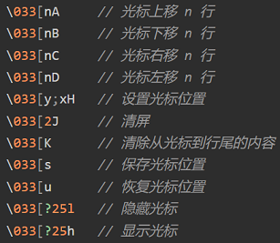


<h2 id="3.2">VT100數字型控制碼</h2>

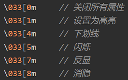

- `\033[30m – \033[37m` 為設置字顏色; `\033[40m – \033[47m` 為設置背景色

   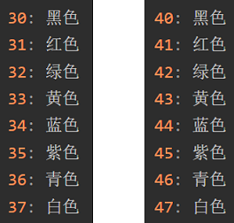

- 整理參考

    ```C
    /*************************************************************************
    僅供參考, 不一定正確
    1. 屬性變化
    控制碼 : [0m還原為黑底白字正常顯示狀態A
    控制碼 : [1m設定文字以高亮度顯示[0m
    控制碼 : [5m設定文字以閃爍方式顯示[0m
    控制碼 : [7m設定以反相方式(前景與背景對調)顯示[0m
    控制碼 : [1;5m設定文字以高亮度, 閃爍方式顯示[0m
    控制碼 : [5;7m設定文字以高亮度, 反相方式顯示[0m

    2.前景顏色
        控制碼
        [30m黑色字[0m
        [31m紅色字[0m
        [32m綠色字[0m
        [33m棕色字[0m
        [34m藍色字[0m
        [35m洋紅色字[0m
        [36m青藍色字[0m
        [37m淡灰色字[0m
        [1;30m黑色字[0m
        [1;31m淡紅色字[0m
        [1;32m淡綠色字[0m
        [1;33m黃色字[0m
        [1;34m淡藍色字[0m
        [1;35m淡洋紅色字[0m
        [1;36m淡青藍色字[0m
        [1;37m白色字[0m
    
    3.背景顏色
        控制碼
        [40m黑色底[0m
        [41m紅色底[0m
        [42m綠色底[0m
        [43m棕色底[0m
        [44m藍色底[0m
        [45m洋紅色底[0m
        [46m青藍色底[0m
        [47m淡灰色底[0m
    *************************************************************************/
    ```


<h2 id="3.3">C語言 宏定義 輸出不同顏色字串</h2>

```C
#include <stdio.h>

#define _RADAR_DELAY	sleep
#define RED 	"\033[0;32;31m"
#define GREEN 	"\033[0;32;32m"
#define BLUE	"\033[0;32;34m"
#define NOCOLOR "\033[m"

#define PRINT_RED(fmt, args...)               \
do{                                           \
	fprintf(stderr, RED fmt NOCOLOR, ##args); \
} while (0)

#define PRINT_GREEN(fmt, args...)              \
do {                                           \
	fprintf(stderr, GREEN fmt NOCOLOR, ##args);\
}while (0)

#define PRINT_BLUE(fmt, args...)               \
do {										   \
	fprintf(stderr, BLUE fmt NOCOLOR, ##args); \
} while(0)
```

<h1 id="4">相關概念</h1>

<h2 id="4.1">void與void*的用法</h2>

## void 的作用

1. 對函數返回的限定，這種情況我們比較常見。

   - 當函數不需要返回值值時，必須使用void限定。例如：void func（int a,char *b）。

2. 對函數參數的限定，這種情況也是比較常見的。

   - 當函數不允許接受參數時，必須使用void限定。例如：int func(void)。

## void 指针的使用规则

1. void 指針可以指向任意類型的數據，就是說可以用任意類型的指針對 void 指針對 void 指針賦值。例如：

    ```C
    int *a；
    void *p；
    p=a；
    ```

2. 如果要將 void 指針 p 賦給其他類型的指針，則需要強制類型轉換，就本例而言：`a=（int *）p`。在內存的分配中我們可以見到 void 指針使用：內存分配函數 malloc 函數返回的指針就是 `void *` 型，用戶在使用這個指針的時候，要進行強制類型轉換，也就是顯式說明該指針指向的內存中是存放的什麼類型的數據 `(int *)malloc(1024)` 表示強制規定 malloc 返回的 void* 指針指向的內存中存放的是一個個的 int 型數據。

   - 在 GNU 中則允許，因為在默認情況下，GNU 認為 `void *` 和 `char *` 一樣，既然是確定的，當然可以進行一些算術操作，在這裡`sizeof(*p)==sizeof(char)`。

   - 在 ANSI C 標準中，不允許對 void 指針進行一些算術運算如 p++ 或 p+=1 等，因為既然 void 是無類型，那麼每次算術運算我們就不知道該操作幾個字節

   - 如果指針 p1 和 p2 的類型相同，那麼我們可以直接在 p1 和 p2 間互相賦值；如果 p1 和 p2 指向不同的數據類型，則必須使用強制類型轉換運算符把賦值運算符右邊的指針類型轉換為左邊指針的類型。

        ```C
        float *p1;
        int *p2;
        p1 = p2;
        //其中p1 = p2語句會編譯出錯，
        //提示“'=' : cannot convert from 'int *' to 'float *'”，必須改為：
        p1 = (float *)p2;
        ```


        而 void * 則不同，任何類型的指針都可以直接賦值給它，無需進行強制類型轉換。

        ```C
        void *p1;
        int *p2;
        p1 = p2;
        ```

<h2 id="4.2">getchar應用</h2>

- 輸入一行字符，分別統計出其中英文字母、空格、數字和其它字符的個數

    ```C
    #include<stdio.h>

    int main()
    {
        char c;
        int letters = 0;
        int spaces = 0;
        int numbers = 0;
        int others = 0;

        printf("Please Input:");

        while((c=getchar()) != '\n'){
            if((c >= 'a' && c <= 'z') || (c >= 'A' && c <= 'Z')){
                letters++;
            }
            else if(c == ' '){
                spaces++;
            }
            else if((c >= 0) || (c <= 9)){
                numbers++;
            }
            else{
                others++;
            }
        }
        printf("letters:%d, spaces:%d, numbers:%d, others:%d\n", letters, spaces, numbers, others);

        return 0;
    }
    ```

<h2 id="4.3">exit() & return</h2>

- exit(0)表示程序正常退出；除了0之外，其他參數均代表程序異常退出，如：exit(1),exit(-1)。

- return；表示的是程序結束（return後沒有參數是因為void函數不返回任何值才會這樣用），return和exit作用大致相同。

- 但是在函數中就會有所區別，return會跳出函數，而exit會結束程序。

<h2 id="4.4">sizeof() & strlen()</h2>

```C
/*第一行定義c為一個字符指針變量，指向常量字符串，c裡面存放的是字符串的首地址*/
char *c = "abcdef";
/*第二行定義d為一個字符數組，以字符串的形式給這個字符數組賦值*/
char d[] = "abcdef";
/*第三行定義的也是個字符數組，以單個元素的形式賦值*/
char e[] = {'a','b','c','d','e','f'};

printf ( "%d %d/n" , sizeof(c) , strlen(c));
printf ( "%d %d/n" , sizeof(d) , strlen(d));
printf ( "%d %d/n" , sizeof(e) , strlen(e));

/******************
4 6
7 6
6 14
*******************/
```

- 當以字符串賦值時，"abcdef", 結尾自動加一個"/0"
- strlen(c)遇到/0就會結束，求的是字符串的長度，為6
- sizeof(c)求的是類型空間大小，在前面說過，指針型所點的空間大小是4個字節，系統地址總線長度為32位時

---

- strlen(d)也是一樣，字符串賦值，自動添加/0,求字符串的長度當然是6
- sizeof(d)是求這個數組所佔空間的大小，即數組所佔內存空間的字節數，應該為7

---

- sizeof(e), 數組e以單個元素賦值，沒有/0結束符，所以所佔空間的大小為6個字節
- strlen(e),去找/0結尾的字符串的長度，由於找不到/0，所以返回的值是一個不確定的值

### sizeof()

sizeof是一個C語言中的一個基本運算子，求的是數據類型所佔空間的位元組數大小，可以以型別、指標、陣列和函式等作為引數，回傳的型別為unsigned int

運算值在編譯的時候就出結果，所以可以用來定義陣列維數

```C
printf ( "char=%d/n" , sizeof ( char)); //1
printf ( "char*=%d/n" , sizeof ( char*)); //4

printf ( "int=%d/n" , sizeof ( int)); //4
printf ( "int*=%d/n" , sizeof ( int*)); //4

printf ( "long=%d/n" , sizeof ( long)); //4
printf ( "long*=%d/n" , sizeof ( long*)); //4

printf ( "double=%d/n" ,sizeof ( double)); //8
printf ( "double*=%d/n" , sizeof ( double*)); //4
```

- char, int, long, double 這些基本數據類型的長度是由編譯器本身決定的
- char*, int*, long*, double* 這些都是指針，指針就是地址，而地址的長度當前是由地址總線的位數決定的，32位元的處理器，故佔4個字節

### strlen()

strlen是一個函數，用來計算字符串的長度，以"\0"作為終止符。引數必須是字元型指標（char*）

strlen的結果執行的時候才出來，是計算字串長度的

```C
char a [ ] ="hello";                    /*數組a定義了一個字符串*/

char b [ ] = { 'h','e','l','l','o'};    /*數組b定義了一個字符數組*/

/*strlen ( a) , strlen ( b )的值分別是多少?*/
```

- strlen是求字符串的長度，字符串有個默認的結束符/0, 這個結束符是在定義字符串的時候系統自動加上去的，就像定義數組a一樣
- 數組b定義了一個字符數組，因為strlen找不到結束符，所以strlen(b)的長度就不確定的


<h1 id="5">Linux C</h1>

<h2 id="5.1">命令行選項解析函數 getopt() & getopt_long()</h2>

[C語言中getopt()和getopt_long()函式的用法](https://www.796t.com/content/1549371631.html)

[命令行選項解析函數(C語言)：getopt()和getopt](https://www.itread01.com/articles/1488862805.html)

getopt() 範例：

- 例題一

    ```C
    #include <unistd.h>
    #include <stdio.h>
    
    int main(int argc, char * argv[])
    {
        int ch;
        printf("\n\n");
        printf("optind:%d，opterr：%d\n",optind,opterr);
        printf("--------------------------\n");
        while ((ch = getopt(argc, argv, "ab:c:de::")) != -1)
        {
            printf("optind: %d\n", optind);
            switch (ch) 
            {
                case 'a':
                        printf("HAVE option: -a\n\n");   
                        break;
                case 'b':
                        printf("HAVE option: -b\n"); 
                        printf("The argument of -b is %s\n\n", optarg);
                        break;
                case 'c':
                        printf("HAVE option: -c\n");
                        printf("The argument of -c is %s\n\n", optarg);
                        break;
                case 'd':
                    printf("HAVE option: -d\n");
                        break;
                case 'e':
                        printf("HAVE option: -e\n");
                        printf("The argument of -e is %s\n\n", optarg);
                    break;
                case '?':
                        printf("Unknown option: %c\n",(char)optopt);
                        break;
                }
        }


    }
    ```

- 例題二

    ```C
    #include <unistd.h>
    #include <stdlib.h>
    #include <stdio.h>

    int main(int argc, char *argv[])
    {
        int opt;
        char *optstring = "a:b:c:d";

        while ((opt = getopt(argc, argv, optstring)) != -1)
        {
            printf("opt = %c\n", opt);
            printf("optarg = %s\n", optarg);
            printf("optind = %d\n", optind);
            printf("argv[optind - 1] = %s\n\n",  argv[optind - 1]);
        }

        return 0;
    }

    -------------------------------------------------------------

    cashey@ubuntu:~/Desktop/getopt$ ./test_getopt -a 100 -b 200 -c admin -d  
    opt = a  
    optarg = 100  
    optind = 3  
    argv[optind - 1] = 100  
    
    opt = b  
    optarg = 200  
    optind = 5  
    argv[optind - 1] = 200  
    
    opt = c  
    optarg = admin  
    optind = 7  
    argv[optind - 1] = admin  
    
    opt = d  
    optarg = (null)  
    optind = 8  
    argv[optind - 1] = -d  
    ```

getopt_long() 範例：

- 例題一

    ```C
    #include <unistd.h>
    #include <stdlib.h>
    #include <stdio.h>
    #include <getopt.h>

    int
    main(int argc, char **argv)
    {
    int opt;
    int digit_optind = 0;
    int option_index = 0;
    char *optstring = "a:b:c:d";
    static struct option long_options[] = {
        {"reqarg", required_argument, NULL, 'r'},
        {"noarg",  no_argument,       NULL, 'n'},
        {"optarg", optional_argument, NULL, 'o'},
        {0, 0, 0, 0}
    };

    while ( (opt = getopt_long(argc, argv, optstring, long_options, &option_index)) != -1)
    {
            printf("opt = %c\n", opt);
            printf("optarg = %s\n", optarg);
            printf("optind = %d\n", optind);
            printf("argv[optind - 1] = %s\n",  argv[optind - 1]);
            printf("option_index = %d\n", option_index);
    }

    return 0;
    }

    ---------------------------------------------------------------

    [ye@localhost c]$ ./test_getopt -a 100 --reqarg 100 --noarg
    opt = a
    optarg = 100
    optind = 3
    argv[optind - 1] = 100
    option_index = 0
    opt = r
    optarg = 100
    optind = 5
    argv[optind - 1] = 100
    option_index = 0
    opt = n
    optarg = (null)
    optind = 6
    argv[optind - 1] = --noarg
    option_index = 1
    ```

- 例題二

    ```C
    void print_help()
    {
        printf("\nCEC Radar test tool\n");
        printf("Usage: cec_radar_tester [para1] [para2]\n");
        printf("  -selftest, -t: selftest\n");
        printf("  --radartest, -T: radartest, average numbers (1~???)\n");
        printf("  --help, -h: print this help\n");
    }

    int main(int argc, char **argv)
    {
        const char *optstring = "hsbdtT:";

        static struct option long_options[] =
        {
            {"reset", no_argument, 0, 's'},
            {"reboot", no_argument, 0, 'b'},
            {"load_default", no_argument, 0, 'd'},
            {"selftest", no_argument, 0, 't'},
            {"radartest", required_argument, 0, 'T'},
            {"help", no_argument, 0, 'h'},
            {0, 0, 0, 0}
        };
        while((c = getopt_long(argc, argv, optstring, long_options, NULL)) != -1)
        {
            switch(c)
            {
            case 'h':
                print_help();
                break;
            case 's':
                funcs()
                break;
            case 'b': 
                funcb();
                break;
            case 'd': 
                funcd()
                break;
            case 't':
                funct()
                return 0;
                break;
            case 'T':
                funcT()
                return 0;
                break;
            case '?' : printf("Unknown parameter\n");
                break;
            default:
                print_help();
                break;
            }
    }
    }
    ```

<h2 id="5.2">計算時間差 gettimeofday()</h2>

`#include <sys/time.h>`

[程式開發 | [Linux][C] 使用 gettimeofday() 函式計算時間](https://nosleep.pixnet.net/blog/post/205120138-%E7%A8%8B%E5%BC%8F%E9%96%8B%E7%99%BC-%7C-%5Blinux%5D%5Bc%5D-%E4%BD%BF%E7%94%A8-gettimeofday()-%E5%87%BD%E5%BC%8F%E8%A8%88%E7%AE%97)

```C
/*[gettimeofday] 計時器*/

struct  timeval start;
struct  timeval end;
unsigned  long diff;
gettimeofday(&start,NULL);

/*.......Other Code.............*/

gettimeofday(&end,NULL);

diff = end.tv_sec-start.tv_sec;
printf("thedifference is %ld\n",diff);
```

[C语言用gettimeofday（）计算时间精确到毫秒/微秒](https://blog.csdn.net/G_Barble/article/details/88254628)

```C
#include <stdio.h>
#include <sys/time.h>

#define COUNT 50000000

int main()
{
    struct  timeval start;
    struct  timeval end;
    struct  timeval result;
    unsigned  long diff;
    gettimeofday(&start,NULL);

    for(int i = 0;i < COUNT;i++);

    gettimeofday(&end,NULL);
    timersub(&end, &start, &result);

    diff = result.tv_sec*1000 + (1.0*result.tv_usec)/1000;
    printf("the difference is %ld\n",diff);

    return 0;
}
```

<h2 id="5.3">FileOperation</h2>

`int _exec_rfs_cmd_return_str(char *cmd, char *reply, int reply_len);`

- 執行一個shell命令行然後回傳字串

`int _exec_rfs_cmd_return_int32(char *cmd, char *reply, int reply_len);`

- 執行一個shell命令行然後回傳整數

`int _read_file_16_return_int(const char *path);`

- 讀取檔案，並回傳整數

`int _write_int_to_file(const char *path, int val);`

- 寫整數到某檔案

`int _query_input_event_num_by_name(char *name, char *event, int elen);`

- 根據輸入的event name取得其對應的event num

- 舉例name=board_keys --> kbd event0, name=cg5251tc --> event1

    ```bash
    # cat /proc/bus/input/devices
    I: Bus=0019 Vendor=0001 Product=0001 Version=0100
    N: Name="board_keys"
    P: Phys=gpio-keys/input0
    S: Sysfs=/devices/platform/board_keys/input/input0
    U: Uniq=
    H: Handlers=kbd event0
    B: PROP=0
    B: EV=3
    B: KEY=10000000

    I: Bus=0000 Vendor=0000 Product=0000 Version=0000
    N: Name="cg5251tc"
    P: Phys=
    S: Sysfs=/devices/virtual/input/input1
    U: Uniq=
    H: Handlers=event1
    B: PROP=0
    B: EV=9
    B: ABS=10000000000
    ```

[FileOperation folder](./code/FileOperation/)

<h2 id="5.4">C 執行shell command並得到回傳字串</h2>

[SystemReplyDebugMsg.c](./code/SystemReplyDebugMsg.c)

<h2 id="5.5">linux c 底層系統調用函數open()</h2>

open是linux下的底層系統調用函數
fopen是c/c++下的標準I/O庫函數，帶輸入/輸出緩衝

linxu下的fopen是open的封裝函數，fopen最終還是要調用底層的系統調用open，進而調用在驅動實現的代碼

- open對應的文件操作有：close, read, write,ioctl 等

- fopen 對應的文件操作有：fclose, fread , fwrite, freopen, fseek, ftell, rewind等

- 簡單範例：

    ```C
    #include <stdio.h>
    #include <time.h>
    #include <sys/types.h>    
    #include <sys/stat.h>    
    #include <fcntl.h>

    const char *pathName = "wsx_out.txt";

    int main(){
        time_t t1,t2;
        int a = 1,b=12,c=1,key =20000000;
        int in, out, flag;   
        char buffer[1024] = "*send!";  

        // 1. 打开/创建，写入，关闭
        out = open(pathName, O_WRONLY|O_CREAT);  
        if (-1 == out) // 创建文件失败,则异常返回  
        {   printf("*001*\n");  
            return -1;   
        }     
        flag = 7;
        write(out, buffer, flag); 
        close(out); 

        // 2. 打开/创建，读取，关闭
        printf("*010*\n");
        out = open(pathName, O_RDWR|O_CREAT);
        if (-1 == out) // 创建文件失败,则异常返回  
        {     
            return -1;   
        }     
        printf("*020*\n");
        flag = read(out, buffer, 1024);
        printf("read str is :%.*s\n",flag,buffer);
        strcpy(buffer,"*return\r\n");
        flag =9;
        write(out, buffer, flag); 
        close(out); 

        /*3. 打开，清空，关闭*/
        out = open(pathName, O_RDWR|O_TRUNC); 
        close(out); 

        return 0;
    }
    ```

```C
int open(const char * pathname, int flags);
int open(const char * pathname, int flags, mode_t mode);
```

- flags：

    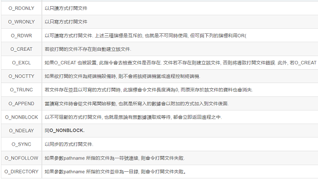

- mode：

    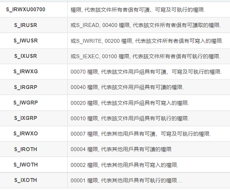

- 返回 0 值, 表示成功, 只要有一個權限被禁止則返回-1

    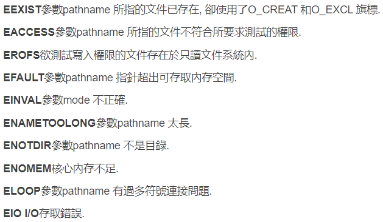

<h2 id="5.6">Uart Tx & Rx 範例</h2>

[How to open, read, and write from serial port in C?](https://stackoverflow.com/questions/6947413/how-to-open-read-and-write-from-serial-port-in-c)

[stm32_uart.c](./code/Uart/stm32_uart.c)

- 開啟COM Port設備，進行 Uart Tx 與 Rx 的通訊

[stm32_uart_tx.c](./code/Uart/stm32_uart_tx.c)

- 開啟COM Port設備，以迴圈形式從 stdin 讀取數據 Tx 出去

[stm32_uart_rx.c](./code/Uart/stm32_uart_rx.c)

- 開啟COM Port設備，以迴圈形式 Rx 並輸出到 stdout

<h2 id="5.7">IPC (Interprocess Communication)</h2>

<h3 id="5.7.1">基於socket的進程間通信</h3>

- [基於socket的進程間通信（上）](https://jasonblog.github.io/note/linux_system/ji_yu_socket_de_jin_cheng_jian_tong_xin_ff08_shang.html)

- [基於socket的進程間通信（下）](https://jasonblog.github.io/note/linux_system/ji_yu_socket_de_jin_cheng_jian_tong_xin_ff08_xia_f.html)

<h3 id="5.7.2">*mmap系統調用共享內存</h3>

- [mmap系統調用共享內存](https://jasonblog.github.io/note/linux_system/mmapxi_tong_diao_yong_gong_xiang_nei_cun.html)

<h3 id="5.7.3">posix 共享內存</h3>

- [posix 共享內存](https://jasonblog.github.io/note/linux_system/posix_gong_xiang_nei_cun.html)

<h3 id="5.7.4">system V共享內存</h3>

- [system V共享內存](https://jasonblog.github.io/note/linux_system/system_vgong_xiang_nei_cun.html)

<h3 id="5.7.5">*pipe和FIFO</h3>

- [pipe和FIFO](https://jasonblog.github.io/note/linux_system/pipehe_fifo.html)

  - 該函數創建一個單向的管道，返回兩個描述符 pipefd[0],和pipefd[1]，pipefd[0]用於讀操作，pipefd[1]用於寫操作。
  - 一般應用在父子進程（有親緣關係的進程）之間的通信，先是一個進程創建管道，再fork出一個子進程，然後父子進程可以通過管道來實現通信。
  - 管道是半雙工的，數據只能向一個方向流動；需要雙方通信時，需要建立起兩個管道
  - 寫入的內容每次都添加在管道緩衝區的末尾，並且每次都是從緩衝區的頭部讀出數據。
  - 1.pipe創建管道；
2.fork創建子進程；
3.父子進程分別關閉掉讀和寫（或寫和讀）描述符；
4.讀端在讀描述符上開始讀（或阻塞在讀上等待寫端完成寫），寫端開始寫，完成父子進程通信過程。

  - 管道最大的劣勢就是只能在擁有共同祖先進程的進程之間通信，在無親緣關係的兩個進程之間沒有辦法使用，不過有名管道FIFO解決了這個問題。可以在無親緣關係的進程之間通信，它提供一個路徑與之關聯，所以只要能訪問該路徑的進程都可以建立起通信，類似於前面的共享內存，都提供一個路徑與之關聯。

<h3 id="5.7.6">信號</h3>

- [信號（上）](https://jasonblog.github.io/note/linux_system/xin_hao_ff08_shang_ff09.html)

  - 信號類似於中斷請求，一個進程不會阻塞在某處等待信號的到來
  - 進程只需要註冊信號處理函數，在信號到來時執行信號處理函數即可。
  - linux系統支持的信號可以通過命令`kill -l`來查看
  - 在linux上信號是否可靠主要體現在信號是否支持排隊，不支持排隊的信號可能會丟失。
  - 大多數信號可以忽略，但兩種信號除外：`SIGKILl`和`SIGSTOP`。

- [信號（下）](https://jasonblog.github.io/note/linux_system/xin_hao_ff08_xia_ff09.html)

  - 一般signal函數用於安裝不可靠信號，sigaction用於安裝可靠信號，但實際上兩個函數都可以安裝可靠信號和不可靠信號。

<h3 id="5.7.7">posix消息隊列</h3>

- [posix消息隊列](https://jasonblog.github.io/note/linux_system/posixxiao_xi_dui_lie.html)

  - 一系列消息組織成的鏈表


<h1 id="6">C Standard Library</h1>

<h2 id="6.1">time.h</h2>

<h3 id="6.1.1">Conversion for time</h3>

https://cplusplus.com/reference/ctime/#:~:text=time%20(function)-,Conversion,-asctime

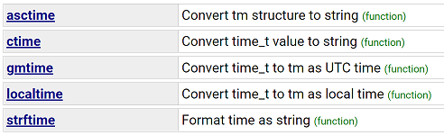

#### strftime() - Format time as string

```C
size_t strftime(char *str, size_t maxsize, const char *format, const struct tm *timeptr)
```

```C
#include <stdio.h>
#include <time.h>

int main () {
   time_t rawtime;
   struct tm *info;
   char buffer[80];

   time( &rawtime );

   info = localtime( &rawtime );

   strftime(buffer, 80 ,"%X", info);
   printf("Formatted date & time : |%s|\n", buffer );
  
   return(0);
}

/**********************************************
Formatted date & time : |11:20:39|
***********************************************/
```

<h2 id="6.2">stdlib.h</h2>


<h3 id="6.2.1">Dynamic memory management</h3>

https://cplusplus.com/reference/cstdlib/#:~:text=generator%20(function)-,Dynamic%20memory%20management,-calloc

[C 語言動態記憶體配置教學：malloc、free 等函數](https://blog.gtwang.org/programming/c-memory-functions-malloc-free/)

- malloc - Allocate memory block

    ```C
    void* malloc (size_t size);
    ```

- calloc - Allocate and zero-initialize array

    ```C
    void* calloc (size_t num, size_t size);
    ```

- realloc - Reallocate memory block

    ```C
    void* realloc (void* ptr, size_t size);
    ```

- free - Deallocate memory block

    ```C
    void free (void* ptr);
    ```

得到指標指向的陣列的長度

- `size_t strlen ( const char * str );`

動態配置二維陣列

- 利用malloc實現，配置m*n大小陣列

    ```C
    int **a = (int ** ) malloc ( m* sizeof(int*) ) ;    //先配置m個指標 (a[])
    for(int i=0; i<m; i++)                              //再對每個指標配置n個int大小的空間(a[][])
        a[i] = (int*)malloc(n*sizeof(int));
    ```

- 回收空間

    ```C
    //------做完後free
    for(int i=0; i<m; i++){
        free(a[i])
    }

    free(a);
    ```

<h3 id="6.2.2">String conversion</h3>

https://cplusplus.com/reference/cstdlib/#:~:text=Functions-,String%20conversion,-atof

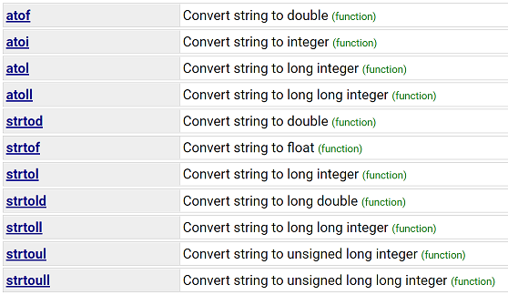

- 以str開頭的函數，可以轉換多個字串變成數值，以空格作為分區
- strtol, strtoll, strtoul, strtoull 可以選擇轉換字串是以什麼base來進行轉換

#### strtol()函數 [string to long]

- 將字符串轉換成long(長整型數)

- 頭文件： `#include <stdlib.h>`

- 原型： `long int strtol (const char* str, char** endptr, int base);`
  - `str` 為要轉換的字符串
  - `endstr` 為第一個不克不及轉換的字符的指針
  - `base` 為字符串 str 所采取的進制

- 函數解釋： strtol() 會將參數 str 字符串依據參數 base 來轉換生長整型數(long)。
  - 參數 base 規模從2 至36，或0
  - base 值為10 則采取10 進制，若base 值為16 則采取16 進制等
  - 當 base 的值為 0 時，默許采取 10 進制轉換
  - 假如碰到 '0x' / '0X' 前置字符則會應用 16 進制轉換
  - 碰到 '0' 前置字符則會應用 8 進制轉換
  - 若endptr 不為NULL，則會將碰到的不相符前提而終止的字符指針由 endptr 傳回
  - 若 endptr 為 NULL，則表現該參數有效，或不應用該參數

- strtol() 會掃描參數 str 字符串，跳過後面的空白字符（例如空格，tab縮進等，可以經由過程 isspace() 函數來檢測），直到趕上數字或正負符號才開端做轉換，再碰到非數字或字符串停止時('\0')停止轉換，並將成果前往。

- 【示例】將字符串轉換成10進制： 

    ```C
    #include <stdio.h>
    #include <stdlib.h>

    int main ()
    {
        char szNumbers[] = "2001 60c0c0 -1101110100110100100000 0x6fffff";
        char * pEnd;
        long int li1, li2, li3, li4;
        li1 = strtol (szNumbers,&pEnd,10);
        li2 = strtol (pEnd,&pEnd,16);
        li3 = strtol (pEnd,&pEnd,2);
        li4 = strtol (pEnd,NULL,0);
        printf ("轉換成10進制: %ld、%ld、%ld、%ld\n", li1, li2, li3, li4);
        system("pause");
        return 0;
    }

    //-------------------------------------------
    2001、6340800、-3624224、7340031
    ```

#### strtoul()函數 [string to unsigned long]

- 將字符串轉換成unsigned long(無符號長整型數)

- 頭文件： `#include <stdlib.h>`

- 原型： `unsigned long strtoul (const char* str, char** endptr, int base);`
  - `str` 為要轉換的字符串
  - `endstr` 為第一個不克不及轉換的字符的指針
  - `base` 為字符串 str 所采取的進制

- 函數解釋： strtoul() 會將參數 str 字符串依據參數 base 來轉換成無符號的長整型數(unsigned long)。
  - 參數 base 規模從2 至36，或0
  - base 值為10 則采取10 進制，若 base 值為16 則采取16 進制數等
  - 當 base 的值為 0 時，默許采取 10 進制轉換
  - 假如碰到 '0x' / '0X' 前置字符則會應用 16 進制轉換
  - 碰到 '0' 前置字符則會應用 8 進制轉換
  - 若 endptr 不為NULL，則會將碰到的不相符前提而終止的字符指針由 endptr 傳回
  - 若 endptr 為 NULL，則表現該參數有效，或不應用該參數

- strtoul() 會掃描參數 str 字符串，跳過後面的空白字符（例如空格，tab縮進等，可以經由過程 isspace() 函數來檢測），直到趕上數字或正負符號才開端做轉換，再碰到非數字或字符串停止時('\0')停止轉換，並將成果前往。

- 【示例】將輸出的字符串轉換為無符號長整型： 

    ```C
    #include <stdio.h>
    #include <stdlib.h>

    int main ()
    {
        char buffer [256];
        unsigned long ul;
        printf ("Enter an unsigned number: ");
        fgets (buffer, 256, stdin);
        ul = strtoul (buffer, NULL, 0);
        printf ("Value entered: %lu.\n", ul);
        system("pause");
        return 0;
    }

    //----------------------------------------------
    Enter an unsigned number: 017cyuyan
    Value entered: 15.
    ```

<h3 id="6.2.3">Environment</h3>

https://cplusplus.com/reference/cstdlib/#:~:text=block%20(function)-,Environment,-abort

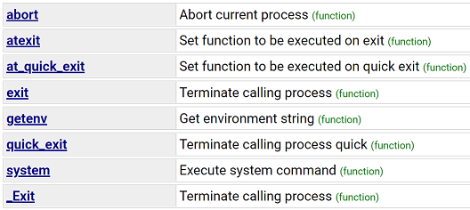

#### system()

**system()理解**

1. 功能：system()函數調用`/bin/sh -c command`執行特定的命令，阻塞當前進程直到command命令執行完畢

2. 原型：`int system(const char *command);`

3. 返回值：

   - 出現不能執行system調用的其他錯誤時返回-1
   - 如果無法啟動shell運行命令，system將返回127
   - 如果system能夠順利執行，返回那個命令的退出碼

**system()函數原理**

1. system函數執行時，會調用fork、execve、waitpid等函數。

    ```C
    int system(const char * cmdstring)
    {
        pid_t pid;
        int status;
        if(cmdstring == NULL){        
            return (1);
        }
        if((pid = fork())<0){
                status = -1;
        }
        else if(pid == 0){
            execl("/bin/sh", "sh", "-c", cmdstring, (char *)0);
            _exit(127); //子進程正常執行則不會執行此語句
        }
        else{
            while(waitpid(pid, &status, 0) < 0){
                if(errno != EINTER){
                    status = -1;
                    break;
                }
            }
        }
        return status;
    }
    ```

2. 函數說明：

   - system()會調用fork()產生子進程，由子進程來調用/bin/sh-c string來執行參數string字符串所代表的命令，此命令執行完後隨即返回原調用的進程。

   - 返回值：
     - =-1:出現錯誤 
     - =0:調用成功但是沒有出現子進程 
     - \>0:成功退出的子進程的id

3. system函數對返回值的處理，涉及3個階段：

   - 階段1：創建子進程等準備工作。如果失敗，返回-1。
   - 階段2：調用/bin/sh拉起shell腳本，如果拉起失敗或者shell未正常執行結束（參見備注1），原因值被寫入到status的低8~15比特位中。system的man中只說明了會寫了127這個值，但實測發現還會寫126等值。
   - 階段3：如果shell腳本正常執行結束，將shell返回值填到status的低8~15比特位中。

4. 如何判斷階段2中，shell腳本子進程是否正常執行結束呢？

   - `WIFEXITED(status)`：為真，則說明正常結束

5. 如何取得階段3中的shell返回值？

   - `WEXITSTATUS(status)`

**system()實際應用**

- 一般在shell腳本中會通過返回值判斷本腳本是否正常執行，如果成功返回0，失敗返回正數。

- 判斷一個system函數調用shell腳本是否正常結束的方法應該是如下3個條件同時成立：

  - -1 != status
  - WIFEXITED(status)為真
  - 0 == WEXITSTATUS(status)

- Note：根據以上分析，當shell腳本不存在、沒有執行權限等場景下時，以上前2個條件仍會成立，此時WEXITSTATUS(status)為127，126等數值。在shell腳本中不能將127，126等數值定義為返回值，否則無法區分中是shell的返回值，還是調用shell腳本異常的原因值。

```C
#include <stdio.h>
#include <unistd.h>
#include <stdlib.h>

#define EXIT_ERR(m) \
do\
{\
    perror(m);\
    exit(EXIT_FAILURE);\
}\
while (0);\

int main(void)
{
    int status ;
    status = system("ls -l|wc -l");

    if(status == -1){
        EXIT_ERR("system error");
    }

    else{
        if(WIFEXITED(status))
        {
            if(WEXITSTATUS(status) == 0)
                printf("run command successful\n");
            else
                printf("run command fail and exit code is %d\n",WEXITSTATUS(status));
        }
        else
            printf("exit status = %d\n",WEXITSTATUS(status));
    }
    return 0;
}
```

<h2 id="6.3">stdio.h</h2>

<h3 id="6.3.0">Macros & Type</h3>

#### (Macro) EOF

- 這個宏是一個表示已經到達文件結束的負整數。

- It is a macro definition of type int that expands into a negative integral constant expression (generally, -1).

#### (Macro) NULL

- 這個宏是一個空指針常量的值。

<h3 id="6.3.1">Formatted input/output</h3>

https://cplusplus.com/reference/cstdio/#:~:text=Formatted%20input/output

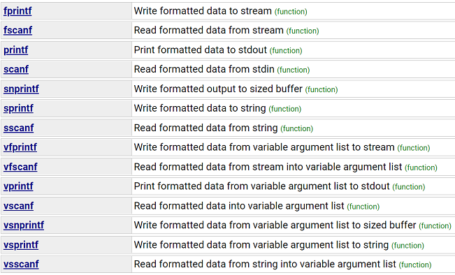

<h4 id="6.3.1.1">printf(), fprintf(), sprintf(), snprintf() 相關用法</h4>

**prinf()**

- `int printf ( const char * format, ... );`

- 基本用法，直接顯示在 terminal 上。

**fprintf()**

- `int fprintf ( FILE * stream, const char * format, ... );`

- f 代表的是 file，透過 fprintf 能專門幫助我們處理「寫進檔案的字串」。

    ```C
    #include <stdio.h>

    void test_fprintf()
    {
        FILE * fp;
        fp = fopen("file.txt", "w+");
        fprintf(fp, "%s %s %s %d!!!", "Hello", "world", "in", 2021);
        fclose(fp);
    }

    int main()
    {
        printf(" ------ test_fprintf ------ \n");
        test_fprintf();
        return 0;
    }

    /**************************************/
    Hello world in 2021!!!
    ```

**sprintf()**

- `int sprintf ( char * str, const char * format, ... );`

- s 代表的是 string，透過 sprintf 能幫助我們把字串保存在變數裡面。

```C
#include <stdio.h>

void test_sprintf()
{
    char str[32];
    const char* s = "Hello";
    sprintf(str, "%s", s);
    printf("%s\n", str); 
    puts(str);
}

int main()
{
    printf(" ------ test_sprintf ------ \n");
    test_sprintf();
    return 0;
}

/**********************************/
 ------ test_sprintf ------ 
Hello
Hello
```

**snprintf()**

- `int snprintf ( char * s, size_t n, const char * format, ... );`

- snprintf 與 sprintf 用絕大部分都相同，只差在多一個 n ，代表的是 numbers of bytes 的控制，相對於 sprintf 會更安全的控制好電腦內儲存空間的限制。

    ```C
    #include <stdio.h>

    void test_snprintf()
    {
        char buffer [100];
        int cx;

        cx = snprintf ( buffer, 100, "The half of %d is %d", 60, 60/2 );
        if (cx>=0 && cx<100)      // check returned value
            snprintf ( buffer+cx, 100-cx, ", and the half of that is %d.", 60/2/2 );

        puts (buffer);
    }

    int main()
    {
        printf(" ------ test_snprintf ------ \n");
        test_snprintf();
        return 0;
    }

    /******************************/
    ------ test_snprintf ------ 
    The half of 60 is 30, and the half of that is 15.
    ```

#### vprintf(), vfprintf(), vsprintf(), vsnprintf()

- 與 printf, fprintf, sprintf, snprintf 只差一個開頭的 「 v 」，這個 v 代表的是使用 va_list 的意思，也就是說，我們使用了「不限定傳入參數數量的方法」。

<h4 id="6.3.1.2">scanf(), sscanf(), fscanf() 相關用法</h4>

**scanf()**

- `int scanf(const char *format, ...);`

- 從控制檯（鍵盤）輸入

- scanf()函式根據由format(格式)指定的格式從stdin(標準輸入)讀取,並儲存資料到其它引數. 

    ```C
    #include <stdio.h>

    int main()
    {
        int a,b,c;
        printf("輸入：a,b,c\n");
        scanf("%d,%d,%d",&a,&b,&c);
        printf("a = %d b = %d c = %d",a,b,c);
        return 0;
    }
    ```

- 前面輸入的時候有一個 `\n` 留在了輸入流中，一個空格是為了把它讀掉吧，相當於 `fflush(stdin);`

    ```C
    scanf(" %c", &i);
    ```

**sscanf()**

- `int sscanf(const char *str, const char *format, ...);`

- 從字串輸入

- `%[ ]`表示要讀入一個字元集合，如果[ 後面第一個字元是`^`，則表示反意思。[ ]內的字串可以是1或更多字元組成。

- 常見用法：

    ```C
    char buf[512] ;

    /*1. 常見用法*/
    sscanf("123456 ", "%s", buf);   //此處buf是陣列名，它的意思是將123456以%s的形式存入buf中！
    printf("%s\n", buf);
    /********************
    結果為：123456
    ********************/

    /*2. 取指定長度的字串*/
    sscanf("123456 ", "%4s", buf);
    printf("%s\n", buf);
    /********************
    結果為：1234
    ********************/

    /*3. 取到指定字元為止的字串。*/
    /*取遇到空格為止字串。*/
    sscanf("123456 abcdedf", "%[^ ]", buf);
    printf("%s\n", buf);
    /********************
    結果為：123456
    ********************/
    /*取遇到大寫字母為止的字串。*/
    sscanf("123456abcdedfBCDEF", "%[^A-Z]", buf);
    printf("%s\n", buf);
    /********************
    結果為：123456abcdedf
    ********************/

    /*4. 取僅包含指定字符集的字串。*/
    /*取僅包含1到9和小寫字母的字串。*/
    sscanf("123456abcdedfBCDEF", "%[1-9a-z]", buf);
    printf("%s\n", buf);
    /********************
    結果為：123456abcdedf
    ********************/
    /*取僅包含1到9和大寫字母的字串。*/
    sscanf("123456abcdedfBCDEF","%[1-9A-Z]",buf);
    printf("%s\n",buf);
    /********************
    結果為：123456
    ********************/

    /*5. “，”之後有一空格，%s遇空格停止，加*則是忽略第一個讀到的字*/
    /*%*s表示第一個匹配到的%s被過濾掉，即“hello,”被過濾了，如果沒有空格則結果為NULL。*/
    /*給定一個字串“hello, world”，僅保留world。*/
    sscanf(“hello, world”, "%*s%s", buf);
    printf("%s\n", buf);
    /********************
    結果為：world
    ********************/
    ```

**fscanf()**

- `int fscanf(FILE *stream, const char *format, ...);`
  - FILE *stream：檔案指標；
  - char *format：格式字串；
  - [argument...]：輸入列表。

- 從檔案輸入

- 從一個流中執行格式化輸入，fscanf遇到空格和換行時結束，注意空格時也結束。這與fgets有區別，fgets遇到空格不結束。

    ```C
    #include <stdio.h> 

    char* filename = "pt.txt";
    FILE *fp;
    if((fp=fopen(filename,"r"))!=NULL)
    {  
        char str[1024];
        fscanf(fp,"h = %s\n",str);
    }
    /*******************************
    txt檔案中就類似這種格式：h = dadf
    ********************************/
    ```

    ```C
    #include <stdio.h> 

    FILE *fp;
    char a[10];
    int b;
    double c;
    fscanf(fp,"%s%d%lf",a,&b,&c)
    /******************************
    返回值：整型，成功讀入的引數的個數
    ******************************/
    ```

<h3 id="6.3.2">Character input/output</h3>

https://cplusplus.com/reference/cstdio/#:~:text=Character%20input/output

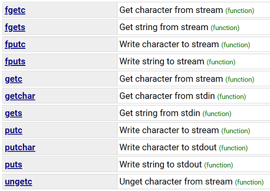

<h4 id="6.3.2.1">getc(), fgetc(), getchar(), gets(), fgets() 相關用法</h4>

**getc()**

- `int getc ( FILE * stream );`
  - stream -- 這是一個文件對象的指針，標識要執行的操作流。

- 從指定的流 stream 獲取下一個字符（一個無符號字符），並把位置標識符往前移動

- **返回值**：這個函數返回讀取的字符為unsigned char轉換為int或EOF文件結束或錯誤

    ```C
    #include<stdio.h>

    int main()
    {
        char c;

        printf("Enter character: ");
        c = getc(stdin);
        printf("Character entered: ");
        putc(c, stdout);

        return(0);
    }

    /*********************
    Enter character: a
    Character entered: a
    **********************/
    ```

    ```C
    /* getc example: money counter */
    #include <stdio.h>
    int main ()
    {
        FILE * pFile;
        int c;
        int n = 0;
        pFile = fopen ("myfile.txt","r");
        if (pFile == NULL) 
            perror ("Error opening file");
        else
        {
        do {
            c = getc (pFile);
            if (c == '$') n++;
        } while (c != EOF);
        fclose (pFile);
        printf ("File contains %d$.\n",n);
        }
        return 0;
    }
    ```

**fgetc()**

- `int fgetc ( FILE * stream );`
  - stream -- 這是一個文件對象的指針，標識要執行的操作流。

- 從指定的流 stream 獲取下一個字符（一個無符號字符），並把位置標識符往前移動

- **返回值**：這個函數返回讀取的字符為unsigned char轉換為int或EOF文件結束或錯誤

    ```C
    #include <stdio.h>

    int main ()
    {
        FILE *fp;
        int c;
        int n = 0;

        fp = fopen("file.txt","r");
        if(fp == NULL) 
        {
            perror("Error in opening file");
            return(-1);
        }
        do
        {
            c = fgetc(fp);
            printf("%c", c);
        }while(c != EOF);

        fclose(fp);

        return(0);
    }
    ```

- Note：getc和之間的區別fgetc是getc可以作為宏來實現，而fgetc不能作為宏來實現。
  - getc不應是具有副作用的表達式。
  - 由於fgetc保證是一個函數，我們可以取它的地址。這允許我們將 的地址fgetc作為參數傳遞給另一個函數。
  - 調用 fgetc 可能比調用 花費更長的時間getc，因為調用函數通常需要更多時間。

**getchar()**

- `int getchar ( void );`

- 從標準輸入 stdin 獲取一個字符（一個無符號字符）。這等同於 **getc 帶有 stdin 作為參數**。

- **返回值**：以無符號 char 強制轉換為 int 的形式返回讀取的字符，如果到達文件末尾或發生讀錯誤，則返回 EOF。

    ```C
    #include <stdio.h>

    int main ()
    {
        char c;

        printf("Enter character: ");
        c = getchar();

        printf("Character entered: ");
        putchar(c);

        return(0);
    }
    ```

    ```C
    /* getchar example : typewriter */
    #include <stdio.h>

    int main ()
    {
        int c;
        puts ("Enter text. Include a dot ('.') in a sentence to exit:");
        do {
            c=getchar();
            putchar (c);
        } while (c != '.');
        return 0;
    }
    ```

**gets()**

- `char * gets ( char * str );`
  - str -- 這是存儲所在的C字符串的字符數組的指針。

- 從標準輸入 stdin 讀取一行，並把它存儲在 str 所指向的字符串中。當讀取到換行符時，或者到達文件末尾時，它會停止

- **返回值**：如果成功，該函數返回 str。如果發生錯誤或者到達文件末尾時還未讀取任何字符，則返回 NULL。


    ```C
    #include <stdio.h>

    int main()
    {
        char str[50];

        printf("请输入一个字符串：");
        gets(str);

        printf("您输入的字符串是：%s", str);

        return(0);
    }

    /******************************
    请输入一个字符串：runoob
    您输入的字符串是：runoob
    ******************************/
    ```

    ```C
    /* gets example */
    #include <stdio.h>

    int main()
    {
        char string [256];
        printf ("Insert your full address: ");
        gets (string);     // warning: unsafe (see fgets instead)
        printf ("Your address is: %s\n",string);
        return 0;
    }
    ```

**fgets()**

- `char * fgets ( char * str, int num, FILE * stream );`
  - str -- 這是字符串讀取存儲的字符數組的指針。
  - n -- 這是最大的被讀取的字符數（包括最後的空字符）。通常情況下，通過使用str是數組的長度。 
  - stream -- 這是一個文件對象標識流中讀取字符的指針。

- 讀到換行就結束一次函數執行，搭配while把全部讀出來

- **返回值**：
  - 如果成功，该函数返回相同的 str 参数。
  - 如果到达文件末尾或者没有读取到任何字符，str 的内容保持不变，并返回一个空指针。
  - 如果发生错误，返回一个空指针。

    ```C
    #include <stdio.h>

    int main()
    {
        FILE *fp;
        char str[60];

        /* opening file for reading */
        fp = fopen("file.txt" , "r");
        if(fp == NULL) {
            perror("Error opening file");
            return(-1);
        }
        if( fgets (str, 60, fp)!=NULL ) {
            /* writing content to stdout */
            puts(str);
        }
        fclose(fp);

        return(0);
    }
    ```

<h4 id="6.3.2.2">putc(), fputc(), putchar(), puts(), fputs() 相關用法</h4>

**putc()**

- `int putc ( int character, FILE * stream );`
  - char -- 這是要寫入的字符。字符通過作為整型轉換。
  - stream -- 這是一個文件對象，確定要寫入字符流的指針。

- 把參數 char 指定的字符（一個無符號字符）寫入到指定的流 stream 中，並把位置標識符往前移動。

- **返回值**：這個函數返回寫入的字符為unsigned char轉換為int或EOF錯誤。

    ```C
    #include <stdio.h>

    int main ()
    {
        FILE *fp;
        int ch;

        fp = fopen("file.txt", "w");
        for( ch = 33 ; ch <= 100; ch++ ) 
        {
            putc(ch, fp);
        }
        fclose(fp);

        return(0);
    }

    /**********************************************************************
    !"#$%&'()*+,-./0123456789:;<=>?@ABCDEFGHIJKLMNOPQRSTUVWXYZ[]^_`abcd
    **********************************************************************/
    ```

**fputc()**

- `int fputc ( int character, FILE * stream );`
  - char -- 這是要寫入的字符。字符通過作為整型轉換。
  - stream -- 這是一個文件對象，確定要寫入字符流的指針。

- 把參數 char 指定的字符（一個無符號字符）寫入到指定的流 stream 中，並把位置標識符往前移動。

- **返回值**：這個函數返回寫入的字符為unsigned char轉換為int或EOF錯誤。

    ```C
    #include <stdio.h>

    int main ()
    {
        FILE *fp;
        int ch;

        fp = fopen("file.txt", "w+");
        for( ch = 33 ; ch <= 100; ch++ )
        {
            fputc(ch, fp);
        }
        fclose(fp);

        return(0);
    }

    /**********************************************************************
    !"#$%&'()*+,-./0123456789:;<=>?@ABCDEFGHIJKLMNOPQRSTUVWXYZ[]^_`abcd
    **********************************************************************/
    ```

- Note：putc是宏定義，fputc是函數

**putchar()**

- `int putchar ( int character );`
  - char -- 這是要寫入的字符。這是通過作為整型轉換。

- 把參數 char 指定的字符（一個無符號字符）寫入到標準輸出 stdout 中。

- **返回值**：返回寫入的字符為unsigned char轉換為int或EOF錯誤。

    ```C
    #include <stdio.h>

    int main ()
    {
        char ch;

        for(ch = 'A' ; ch <= 'Z' ; ch++) {
            putchar(ch);
        }

        return(0);
    }

    /***********************************
    ABCDEFGHIJKLMNOPQRSTUVWXYZ
    ***********************************/
    ```

**puts()**

- `int puts ( const char * str );`
  - str -- 這是C字符串的寫入。

- 把一個字符串寫入到標準輸出 stdout，直到空字符，但不包括空字符。換行符會被追加到輸出中。

- **返回值**：如果成功，該函數返回一個非負值為字符串長度（包括末尾的 \0），如果發生錯誤則返回 EOF。

    ```C
    #include <stdio.h>
    #include <string.h>

    int main()
    {
    char str1[64];
    char str2[32];

    strcpy(str1, "RUNOOB1  Hi\nI am Antony, and how about you.");
    strcpy(str2, "RUNOOB2");

    puts(str1);
    puts(str2);
    
    return(0);
    }

    /**************************
    RUNOOB1  Hi
    I am Antony, and how about you.
    RUNOOB2
    ***************************/
    ```

**fputs()**

- `int fputs ( const char * str, FILE * stream );`
  - str -- 這是一個數組，包含null結尾的要寫入的字符序列。
  - stream -- 這是一個文件對象的標識字符串將被寫入流的指針。

- 把字符串寫入到指定的流 stream 中，但不包括空字符。

- **返回值**：該函數返回一個非負值，如果發生錯誤則返回 EOF。

    ```C
    #include <stdio.h>

    int main ()
    {
        FILE *fp;

        fp = fopen("file.txt", "w+");

        fputs("嗨\t这是 C 语言。\n", fp);
        fputs("这是一种系统程序设计语言。\n", fp);

        fclose(fp);

        return(0);
    }

    /*****************************
    嗨      这是 C 语言。
    这是一种系统程序设计语言。
    ******************************/
    ```

<h3 id="6.3.3">File access</h3>

https://cplusplus.com/reference/cstdio/#:~:text=filename%20(function)-,File%20access,-%3A

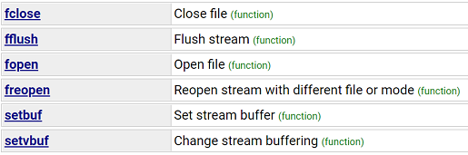

#### fopen()/fclose() - Open/Close file

```C
FILE * fopen ( const char * filename, const char * mode );
int fclose ( FILE * stream );
```

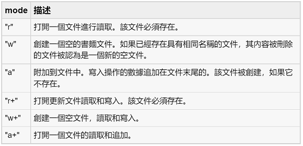

- With the mode specifiers above the file is open as a text file.
- In order to open a file as a binary file, a "b" character has to be included in the mode string.

```C
/* fopen example */
#include <stdio.h>
int main ()
{
    FILE * pFile;
    pFile = fopen ("myfile.txt","w");
    if (pFile!=NULL)
    {
        fputs ("fopen example",pFile);
        fclose (pFile);
    }
    return 0;
}
```

#### popen()/pclose() - 啟動另外一個進程去執行一個shell命令行

```C
FILE * popen( const char * command, const char * type);
int pclose(FILE * stream);
```

popen函數還創建一個管道用於父子進程間通信

- 調用popen的進程為父進程，由popen啟動的進程稱為子進程
- 父進程可以從管道讀信息，或是向管道寫信息，至於是讀還是寫取決於父進程調用popen時傳遞的參數

fgets()讀取到換行就結束一次函數的呼叫，透過while迴圈可把全部讀出來

```C
#include <stdio.h>
  
int main(void)
{
    FILE * fp;
    if ((fp = popen("ls -l", "r")) == NULL)
    {
        perror("open failed!");
        return -1;
    }
    char buf[256];
    while (fgets(buf, 255, fp) != NULL)
        printf("%s", buf);
    if (pclose(fp) == -1)
    {
        perror("close failed!");
        return -2;
    }
    return 0;
}
```


<h2 id="6.4">string.h</h2>

<h3 id="6.4.1">Copying</h3>

https://cplusplus.com/reference/cstring/#:~:text=Functions-,Copying,-%3A

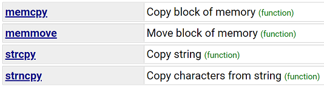

#### memcpy() - Copy block of memory

```C
void * memcpy ( void * destination, const void * source, size_t num );
```

```C
/* memcpy example */
#include <stdio.h>
#include <string.h>

struct {
    char name[40];
    int age;
} person, person_copy;

int main ()
{
    char myname[] = "Pierre de Fermat";

    /* using memcpy to copy string: */
    memcpy ( person.name, myname, strlen(myname)+1 );
    person.age = 46;

    /* using memcpy to copy structure: */
    memcpy ( &person_copy, &person, sizeof(person) );

    printf ("person_copy: %s, %d \n", person_copy.name, person_copy.age );

    return 0;
}

/*************************************
person_copy: Pierre de Fermat, 46
**************************************/
```

#### strcpy() or strncpy() - Copy string

```C
char * strcpy ( char * destination, const char * source );
char * strncpy ( char * destination, const char * source, size_t num );
```

```C
/* strcpy example */
#include <stdio.h>
#include <string.h>

int main ()
{
    char str1[]="Sample string";
    char str2[40];
    char str3[40];
    strcpy (str2,str1);
    /*strncpy ( str2, str1, sizeof(str2) );*/
    strcpy (str3,"copy successful");
    printf ("str1: %s\nstr2: %s\nstr3: %s\n",str1,str2,str3);
    return 0;
}

/*****************************************
str1: Sample string
str2: Sample string
str3: copy successful
******************************************/
```

<h3 id="6.4.2">Concatenation</h3>

https://cplusplus.com/reference/cstring/#:~:text=string%20(function)-,Concatenation,-%3A

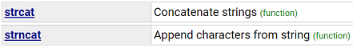

#### strcat() & strncat()

strcat() - Concatenate strings

strncat() - Append characters from string

```C
char * strcat ( char * destination, const char * source );
char * strncat ( char * destination, const char * source, size_t num );
```

```C
/* strcat example */
#include <stdio.h>
#include <string.h>

int main ()
{
    /*strcat*/
    char str[80];
    strcpy (str,"these ");
    strcat (str,"strings ");
    strcat (str,"are ");
    strcat (str,"concatenated.");
    puts (str);
    return 0;

    /*strncat*/
    char str1[20];
    char str2[20];
    strcpy (str1,"To be ");
    strcpy (str2,"or not to be");
    strncat (str1, str2, 6);
    puts (str1);
    return 0;
}

/*************************************
these strings are concatenated.

To be or not
**************************************/
```

<h3 id="6.4.3">Comparison</h3>

https://cplusplus.com/reference/cstring/#:~:text=string%20(function)-,Comparison,-%3A

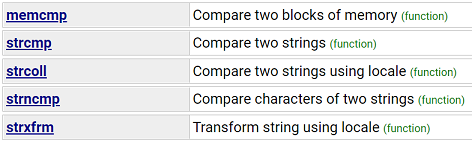

#### memcmp() - Compare two blocks of memory

```C
int memcmp ( const void * ptr1, const void * ptr2, size_t num );
```

return value = 0：the contents of both memory blocks are equal

```C
/* memcmp example */
#include <stdio.h>
#include <string.h>

int main ()
{
    char buffer1[] = "DWgaOtP12df0";
    char buffer2[] = "DWGAOTP12DF0";

    int n;

    n=memcmp ( buffer1, buffer2, sizeof(buffer1) );

    if (n>0) printf ("'%s' is greater than '%s'.\n",buffer1,buffer2);
    else if (n<0) printf ("'%s' is less than '%s'.\n",buffer1,buffer2);
    else printf ("'%s' is the same as '%s'.\n",buffer1,buffer2);

    return 0;
}

/**********************************************
'DWgaOtP12df0' is greater than 'DWGAOTP12DF0'.
***********************************************/
```

#### strcmp() & strncmp()

strcmp() - Compare two strings

strncmp() - Compare characters of two strings

```C
int strcmp ( const char * str1, const char * str2 );
int strncmp ( const char * str1, const char * str2, size_t num );
```

return value = 0：the contents of both strings are equal

```C
#include <stdio.h>
#include <string.h>

int main ()
{
    /*strcmp*/
    char key[] = "apple";
    char buffer[80];
    do {
        printf ("Guess my favorite fruit? ");
        fflush (stdout);
        scanf ("%79s",buffer);
    } while (strcmp (key,buffer) != 0);
    puts ("Correct answer!");
    return 0;

    /*strncmp*/
    char str[][5] = { "R2D2" , "C3PO" , "R2A6" };
    int n;
    puts ("Looking for R2 astromech droids...");
    for (n=0 ; n<3 ; n++)
        if (strncmp (str[n],"R2xx",2) == 0)
        {
            printf ("found %s\n",str[n]);
        }
    return 0;
}

/*********************************
Guess my favourite fruit? orange
Guess my favourite fruit? apple
Correct answer!

Looking for R2 astromech droids...
found R2D2
found R2A6
**********************************/
```

<h3 id="6.4.4">Searching</h3>

https://cplusplus.com/reference/cstring/#:~:text=locale%20(function)-,Searching,-%3A

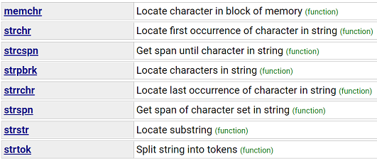

#### memchr() - Locate character in block of memory

```C
const void * memchr ( const void * ptr, int value, size_t num );
void * memchr ( void * ptr, int value, size_t num );
```

```C
/* memchr example */
#include <stdio.h>
#include <string.h>

int main ()
{
    char * pch;
    char str[] = "Example string";
    pch = (char*) memchr (str, 'p', strlen(str));
    if (pch!=NULL)
        printf ("'p' found at position %d.\n", pch-str+1);
    else
        printf ("'p' not found.\n");
    return 0;
}

/************************
'p' found at position 5.
*************************/
```

#### strchr() - Locate first occurrence of character in string

```C
const char * strchr ( const char * str, int character );
char * strchr ( char * str, int character );
```

```C
/* strchr example */
#include <stdio.h>
#include <string.h>

int main ()
{
    char str[] = "This is a sample string";
    char * pch;
    printf ("Looking for the 's' character in \"%s\"...\n",str);
    pch=strchr(str,'s');
    while (pch!=NULL)
    {
        printf ("found at %d\n",pch-str+1);
        pch=strchr(pch+1,'s');
    }
    return 0;
}

/*************************************************************
Looking for the 's' character in "This is a sample string"...
found at 4
found at 7
found at 11
found at 18
**************************************************************/
```

#### strrchr() - Locate last occurrence of character in string

```C
const char * strrchr ( const char * str, int character );
char * strrchr ( char * str, int character );
```

```C
/* strrchr example */
#include <stdio.h>
#include <string.h>

int main ()
{
    char str[] = "This is a sample string";
    char * pch;
    pch=strrchr(str,'s');
    printf ("Last occurence of 's' found at %d \n",pch-str+1);
    return 0;
}

/***************************************
Last occurrence of 's' found at 18
****************************************/
```

#### strstr() - Locate substring

```C
const char * strstr ( const char * str1, const char * str2 );
char * strstr ( char * str1, const char * str2 );
```

This example searches for the "simple" substring in str and replaces that word for "sample".

```C
/* strstr example */
#include <stdio.h>
#include <string.h>

int main ()
{
    char str[] ="This is a simple string";
    char * pch;
    pch = strstr (str,"simple");
    if (pch != NULL)
        strncpy (pch,"sample",6);
    puts (str);
    return 0;
}

/*****************************
This is a sample string
******************************/
```

#### strtok() - Split string into tokens

```C
char * strtok ( char * str, const char * delimiters );
```

A sequence of calls to this function split str into tokens, which are sequences of contiguous characters separated by any of the characters that are part of delimiters.

```C
/* strtok example */
#include <stdio.h>
#include <string.h>

int main ()
{
    char str[] ="- This, a sample string.";
    char * pch;
    printf ("Splitting string \"%s\" into tokens:\n",str);
    pch = strtok (str," ,.-");
    while (pch != NULL)
    {
        printf ("%s\n",pch);
        pch = strtok (NULL, " ,.-");
    }
    return 0;
}

/*************************************************
Splitting string "- This, a sample string." into tokens:
This
a
sample
string
**************************************************/
```

<h3 id="6.4.5">memset() - Fill block of memory</h3>

```C
void * memset ( void * ptr, int value, size_t num );
```

Sets the first num bytes of the block of memory pointed by ptr to the specified value (interpreted as an unsigned char).

```C
/* memset example */
#include <stdio.h>
#include <string.h>

int main ()
{
    char str[] = "almost every programmer should know memset!";
    memset (str,'-',6);
    puts (str);
    return 0;
}

/*********************************************
------ every programmer should know memset!
**********************************************/
```

<h3 id="6.4.6">strlen() - Get string length</h3>

```C
size_t strlen ( const char * str );
```

```C
/* strlen example */
#include <stdio.h>
#include <string.h>

int main ()
{
    char szInput[256];
    printf ("Enter a sentence: ");
    gets (szInput);
    printf ("The sentence entered is %u characters long.\n",(unsigned)strlen(szInput));
    return 0;
}

/********************************************
Enter sentence: just testing
The sentence entered is 12 characters long.
*********************************************/
```

<h2 id="6.5">assert.h - assert()</h2>

- C庫宏 void assert(int expression) 允許被寫入標準錯誤文件的診斷信息。換句話說，在C程序可以用來診斷程序。

- `void assert(int expression);`
  - expression -- 這可以是一個變量或任何C表達式。
  - expression 計算結果為TRUE，assert()什麼都不做。
  - 如果表達式計算為false時，assert() 顯示stderr和中止執行程序上的錯誤信息。

- 範例

    ```C
    #include <assert.h>
    #include <stdio.h>

    int main()
    {
        int a;
        char str[50];
            
        printf("Enter an integer value: ");
        scanf("%d", &a);
        assert(a >= 10);
        printf("Integer entered is %d\n", a);

        printf("Enter string: ");
        scanf("%s", &str);
        assert(str != NULL);
        printf("String entered is: %s\n", str);

        return(0);
    }

    /***********************************
    chicony@ubuntu:/mnt/disk2/SF/tmp/00$ ./test 
    Enter an integer value: 0
    test: test.c:11: main: Assertion `a >= 10' failed.
    Aborted
    ************************************/
    ```


<h1 id="7">Json</h1>

gcc 編譯時帶 `-ljson-c`

<h2 id="7.1">安裝 json-c library</h2>

```Shell
$ sudo apt-get install libjson-c-dev
```

https://github.com/json-c/json-c

<h2 id="7.2">Function</h2>

**Write**

```C
struct json_object *json_object_new_object(void);
void json_object_object_add(struct json_object *obj, const char *key, struct json_object *val);
struct json_object *json_object_new_boolean(json_bool b);
struct json_object *json_object_new_string(const char *s);
struct json_object *json_object_new_int(int32_t i);
struct json_object *json_object_new_double(double d);
struct json_object *json_object_new_array(void);
struct json_object *json_object_new_string(const char *s);

void json_object_object_add(struct json_object *obj, const char *key, struct json_object *val);

int json_object_to_file(char *filename, struct json_object *obj);

int json_object_put(struct json_object *obj);
```

**Read**

```C
struct json_object *json_object_from_file(const char *filename);

struct json_object *json_object_object_get(struct json_object *obj, const char *key);

json_bool json_object_get_boolean(struct json_object *obj);
const char *json_object_get_string(struct json_object *obj);
int32_t json_object_get_int(struct json_object *obj);
double json_object_get_double(struct json_object *obj);

int json_object_array_length(struct json_object *obj);
struct json_object *json_object_array_get_idx(struct json_object *obj, int idx);

int json_object_put(struct json_object *obj);
```

<h2 id="7.3">write_to_json_file</h2>

- 初始化一個base json_object

    ```C
    json_object *json_obj = NULL;

    //new a base object
    json_obj = json_object_new_object();
    if (!json_obj)
    {
        printf("Cannot create object\n");
        ret = -1;
        goto error;
    }
    ```

- 在 `json_obj` 階層中，新增NULL

    ```C
    //new a null
    json_object_object_add(json_obj, "NULL", NULL);
    ```

- 新增子階層的 `json_object`，來存放資料，並加入base json_object

    ```C
    json_object *tmp_obj = NULL;

    //new a boolean
    tmp_obj = json_object_new_boolean(1);
    if (!tmp_obj)
    {
        printf("Cannot create boolean object for %s\n", "BOOLEAN");
        ret = -1;
        goto error;
    }
    json_object_object_add(json_obj, "BOOLEAN", tmp_obj);
    tmp_obj = NULL;

    //new a string
    tmp_obj = json_object_new_string("string");
    if (!tmp_obj)
    {
        printf("Cannot create string object for %s\n", "STRING");
        ret = -1;
        goto error;
    }
    json_object_object_add(json_obj, "STRING", tmp_obj);
    tmp_obj = NULL;

    //new a integer
    tmp_obj = json_object_new_int(100);
    if (!tmp_obj)
    {
        printf("Cannot create number object for %s\n", "NUMBER");
        ret = -1;
        goto error;
    }
    json_object_object_add(json_obj, "NUMBER", tmp_obj);
    tmp_obj = NULL;

    //new a double
    tmp_obj = json_object_new_double(3.1415926);
    if (!tmp_obj)
    {
        printf("Cannot create double object for %s\n", "DOUBLE");
        ret = -1;
        goto error;
    }
    json_object_object_add(json_obj, "DOUBLE", tmp_obj);
    tmp_obj = NULL;
    ```

- 新增array的階層

    ```C
    json_object *array_obj = NULL;
    json_object *new_obj = NULL;

    //new a array
    array_obj = json_object_new_array();
    if (!array_obj)
    {
        printf("Cannot create array object\n");
        ret = -1;
        goto error;
    }

    //new a string and add to the array
    new_obj = json_object_new_string("str1");
    if (!new_obj)
    {
        printf("Cannot create string object for %s\n", "ARRAY");
        ret = -1;
        goto error;
    }
    json_object_array_add(array_obj, new_obj);
    new_obj = NULL;

    //new a string and add to the array
    new_obj = json_object_new_string("str2");
    if (!new_obj)
    {
        printf("Cannot create string object for %s\n", "ARRAY");
        ret = -1;
        goto error;
    }
    json_object_array_add(array_obj, new_obj);
    new_obj = NULL;

    //new a string and add to the array
    new_obj = json_object_new_string("str3");
    if (!new_obj)
    {
        printf("Cannot create string object for %s\n", "ARRAY");
        ret = -1;
        goto error;
    }
    json_object_array_add(array_obj, new_obj);
    new_obj = NULL;

    //add array to the base object
    json_object_object_add(json_obj, "ARRAY", array_obj);
    array_obj = NULL;
    ```

- 新增階層包含多的Json物件

    ```C
    json_object *new_obj = NULL;
    json_object *tmp_obj = NULL;
    json_object *tmp1_obj = NULL;

    //new an object
    tmp_obj = json_object_new_object();
    if (!tmp_obj)
    {
        printf("Cannot create object\n");
        ret = -1;
        goto error;
    }

    //add a null to the object
    json_object_object_add(tmp_obj, "MEMBER_NULL", NULL);

    //new a boolean and add to the object
    tmp1_obj = json_object_new_boolean(0);
    if (!tmp1_obj)
    {
        printf("Cannot create boolean object for %s\n", "MEMBER_BOOLEAN");
        ret = -1;
        goto error;
    }
    json_object_object_add(tmp_obj, "MEMBER_BOOLEAN", tmp1_obj);
    tmp1_obj = NULL;

    //new a string and add to the object
    tmp1_obj = json_object_new_string("string");
    if (!tmp1_obj)
    {
        printf("Cannot create string object for %s\n", "MEMBER_STRING");
        ret = -1;
        goto error;
    }
    json_object_object_add(tmp_obj, "MEMBER_STRING", tmp1_obj);
    tmp1_obj = NULL;

    //new a integer and add to the object
    tmp1_obj = json_object_new_int(200);
    if (!tmp1_obj)
    {
        printf("Cannot create number object for %s\n", "MEMBER_NUMBER");
        ret = -1;
        goto error;
    }
    json_object_object_add(tmp_obj, "MEMBER_NUMBER", tmp1_obj);
    tmp1_obj = NULL;

    //new a double and add to the object
    tmp1_obj = json_object_new_double(0.123456789);
    if (!tmp1_obj)
    {
        printf("Cannot create double object for %s\n", "MEMBER_DOUBLE");
        ret = -1;
        goto error;
    }
    json_object_object_add(tmp_obj, "MEMBER_DOUBLE", tmp1_obj);
    tmp1_obj = NULL;

    //new a array
    array_obj = json_object_new_array();
    if (!array_obj)
    {
        printf("Cannot create array object\n");
        ret = -1;
        goto error;
    }

    //new a integer and add to array
    new_obj = json_object_new_int(1);
    if (!new_obj)
    {
        printf("Cannot create string object for %s\n", "MEMBER_ARRAY");
        ret = -1;
        goto error;
    }
    json_object_array_add(array_obj, new_obj);
    new_obj = NULL;

    //new a integer and add to array
    new_obj = json_object_new_int(2);
    if (!new_obj)
    {
        printf("Cannot create string object for %s\n", "MEMBER_ARRAY");
        ret = -1;
        goto error;
    }
    json_object_array_add(array_obj, new_obj);
    new_obj = NULL;

    //new a integer and add to array
    new_obj = json_object_new_int(3);
    if (!new_obj)
    {
        printf("Cannot create string object for %s\n", "MEMBER_ARRAY");
        ret = -1;
        goto error;
    }
    json_object_array_add(array_obj, new_obj);
    new_obj = NULL;

    //add array to the object
    json_object_object_add(tmp_obj, "MEMBER_ARRAY", array_obj);
    array_obj = NULL;

    //add the object to base object
    json_object_object_add(json_obj, "OBJECT", tmp_obj);
    tmp_obj = NULL;
    ```

- 存成json file

    ```C
    //write the base object to write.json
    json_object_to_file(filename, json_obj);
    ```

<h2 id="7.4">read_from_json_file</h2>

- 設置讀取json file的 json_object

    ```C
    json_object *test_obj = NULL;

    //get json object from file
    test_obj = json_object_from_file(filename);
    if (!test_obj)
    {
        printf("Cannot open %s\n", filename);
        ret = -1;
        goto error;
    }
    ```

- 設置接收第一階層的 json_object，且從test_obj讀取相關資料

    ```C
    json_object *tmp_obj = NULL;

    //get null
    tmp_obj = json_object_object_get(test_obj, "NULL");
    if (tmp_obj)
    {
        printf("Cannot get %s object\n", "NULL");
        ret = -1;
        goto error;
    }
    printf("%s = %s\n", "NULL", "null");

    //get boolean
    tmp_obj = json_object_object_get(test_obj, "BOOLEAN");
    if (!tmp_obj)
    {
        printf("Cannot get %s object\n", "BOOLEAN");
        ret = -1;
        goto error;
    }
    printf("%s = %s\n", "BOOLEAN", ((json_object_get_boolean(tmp_obj))?("TRUE"):("FALSE")));

    //get string
    tmp_obj = json_object_object_get(test_obj, "STRING");
    if (!tmp_obj)
    {
        printf("Cannot get %s object\n", "STRING");
        ret = -1;
        goto error;
    }
    printf("%s = %s\n", "STRING", json_object_get_string(tmp_obj));

    //get integer
    tmp_obj = json_object_object_get(test_obj, "NUMBER");
    if (!tmp_obj)
    {
        printf("Cannot get %s object\n", "NUMBER");
        ret = -1;
        goto error;
    }
    printf("%s = %d\n", "NUMBER", json_object_get_int(tmp_obj));

    //get double
    tmp_obj = json_object_object_get(test_obj, "DOUBLE");
    if (!tmp_obj)
    {
        printf("Cannot get %s object\n", "DOUBLE");
        ret = -1;
        goto error;
    }
    printf("%s = %F\n", "DOUBLE", json_object_get_double(tmp_obj));
    ```

- 讀取矩陣

    ```C
    json_object *tmp_obj = NULL;
    json_object *tmp1_obj = NULL;

    //get the length of the array
    printf("%s size = %d\n", "ARRAY", json_object_array_length(tmp_obj));

    //get the value of array[0]
    tmp1_obj = json_object_array_get_idx(tmp_obj, 0);
    printf("%s[0] = %s\n", "ARRAY", json_object_get_string(tmp1_obj));

    //get the value of array[1]
    tmp1_obj = json_object_array_get_idx(tmp_obj, 1);
    printf("%s[1] = %s\n", "ARRAY", json_object_get_string(tmp1_obj));

    //get the value of array[2]
    tmp1_obj = json_object_array_get_idx(tmp_obj, 2);
    printf("%s[2] = %s\n", "ARRAY", json_object_get_string(tmp1_obj));
    ```

- 讀取有第二層Json物件的

    ```C
    json_object *tmp_obj = NULL;
    json_object *tmp1_obj = NULL;
    json_object *tmp2_obj = NULL;

    //get object
    tmp_obj = json_object_object_get(test_obj, "OBJECT");
    if (!tmp_obj)
    {
        printf("Cannot get %s object\n", "OBJECT");
        ret = -1;
        goto error;
    }

    //get null within a object
    tmp1_obj = json_object_object_get(tmp_obj, "MEMBER_NULL");
    if (tmp1_obj)
    {
        printf("Cannot get %s object\n", "MEMBER_NULL");
        ret = -1;
        goto error;
    }
    printf("%s = %s\n", "MEMBER_NULL", "null");

    //get boolean within a object
    tmp1_obj = json_object_object_get(tmp_obj, "MEMBER_BOOLEAN");
    if (!tmp1_obj)
    {
        printf("Cannot get %s object\n", "MEMBER_BOOLEAN");
        ret = -1;
        goto error;
    }
    printf("%s = %s\n", "MEMBER_BOOLEAN", ((json_object_get_boolean(tmp1_obj))?("TRUE"):("FALSE")));

    //get string within a object
    tmp1_obj = json_object_object_get(tmp_obj, "MEMBER_STRING");
    if (!tmp1_obj)
    {
        printf("Cannot get %s object\n", "MEMBER_STRING");
        ret = -1;
        goto error;
    }
    printf("%s = %s\n", "MEMBER_STRING", json_object_get_string(tmp1_obj));

    //get integer within a object
    tmp1_obj = json_object_object_get(tmp_obj, "MEMBER_NUMBER");
    if (!tmp1_obj)
    {
        printf("Cannot get %s object\n", "MEMBER_NUMBER");
        ret = -1;
        goto error;
    }
    printf("%s = %d\n", "MEMBER_NUMBER", json_object_get_int(tmp1_obj));

    //get double within a object
    tmp1_obj = json_object_object_get(tmp_obj, "MEMBER_DOUBLE");
    if (!tmp1_obj)
    {
        printf("Cannot get %s object\n", "MEMBER_DOUBLE");
        ret = -1;
        goto error;
    }
    printf("%s = %F\n", "MEMBER_DOUBLE", json_object_get_double(tmp1_obj));

    //get array within a object
    tmp1_obj = json_object_object_get(tmp_obj, "MEMBER_ARRAY");
    if (!tmp1_obj)
    {
        printf("Cannot get %s object\n", "MEMBER_ARRAY");
        ret = -1;
        goto error;
    }
    //get the length of the array within a object
    printf("%s size = %d\n", "MEMBER_ARRAY", json_object_array_length(tmp1_obj));

    //get the value of array[0] within a object
    tmp2_obj = json_object_array_get_idx(tmp1_obj, 0);
    printf("%s[0] = %d\n", "MEMBER_ARRAY", json_object_get_int(tmp2_obj));

    //get the value of array[0] within a object
    tmp2_obj = json_object_array_get_idx(tmp1_obj, 1);
    printf("%s[1] = %d\n", "MEMBER_ARRAY", json_object_get_int(tmp2_obj));

    //get the value of array[0] within a object
    tmp2_obj = json_object_array_get_idx(tmp1_obj, 2);
    printf("%s[2] = %d\n", "MEMBER_ARRAY", json_object_get_int(tmp2_obj));
    ```

<h2 id="7.5">Example</h2>

[JsonExample.c](./Json/JsonExample.c)

[example.json](./Json/example.json)

