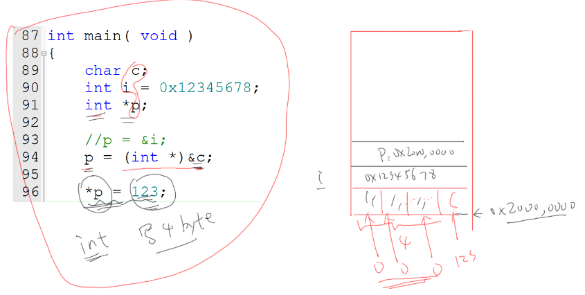

```
Author: <weng851107@gmail.com>

This file is only used for the record of the learning process, only used by myself and the file has never been leaked out.
If there is related infringement or violation of related regulations, please contact me and the related files will be deleted immediately. Thank you!
```

## [直播公開課]韋東山老師嵌入式C語言加強

- https://www.bilibili.com/video/BV1VM4y137Pm?spm_id_from=333.999.0.0&vd_source=790c8244dbe879457094c8374beb04d3

- 嵌入式開發版


### 1. 變量與指針

2個口訣：

* 變量變量，能變，就是能讀能寫，必定在內存裡
* 指針指針，保存的是地址，32位處理器中地址都是32位的，無論是什麼類型的指針變量，都是4字節

### 2. sizeof與關鍵字

Q: 測試指針p占的內存使用sizeof(p)還是sizeof(*p)

```C
printf("sizeof(int) = %d, sizeof(char) = %d\r\n", sizeof(int), sizeof(char));
printf("sizeof(int *) = %d, sizeof(char *) = %d\r\n", sizeof(int *), sizeof(char *));
```


**volatile關鍵字**

- 有些變量，在編譯優化後，會被備份到CPU上面暫存器上進行直接操作，並不會每次都從內存來存取變量。但如果有加volatile關鍵字的話，每次在存取變量時，都會去內存進行存取，且不會被編譯器優化掉存取該變量的程式

**const關鍵字**

- 可以用來節省內存，將常量存於flash而非內存中

- 可以使某參數成為不可再修改的常量

Q: 只讀常量是否放在flash中? 所以增加const關鍵字就可以節省RAM內存空間

> 基本上會放在flash中，但編譯器有時優化會把其放置內存中

> 增加const關鍵字會把常量儲存於flash中

**static關鍵字**

- 使某變(常)量或是函數其作用域只在某檔案內(某一個.c裡面)

- 該變量會存放於BSS段

**extern關鍵字**

- 存取外部其他文件的變數

Q: 只要在要存取外部定義的參數的.c中，可以看到extern某參數的程式碼即可，可以透過在.c直接使用或是透過include某header file


### 3. struct

- 聲明類型，不是變量，故不會分配內存空間，定義變量才會分配內存空間

    

    

    

- 結構體字節對齊

    

    

    

    

- 使用一個奇數地址來訪問一個四字節的地址會使效率低落或是硬體無法支持這種訪問方式。但可以用一個奇數地址來訪問一個一字節的地址

    

### 4. 變量賦值

- 變量需要幾個字節是根據變量的類型的定的

- 隱含類型轉換

    

- 利用不同類型的指針指向變量，當透過指針讀寫字節時，會發生非預期的狀況，有機會會覆寫到其他變量的字節

    

    

### 5. 通過指針賦值

- CPU透過讀取flash上的某個C程序來得到指令，接著CPU執行C指令寫入內存`a=123`。裡面隱含著對地址的操作

    

    

- 透過指針給變量或結構體設值

    

    

    

### 6. 問題

1. type * pt;
    > pt ： 是指指針指向的地址
    > *pt： 是指指針指向地址的內容

2. 聲明與定義

    ```C
    /*b.h*/
    /*聲明*/
    extern int b;

    /*b.c*/
    /*定義*/
    int b;
    ```

   - 重複定義

        ```C
        /*b.h*/
        /*定義*/
        int b;

        /*b.c*/
        /*定義*/
        int b;

        /*a.c*/
        #include "b.h"
        ```

3. 什麼情況會使用volatile?

    > 訪問硬件暫存器時，若某變數是易變的話，可以設置volatile，避免存取到非預期的數值

4. 撰寫程式時，不建議使用全域變數，而是將變數以static局限於本檔案，且撰寫一個讀取此變數的函式，讓別人在存取此變數時可以使用

5. typedef

    

    

### 7. 結構體指針、函數指針

- 結構體內不能包含結構體，會遞迴使得字節無限大，因此要用結構體指針

    

- `student` 代表 `struct student`
    `pstudent` 代表 `struct student *`

    ```C
    typedef struct student
    {
        char * name;
        int age;
        struct student * classmate;
        int sex;
    } student, * pstudent;
    ```

- 變量指針與函數指針

    ```C
    /*指向變量用的指針*/
    int * pt;

    /*指向函數用的指針*/
    void (* pt)(void);
    ```

- 函數指針指向函數時，有沒有取址(&)符號不影響，因為取用函數即是取用某地址，但若是變量指針的話一定要取址(&)符號，才代表某地址，否則為取用其內容

    ```C
    /*變量*/
    int i = 5;

    /*函數*/
    static void play_ball()
    {
        printf("playing vall\n");
    }

    /*指向變量用的指針*/
    int * pt;
    pt = &i;

    /*指向函數用的指針*/
    void (* pt)(void);
    pt = &play_ball
    pt = play_ball
    ```

- 結構體內不能放函數，只能使用函數指針去指向定義的函數

    ```C
    static void play_ball()
    {
        printf("playing vall\n");
    }

    static void sing_song()
    {
        printf("singing\n");
    }

    typedef struct student
    {
        char * name;
        int age;
        void (*good_work)(void);
        int sex;
    } student, * pstudent;

    int main()
    {
        student ss[2] = {{ling, 25, sing_song, 0}, {Antony, 25, play_ball, 1}};

        return 0;
    }
    ```

- 產品有不同類型，可以透過macro的形式，根據不同代產品選用不同函數，但必須隨著更新版本而修改代碼來選用不同函數

    

    ```C
    #define LCD_TYPE_A

    void draw_logo_lcda(void)
    {
        printf("display logo on lcd a\r\n");
    }

    void draw_logo_lcdb(void)
    {
        printf("display logo on lcd b\r\n");
    }

    #ifdef LCD_TYPE_A
        draw_logo_lcda();
    #else
        draw_logo_lcdb();
    #endif	
    ```

- 可以在產品新增一個EEPROM，把產品配用的設備類型寫入EEPORM，當要使用函數時，可以根據EEPROM的讀取來判斷，但隨著版本變多，判斷的代碼會變很冗長

    ```C
    int read_eeprom()
    {
        /* 0: lcd a
            * 1: lcd b
            */
        return 0; 
    }

    int get_lcd_type(void)
    {
        return read_eeprom();
    }

    void draw_logo_lcda(void)
    {
        printf("display logo on lcd a\r\n");
    }

    void draw_logo_lcdb(void)
    {
        printf("display logo on lcd b\r\n");
    }

    int type = get_lcd_type();

    if (type == 0)
        draw_logo_lcda();
    else if (type == 1)
        draw_logo_lcdb();
    else if (type == 2)
        draw_logo_lcdc();
    else if (type == 3)
        draw_logo_lcdd();
    else if (type == 4)
        draw_logo_lcde();
    ```

- 較好的方式，是將產品抽象出它的結構體，並且搭配函數指針來選擇該產品要選用的函數

    ```C
    typedef struct lcd_operation {
        int type;
        void (*draw_logo)(void)
    }lcd_operation, *p_lcd_operation;

    int read_eeprom()
    {
        /* 0: lcd a
            * 1: lcd b
            */
        return 0; 
    }

    int get_lcd_type(void)
    {
        return read_eeprom();
    }

    void draw_logo_lcda(void)
    {
        printf("display logo on lcd a\r\n");
    }

    void draw_logo_lcdb(void)
    {
        printf("display logo on lcd b\r\n");
    }

    lcd_operation xxx_com_lcds[] = {
        {0, draw_logo_lcda},
        {1, draw_logo_lcdb},
    };

    p_lcd_operation get_lcd(void)
    {
        int type = get_lcd_type();
        return &xxx_com_lcds[type];
    }

    int main( void )
    {
        p_lcd_operation lcd;

        lcd = get_lcd();

        lcd->draw_logo();

        return 0;
    }
    ```

- 當今天函數返回結構體與結構體指針的差別，會是返回的字節大小

### 8. 指針問答

- 結構體初始化，C99擴展

    

- typedef

    

    

- 結構體數組

    

### 9. 鏈表


### 10. 鏈表插入操作


```C
typedef struct spy {
    char *name;
    struct spy *next;
}spy, *p_spy;

spy A = {"A", NULL};
spy B = {"B", NULL};
spy C = {"C", NULL};
spy D = {"D", NULL};

p_spy head = NULL;

void insert_spy(p_spy newspy)
{
    p_spy last;

    if (head == NULL)
    {
        head = newspy;
        newspy->next = NULL;
    }
    else
    {
        /* 先找到链表的最后一项 last */
        last = head;
        while (last)
        {
            if (last->next == NULL) /* 找到了 */
                break;
            else
                last = last->next;
        }
        
        /*  */
        last->next = newspy;
        newspy->next = NULL;
    }
}

int main( void )
{
    /*	
    A.next = &B;
    B.next = &C;
    C.next = NULL;
    */
    insert_spy(&A);	
    insert_spy(&B);	
    insert_spy(&C);	
    insert_spy(&D);	

    prvSetupHardware();

    head = &A;

    while (head)
    {
        printf("%s\r\n", head->name);
        head = head->next;
    }

    while (1);

    return 0;
}
```

### 11. 鏈表刪除操作


```C
typedef struct spy {
    char *name;
    struct spy *next;
}spy, *p_spy;

spy A = {"A", NULL};
spy B = {"B", NULL};
spy C = {"C", NULL};
spy D = {"D", NULL};

p_spy head = NULL;

void remove_spy(p_spy oldspy)
{
    p_spy left;

    if (head == oldspy)
    {
        head = oldspy->next;
    }
    else
    {
        /* 找出oldspy的上线 */
        left = head;
        while (left)
        {
            if (left->next == oldspy)
                break;
            else
                left = left->next;
        }
        
        if (left)
        {
            left->next = oldspy->next;
        }
    }
}

int main( void )
{
    /*	
    A.next = &B;
    B.next = &C;
    C.next = NULL;
    */
    insert_spy(&A);	
    insert_spy(&B);	
    insert_spy(&C);	
    insert_spy(&D);	

    remove_spy(&B);
    printf("remove spy B: \r\n");


    return 0;
}
```

### 12. ARM架構與淺談匯編


- 內存只有讀與寫的操作，計算在CPU進行運算

- CPU中有暫存器，存放要計算的數據

- load(Read): `LDR {條件} 目的寄存器, <存儲器地址>`

    ```Assembly
    LDR R0, [R1]

    LDR R1, #0X00000100 //將數據0x00000100；放入寄存器R1中；
    ```

- store(Write): `STR {條件} 源寄存器, <存儲器地址>`
- mov: 用於給暫存器賦值，類似高階語言的 `=`

    ```Assembly
    MOV AX, 10   ; 將 10 放進 AX 暫存器中
    ```

- add: 用於加法運算，類似高階語言的 `+=`
- sub: 用於減法運算，類似高階語言的 `-=`

    ```Assembly
    ADD AX, 20   ; 將 AX 暫存器加上 20
    SUB AX, 20   ; 將 AX 暫存器減去 20
    ```

### 13. 全局變量的初始化與棧的引入

- 程序會儲存在flash中，當SoC斷電時，在內存的數據都會消失

- 上電運行程序時，數據會從flash中載去至內存

- 程序會以分區段的方式被編譯出來，因此在運行程序初始化時，會被一段一段地載入至內存中


### 14. 局部變量的初始化

https://www.bilibili.com/video/BV1VM4y137Pm?p=15
